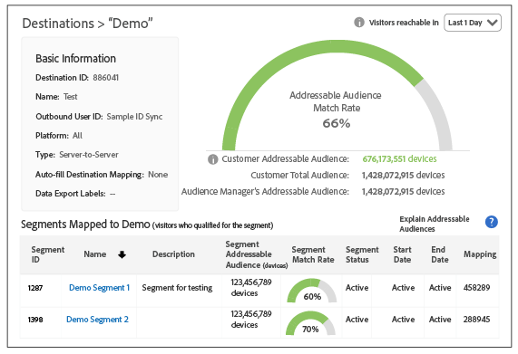

# Addressable Audience {#addressable-audiences}

Panoramica della funzionalità e dei casi di utilizzo di Addressable Audience.

## What is an Addressable Audience? {#addressable-audience-description}

The [!UICONTROL Addressable Audiences] feature shows you the overlap between the audiences you see across all of your properties where [!DNL Audience Manager] collects data and your selected destination. Per comprendere questo concetto, consulta l'illustrazione seguente. La sovrapposizione tra ciascun cerchio rappresenta i diversi tipi di pubblico indirizzabili.

<table id="table_6DC02E219B074BF782EAA0E9DB9495FB"> 
 <thead> 
  <tr> 
   <th colname="col1" class="entry"> Metrica </th> 
   <th colname="col2" class="entry"> Descrizione </th> 
  </tr> 
 </thead>
 <tbody> 
    <tr> 
   <td colname="col1"> 
 <b>Pubblico indirizzabile di Audience Manager per una destinazione</b> 
 </td> 
   <td colname="col2"> 
Un totale di tutti i dispositivi che hanno interagito con tutti i clienti Audience Manager a livello di piattaforma durante il periodo di look-back del rapporto e che possono essere associati alla destinazione scelta. 
 
Questa metrica è utile perché mostra: 
 
 
     <ul id="ul_67A82A40C7A64457822272B45D2817FC"> 
      <li id="li_DAEFB565CE774F68AA29274A021F1E5A"> The size of the total addressable audience that  Audience Manager can reach on a particular targeting destination. </li> 
      <li id="li_AF26F88068CA44F7B5C4C42DE5E21055">How big the  Audience Manager profile pool is for a targeting platform and the size of their audiences. </li> 
     </ul> 
 </td> 
  </tr> 
  <tr> 
   <td colname="col1"> 
 <b>Pubblico totale cliente</b> 
 </td> 
   <td colname="col2"> 
Un numero di dispositivi che hanno realizzato una caratteristica basata su regole sulle proprietà o su una caratteristica registrata dai file offline durante la finestra di look-back. 
 </td> 
  </tr> 
  <tr> 
   <td colname="col1"> 
 <b>Tasso di corrispondenza pubblico indirizzabile</b> 
 </td> 
   <td colname="col2"> 
    <draft-comment> 
     
Un totale di sovrapposizioni di dispositivi che hanno generato una caratteristica basata su regole o una caratteristica registrata durante la finestra del look-back e i dispositivi che si sincronizzano con la destinazione selezionata, indipendentemente dal tempo di sincronizzazione. 
 
    </draft-comment> 
Questa metrica rappresenta i dispositivi che: 
     <ul id="ul_B609B402A29D44898DF0B1ABC6011D40"> 
      <li id="li_27A530DE2AEB48069BECFB2D78E94C4E">Have realized either a rule-based or an onboarded trait during the look-back window <b>AND</b> </li> 
      <li id="li_47C44ECAEC5844DEB11C6A93C8F061BB">Disponete di una sincronizzazione ID con la destinazione selezionata, indipendentemente dal tempo di sincronizzazione. </li> 
     </ul> 
 </td> 
  </tr> 
  <tr> 
   <td colname="col1"> 
 <b>Tasso di corrispondenza cliente</b> 
 </td> 
   <td colname="col2"> 
Pubblico indirizzabile cliente‡ Pubblico totale cliente espresso come percentuale. 
 </td> 
  </tr>
   <tr> 
   <td colname="col1"> 
 <b>Popolazione segmento totale</b> 
 </td> 
   <td colname="col2"> 
Un conteggio di tutti i dispositivi che erano membri del segmento durante il periodo di look-back. 
 </td> 
  </tr> 
  <tr> 
   <td colname="col1"> 
 <b>Pubblico indirizzabile segmento</b> 
 </td> 
   <td colname="col2"> 
Il numero di utenti che hanno partecipato al segmento durante il periodo di look-back e che dispongono di una sincronizzazione ID attiva sul sito. Segments can include your own first-party data and second party and third party data, via traits acquired in the <a href="../features/audience-marketplace/marketplace-data-buyers/marketplace-data-buyers.md"> Audience Marketplace</a>. 
 
 
Suggerimento: Se utilizzata con il periodo di look-back di 1 giorni, questa metrica può aiutarti a capire lo stato corrente dei tuoi segmenti. This is because the  Segment Addressable Audience metric represents the users who stayed in a segment throughout the previous day. Combine this with the fact that  Audience Manager refreshes  Addressable Audiences daily, combining this metric and lookback period provides the most up-to-date snapshot of your segments. 
 
 </td> 
  </tr> 
  <tr> 
   <td colname="col1"> 
 <b>Tasso di corrispondenza segmento</b> 
 </td> 
   <td colname="col2"> 
Segmento indirizzabile segmento ÷ Popolazione segmento totale espressa come percentuale. 
 </td> 
  </tr>  
 </tbody> 
</table>

## Addressable Audience Interface {#addressable-audience-interface}

The [!UICONTROL Addressable Audience] feature turns this abstract concept into quantifiable data. In [!DNL Audience Manager], this feature displays audience overlap with data visualizations that provide at-a-glance information along with numeric data in tabular form.

[!UICONTROL Addressable Audiences] si trova in **[!UICONTROL Audience Data > Destinations]**. Select **[!UICONTROL Integrated Platforms > Device-Based]** to see addressable audiences metrics.

Le tre metriche che puoi vedere sulla pagina di destinazione Pubblico indirizzabile rappresentano:

| Metrica | Descrizione |
---------|----------|
| **Pubblico indirizzabile (dispositivi)** | This metric represents the Customer Addressable Audience (described in the table above) *for the last 30 days.* |
| **Tasso di corrispondenza** | This metric represents the Addressable Audience Match Rate (described in the table above) *for the last 30 days*. |
| **Pubblico indirizzabile del ciclo di vita (dispositivi)** | Un totale di tutti i dispositivi che hanno interagito con tutti i clienti Audience Manager a livello di piattaforma durante il periodo di look-back del rapporto e che potrebbero essere associati a questa destinazione. See [Platform-Level Metrics](/help/using/features/addressable-audiences.md#platform-level-metrics) for more information. |

Fai clic sul nome di una destinazione server-to-server per visualizzare i dati di pubblico indirizzabili. Nota, questa funzione restituisce solo i dati per le destinazioni server-to-server e l'accesso richiede autorizzazioni amministratore.

La revisione di questi dati può essere utile per:

* **Previsioni e pianificazione:**[!UICONTROL Segment Addressable Audience] I dati offrono maggiore granularità nei segmenti che si intende inviare a una destinazione per targeting e attivazione dell'audience.

* **Recensioni sulle prestazioni:** La [!UICONTROL Addressable Audiences] funzione è anche uno strumento di risoluzione dei problemi. Consente di analizzare le prestazioni delle campagne, comprendere la portata della campagna e passare con i partner di targeting/attivazione se non si vedono i risultati previsti.

### Pianificazione con dati e implicazioni di terze parti per percentuali di corrispondenza

Prima di acquistare dati di terze parti per l'acquisizione di audience, i clienti possono convalidare la sovrapposizione con altri provider di dati. Questo può aiutarti a prendere una decisione informata prima di acquistare nuovi dati. The ID syncs for purchased third-party data rely not only on the overlap of your data but also on third-party providers’ footprints with all other [!DNL Audience Manager] customers. Your [!DNL Adobe] consultant can help you identify additional relevant data sources to optimize prospecting campaigns.

### Utenti e percentuali di corrispondenza

There are gaps when trying to connect [!DNL Safari] or mobile app users where there are no third-party cookies present. That makes it difficult to sync users with some partners because only those [!DNL Adobe] IDs for synced third-party cookies are provided in the media delivery logs. This is a reason why you might see [low match rates](../features/addressable-audiences.md#low-match-rates) for your destinations.

## Date Ranges in Addressable Audiences and Destinations {#date-ranges}

Read the sections below for available date ranges and how data ages out of each interval in the reports for an [!UICONTROL Addressable Audience] or [!UICONTROL Destination].

## Available Date Ranges and Time Zones {#available-date-ranges}

<!-- addressable-audience-dates.xml -->

Reports for your [!UICONTROL Addressable Audiences] and [Destinations](../features/destinations/destinations.md) use the same date range intervals. Le opzioni dell'intervallo di date includono:

* [!UICONTROL Last 1 Day] (L'intervallo va da Mezzanotte a Mezzanotte del precedente periodo di 24 ore. Non si tratta di una metrica in tempo reale o corrente.
* [!UICONTROL Last 7 Days]
* [!UICONTROL Last 14 Days]
* [!UICONTROL Last 30 Days]
* [!UICONTROL Last 60 Days]
* [!UICONTROL Last 90 Days]
* [!UICONTROL Lifetime]

All dates and date ranges are set in the [!DNL UTC] time zone. See [Time Zones in Audience Manager](../reference/aam-time-zones.md).

## Data in Date Range Intervals {#date-range-intervals}

The [!UICONTROL Addressable Audience] and [!UICONTROL Destination] metrics return a count of unique users for the selected time interval. Ad esempio, un visitatore viene conteggiato solo una volta, anche se accedono più volte al sito. La prima visita è l'unica visita e viene registrata. Le visite successive restituiscono visite e non vengono conteggiate perché non sono univoche.

Gli intervalli di date contengono dati per l'intervallo di tempo selezionato o precedente. Inoltre, i dati risalgono a ciascun intervallo di report durante la trasmissione del tempo. For example, let's assume you see 2 visitors after choosing the [!UICONTROL Last 30 Days] option. Nei rapporti, questi visitatori:

* *Verrà* incluso nei risultati restituiti entro intervalli lunghi (60 giorni, 90 giorni e Lifetime).
* *Non verrà* incluso negli intervalli più brevi che precedono l [!UICONTROL Last 30 Day] 'opzione (corrente, 7 giorni e 14 giorni).

And, on day 31, these visitors only show up in the 60 day, 90 day, and [!UICONTROL Lifetime] results. Hanno invecchiato con un intervallo di 30 giorni. Visitors do not age out of the [!UICONTROL Lifetime] interval.

## Addressable Audience Metrics {#addressable-audience-metrics}

This section describes the types of metrics provided by [!UICONTROL Addressable Audiences].

### Customer-Level Metrics {#customer-level-metrics}

<!-- addressable-audience-metrics.xml -->

These metrics return data for traits realized when visitors come to your site or when you send inbound data files to [!DNL Audience Manager]. Queste metriche forniscono una visualizzazione completa delle dimensioni del pubblico per l'account.

<table id="table_6DC02E219B074BF782EAA0E9DB9495FB"> 
 <thead> 
  <tr> 
   <th colname="col1" class="entry"> Metrica </th> 
   <th colname="col2" class="entry"> Descrizione </th> 
  </tr> 
 </thead>
 <tbody> 
  <tr> 
   <td colname="col1"> 
 <b>Pubblico indirizzabile cliente</b> 
 </td> 
   <td colname="col2"> 
    <draft-comment> 
     
Un totale di sovrapposizioni di dispositivi che hanno generato una caratteristica basata su regole o una caratteristica registrata durante la finestra del look-back e i dispositivi che si sincronizzano con la destinazione selezionata, indipendentemente dal tempo di sincronizzazione. 
 
    </draft-comment> 
Questa metrica rappresenta i dispositivi che: 
     <ul id="ul_B609B402A29D44898DF0B1ABC6011D40"> 
      <li id="li_27A530DE2AEB48069BECFB2D78E94C4E">Have realized either a rule-based or an onboarded trait during the look-back window <b>AND</b> </li> 
      <li id="li_47C44ECAEC5844DEB11C6A93C8F061BB">Disponete di una sincronizzazione ID con la destinazione selezionata, indipendentemente dal tempo di sincronizzazione. </li> 
     </ul> 
 </td> 
  </tr> 
  <tr> 
   <td colname="col1"> 
 <b>Pubblico totale cliente</b> 
 </td> 
   <td colname="col2"> 
Un numero di dispositivi che hanno realizzato una caratteristica basata su regole sulle proprietà o su una caratteristica registrata dai file offline durante la finestra di look-back. 
 </td> 
  </tr> 
  <tr> 
   <td colname="col1"> 
 <b>Tasso di corrispondenza cliente</b> 
 </td> 
   <td colname="col2"> 
Pubblico indirizzabile cliente‡ Pubblico totale cliente espresso come percentuale. 
 </td> 
  </tr> 
 </tbody> 
</table>

### Segment-Level Match Metrics {#segment-level-metrics}

Queste metriche restituiscono dati sull'appartenenza al segmento. Consentono di fornire una vista più granulare e precisa della dimensione del pubblico per ogni segmento.

>[!NOTE]
>
>Il modo in cui la finestra di look-back viene applicata a livello di segmento è diverso da quello a livello del cliente. I visitatori possono visitare il sito e realizzare una caratteristica 10 giorni fa e possono qualificarsi per un segmento da quel momento in poi abbandonato dal segmento 2 giorni fa. Quando viene applicato il look-back di 7 giorni, questi visitatori saranno conteggiati a livello di segmento ma non a livello del cliente.

<table id="table_4185AA02CC774B6C93B02E45F88BBBD9"> 
 <thead> 
  <tr> 
   <th colname="col1" class="entry"> Metrica </th> 
   <th colname="col2" class="entry"> Descrizione </th> 
  </tr> 
 </thead>
 <tbody> 
  <tr> 
   <td colname="col1"> 
 <b>Pubblico indirizzabile segmento</b> 
 </td> 
   <td colname="col2"> 
Il numero di utenti che hanno partecipato al segmento durante il periodo di look-back e che dispongono di una sincronizzazione ID attiva sul sito. Segments can include your own first-party data and second party and third party data, via traits acquired in the <a href="../features/audience-marketplace/marketplace-data-buyers/marketplace-data-buyers.md"> Audience Marketplace</a>. 
 
 
Suggerimento: Se utilizzata con il periodo di look-back di 1 giorni, questa metrica può aiutarti a capire lo stato corrente dei tuoi segmenti. This is because the  Segment Addressable Audience metric represents the users who stayed in a segment throughout the previous day. Combine this with the fact that  Audience Manager refreshes  Addressable Audiences daily, combining this metric and lookback period provides the most up-to-date snapshot of your segments. 
 
 </td> 
  </tr> 
  <tr> 
   <td colname="col1"> 
 <b>Popolazione segmento totale</b> 
 </td> 
   <td colname="col2"> 
Un conteggio di tutti i dispositivi che erano membri del segmento durante il periodo di look-back. 
 </td> 
  </tr> 
  <tr> 
   <td colname="col1"> 
 <b>Tasso di corrispondenza segmento</b> 
 </td> 
   <td colname="col2"> 
Segmento indirizzabile segmento ÷ Popolazione segmento totale espressa come percentuale. 
 </td> 
  </tr> 
 </tbody> 
</table>

### Platform-Level Metrics {#platform-level-metrics}

Questa metrica restituisce dati sulle attività raccolte in tutti i clienti di Audience Manager. Possono fornire una visualizzazione più ampia dei destinatari del cliente rispetto ai clienti aggregati di Audience Manager.

<table id="table_B6654D9858FF46AF95B1C181D4608D26"> 
 <thead> 
  <tr> 
   <th colname="col1" class="entry"> Metrica </th> 
   <th colname="col2" class="entry"> Descrizione </th> 
  </tr> 
 </thead>
 <tbody> 
  <tr> 
   <td colname="col1"> 
 <b>Pubblico indirizzabile di Audience Manager</b> 
 </td> 
   <td colname="col2"> 
Un totale di tutti i dispositivi che hanno interagito con tutti i clienti Audience Manager a livello di piattaforma durante il periodo di look-back del rapporto e che possono essere associati alla destinazione scelta. 
 
Questa metrica è utile perché mostra: 
 
 
     <ul id="ul_67A82A40C7A64457822272B45D2817FC"> 
      <li id="li_DAEFB565CE774F68AA29274A021F1E5A"> The size of the total addressable audience that  Audience Manager can reach on a particular targeting destination. </li> 
      <li id="li_AF26F88068CA44F7B5C4C42DE5E21055">How big the  Audience Manager profile pool is for a targeting platform and the size of their audiences. </li> 
     </ul> 
 </td> 
  </tr> 
 </tbody> 
</table>

## Comparing Customer and Segment Addressable Audiences{#comparing-metrics}

You shouldn't compare the [!UICONTROL Customer Addressable Audience] and [!UICONTROL Segment Addressable Audience] metrics to determine if one is more significant than the other. Queste metriche separate, diverse e indipendenti. Come descritto nelle definizioni sopra, ciascuna di esse viene derivata da set di dati diversi. In tal caso, evitate di derivare conclusioni se una metrica è più grande dell'altro. Quando confrontate questi è tutto ciò che potete dire:

* [!UICONTROL Customer Addressable Audiences] si basa sulle realioni delle caratteristiche *per i tuoi dati di prime parti*. Questa metrica fornisce una panoramica completa e completa dell'integrazione con un partner dati.

* [!UICONTROL Segment Addressable Audiences] si basa sulle qualifiche del segmento *per i dati di prime parti, oltre che per i dati secondo e terzo*. Questa metrica fornisce una visualizzazione granulare e più precisa dei tipi di pubblico indirizzabili in una piattaforma di targeting.

## Causes of Low Match Rates for Addressable Audiences {#low-match-rates}

Common elements responsible for low [!UICONTROL Addressable Audience] match rates or discrepancies in reported numbers.

<!-- addressable-audiences.xml -->

<table id="table_895D536F69134330A4F13887ECAFD4F5"> 
 <thead> 
  <tr> 
   <th colname="col1" class="entry"> Causa </th> 
   <th colname="col2" class="entry"> Descrizione </th> 
  </tr> 
 </thead>
 <tbody> 
  <tr> 
   <td colname="col1"> 
 <b>Traffico mobile</b> 
 </td> 
   <td colname="col2"> 
La maggior parte delle integrazioni server-to-server si basano su processi di sincronizzazione facilitate dai cookie di terze parti. Tuttavia, gli ambienti mobili non utilizzano cookie di terze parti. Di conseguenza, i numeri di Pubblico indirizzabili potrebbero apparire bassi rispetto alle dimensioni del segmento. 
 
A partire da gennaio 2018, potete attivare i tipi di pubblico mobili nelle stesse destinazioni Google e Adobe Advertising Cloud configurate per i tipi di pubblico basati su cookie. Se questo significa che puoi inviare segmenti con cookie combinato e l'iscrizione ID mobile alle destinazioni Google e Advertising Cloud, tieni presente che l'audience di riferimento visualizza solo la sovrapposizione tra ID cookie e destinazioni. Audience Manager invia il 100% dei tipi di pubblico per dispositivi mobili alle destinazioni, ma le audience per dispositivi mobili non sono misurate dalla metrica Pubblico indirizzabile. 
 
 
<b>Nota</b>: Ad esempio, prendi un segmento con una popolazione di 1,000,000. Se mappate questo segmento su una destinazione Google o Adobe Advertising Cloud, potrebbe essere visualizzato un pubblico indirizzabile di 700,000 dispositivi e una percentuale di corrispondenza pari a 70%. L'iscrizione a 700,000 è composta da ID cookie con una sincronizzazione ID con la destinazione. L'audience indirizzabile potrebbe, in realtà, essere molto più alta, perché gli ID mobili indirizzabili non vengono visualizzati in questa metrica. 
 
 </td> 
  </tr> 
  <tr> 
   <td colname="col1"> 
 <b>Traffico Safari</b> 
 </td> 
   <td colname="col2"> 
Safari blocca i cookie di terze parti. In questo modo Audience Manager non sincronizza gli ID con la destinazione. With the introduction of <a href="https://webkit.org/blog/8311/intelligent-tracking-prevention-2-0/" format="https" scope="external"> ITP 2.0</a>, you can expect your addressable audiences not to include Safari users. 
 </td>
  </tr> 
  <tr> 
   <td colname="col1"> 
 <b>Impressioni multimediali tracciate</b> 
 </td> 
   <td colname="col2"> 
A causa delle best practice del server di annunci, le sincronizzazioni ID non vengono effettuate all'interno di tag pubblicitari. I clienti che eseguono una grande quantità di pubblicità offsite non sincronizzeranno gli utenti con integrazioni di terze parti in tali ambienti. Inoltre, una grande quantità di dati relativi alle impression multimediali raccolti potrebbe ridurre i numeri di pubblico indirizzabili. 
 </td>
  </tr> 
 </tbody> 
</table>

## Troubleshooting with Addressable Audiences {#troubleshooting}

In addition to surfacing match rates, you can also use [!UICONTROL Addressable Audiences] as a troubleshooting tool.

<!-- addressable-audiences-troubleshooting.xml -->

Ad esempio, supponiamo che tu mandi un segmento a una destinazione e che la destinazione mostri numeri di reporting ridotti. Checking the [!UICONTROL Addressable Audience] results will show you if this is a technical problem or just a case of low match rates. Una frequenza di corrispondenza bassa indica che la destinazione non è tutto molto grande per i segmenti selezionati. Tuttavia, una differenza nel numero totale dei destinatari indirizzabili tra Audience Manager e la destinazione indica un'integrazione, la sincronizzazione o un altro problema tecnico. In questi casi, contattate il responsabile commerciale.