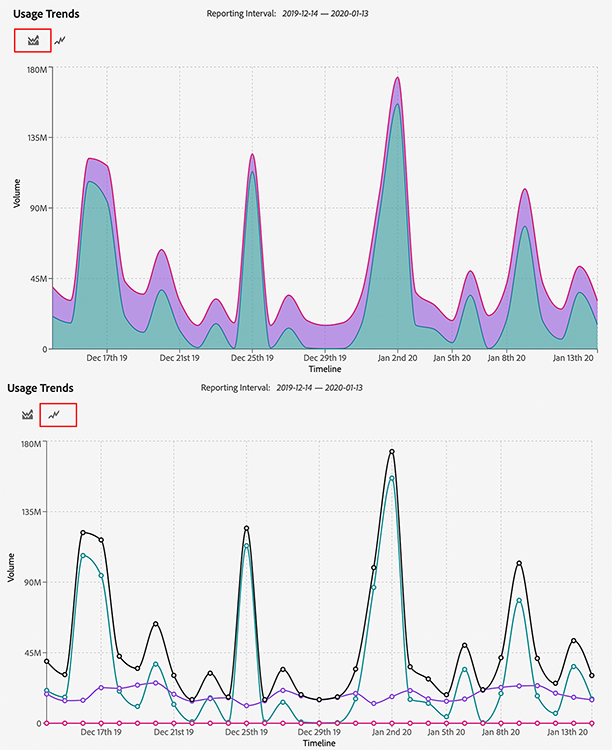

# Report sull&#39;utilizzo dell&#39;attività

## Panoramica {#overview}

Questo [!UICONTROL Activity Usage Report] consente di visualizzare e monitorare l&#39;utilizzo dell&#39;attività dell&#39;istanza Audience Manager, fornendo un&#39;idea chiara del modo in cui l&#39;utilizzo dell&#39;attività viene confrontato con l&#39;impegno contrattuale.

Inoltre, puoi scaricare il file [!UICONTROL Activity Usage Report] ogni volta che ti serve, per la conservazione dei record e l&#39;analisi personalizzata.

## Considerazioni {#considerations}

Il [!UICONTROL Activity Usage Report] componente è disponibile per tutti gli utenti di Audience Manager con privilegi di [amministratore](edit-account-settings.md).

> [!IMPORTANT]
>
> Il riquadro [!UICONTROL Activity Usage Report] mostra le statistiche di utilizzo dell&#39;attività dell&#39;istanza Audience Manager. Per qualsiasi richiesta di fatturazione relativa all&#39;utilizzo dell&#39;attività, contattate il vostro rappresentante Adobe.

## Casi d&#39;uso {#use-cases}

Esistono due casi d’uso principali di [!UICONTROL Activity Usage Report]:

* **Tracciamento dell’utilizzo effettivo dell’attività dell’istanza rispetto all’impegno** di utilizzo dell’attività: La maggior parte dei clienti ha un impegno di attività stimato mensilmente per istanza di Audience Manager, che viene poi cumulato in un impegno di attività annuale in tutti i casi. Anche se questo rapporto non è un rapporto di fatturazione, può fornire utili indicazioni sul fatto che si stia superando l&#39;utilizzo dell&#39;attività impegnata.
* **Convalida per le modifiche** di implementazione: Se hai aggiornato di recente l&#39;implementazione, ad esempio configurando l&#39;inoltro lato server di Analytics o modificando le impostazioni delle chiamate al server di Target, questo rapporto può essere utile per verificare se il nuovo volume di attività è in linea con il volume di attività previsto.

## Utilizzo del rapporto Utilizzo dell&#39;attività {#using}

Per visualizzare il [!UICONTROL Activity Usage Report]collegamento, accedi al tuo account Audience Manager e vai a **[!UICONTROL Administration]**>**[!UICONTROL Usage]**.

Quindi, utilizzate il **[!UICONTROL Reporting Interval]**filtro per selezionare l&#39;intervallo di tempo per il quale generare il rapporto. Puoi scegliere tra 30, 60, 90 giorni o un intervallo di date personalizzato.

Una volta caricato il rapporto, potete visualizzare una suddivisione del periodo [!UICONTROL Activities] selezionato.

[!UICONTROL Activities] definite il totale complessivo di tutte le interazioni in sito e offsite con Audience Manager, suddivise nelle seguenti categorie:

* **[!UICONTROL Server Calls]**: Qualsiasi evento di raccolta o recupero dei dati inviato ad Audience Manager da siti Web, server, e-mail, applicazioni mobili o altri sistemi.
* **[!UICONTROL Pixel Calls](precedentemente noto come[!UICONTROL Impression Server Calls])**: Dati raccolti dagli annunci (come volume di impression da una piattaforma di targeting) o dalle chiamate di impression e-mail effettuate ad Audience Manager. Questi richiedono la presenza del `d_event` parametro nella stringa di query.
* **[!UICONTROL On-Boarded Records]**: Record univoci acquisiti dal sistema CRM (Customer Relationship Management System) o da altri file di dati offline, come record del call center, ID dispositivo e feed di dati personalizzati da fornitori di dati esterni.
* **[!UICONTROL Log File Records]**: Record univoci dai file di registro inviati ad Audience Manager da una piattaforma di destinazione.

> [!NOTE]
> Un record univoco definisce ogni singolo record di dati in un file memorizzato da Adobe per conto di un cliente Audience Manager.

Inoltre, potete usare i tipi di [!UICONTROL Activity Usage Trends] grafico per passare da un tipo di grafico all’altro.

Puoi anche passare il cursore su una data specifica nella timeline per visualizzare l’utilizzo dettagliato di tale data.

## Esportazione dei rapporti sull&#39;uso dell&#39;attività {#export}

Per una migliore panoramica del livello di utilizzo dell&#39;attività di Audience Manager, puoi esportarlo [!UICONTROL Activity Usage Report] in base al tipo di record che desideri includere.

I **[!UICONTROL Onboarded Records Breakdown]**rapporti e**[!UICONTROL Onsite Server Calls Breakdown]** le informazioni più dettagliate sui dati di origine disponibili per queste attività. Il volume attribuito a queste suddivisioni è basato sull&#39;implementazione.

### Suddivisione record caricati {#onboarded-breakdown}

Questo rapporto contiene record caricati suddivisi per origine dati.

### Suddivisione chiamate server on-site {#onsite-breakdown}

Questo rapporto contiene una suddivisione delle chiamate server da tre origini: [!UICONTROL Analytics], [!UICONTROL Target], e [!UICONTROL Other].

* **[!UICONTROL Analytics]**: Si tratta di chiamate server fatturabili passate da tutte le istanze di Adobe Analytics ad Audience Manager, incluso l&#39;inoltro lato server. Le chiamate server secondarie o le chiamate server duplicate (come nel caso dell&#39;inoltro lato server da più suite di rapporti) non sono attività fatturabili, pertanto non sono incluse in questa suddivisione.
* **[!UICONTROL Target]**: Si tratta di chiamate lato server da Adobe Target ad Audience Manager per recuperare i dati del segmento di Audience Manager come parte di un&#39;integrazione tra server.
* **[!UICONTROL Other]**: Include chiamate da qualsiasi altro sito Web o sistema (siti partner, chiamate server dirette, ecc.), browser mobile/chiamate app tramite[!DNL SDK],[!DNL DIL], chiamate evento e[!DNL DCS]chiamate. Sono incluse anche le chiamate da[!DNL Target]se configurate come integrazione dei cookie (anziché da server a server).
