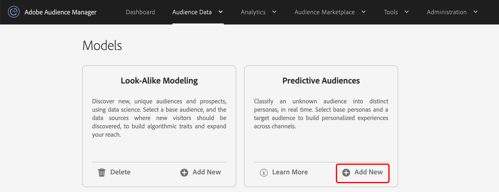

# Guida introduttiva all&#39;audience predittiva {#predictive-audiences-getting-started}

>[!IMPORTANT]
>Questo articolo contiene la documentazione del prodotto destinata a guidarvi nella configurazione e nell&#39;utilizzo di questa funzione. Nulla di ciò è contenuto nella consulenza legale. Consulta il tuo consulente legale per ottenere assistenza legale.

## Creare un modello di pubblico predittivo {#create-predictive-audiences}

Prima di creare un [!UICONTROL Predictive Audiences] modello, è necessario stabilire a quale origine dati di prime parti si desidera assegnare [!UICONTROL Predictive Audiences] caratteristiche e segmenti. È possibile utilizzare un&#39;origine dati di prime parti esistente o crearne una nuova. Consulta [Gestione origini](https://docs.adobe.com/content/help/en/audience-manager/user-guide/features/data-sources/manage-datasources.html) dati per informazioni dettagliate su come creare una nuova origine dati di prime parti.

Una volta ottenuta l&#39;origine dati da utilizzare, segui i passaggi descritti di seguito.

1. Vai a **[!UICONTROL Audience Data]** > **[!UICONTROL Models]**.
1. Nella [!UICONTROL Predictive Audiences] sezione fare clic su **[!UICONTROL Add New]**.

   

1. Quindi, definite le persone per le quali desiderate classificare il pubblico. A tal fine, puoi scegliere caratteristiche o segmenti da cui creare le persone. Utilizzate le schede [!UICONTROL Traits] e nell&#39; [!UICONTROL Segments] angolo superiore sinistro dello schermo per passare dal catalogo delle caratteristiche a quello dei segmenti e viceversa. Dopo aver identificato le caratteristiche o i segmenti che si desidera utilizzare come personaggi, fai clic sull’ **[!UICONTROL Add]** icona corrispondente nella [!UICONTROL Action] colonna.
   
   >[!NOTE]
   >Devi scegliere almeno due caratteristiche o due segmenti per le tue figure di base. Non è possibile utilizzare una combinazione di caratteristiche e segmenti.
1. Fai clic **[!UICONTROL Next]** dopo aver definito le tue personalità.
1. Quindi, selezionate il pubblico di prime parti che desiderate classificare scegliendo una caratteristica o un segmento di prime parti per questo pubblico. Utilizzate le schede [!UICONTROL Traits] e nell&#39; [!UICONTROL Segments] angolo superiore sinistro dello schermo per passare dal catalogo delle caratteristiche e dei segmenti al catalogo. Selezionate la caratteristica o il segmento di prime parti che desiderate utilizzare come pubblico, per aggiungerlo al modello.
   
1. Fate clic **[!UICONTROL Next]** dopo aver selezionato il pubblico.
1. Compila i dettagli del modello:
   1. **[!UICONTROL Model Name]**: Inserite un nome descrittivo per il modello, che vi aiuterà a identificarlo in un secondo momento. I nomi dei segmenti generati dal modello inizieranno con il nome del modello.
   2. **[!UICONTROL Description]**: Inserire una descrizione del modello che consenta di identificare il relativo caso di utilizzo.
   3. **[!UICONTROL Data Source]**: Selezionare l&#39;origine dati di prime parti a cui si desidera assegnare i [!UICONTROL Predictive Audiences] segmenti di questo modello.
      
1. Clic **[!UICONTROL Save]**.

## Modifica di audience predittive {#edit-predictive-audiences}

Audience Manager non supporta la modifica di [!UICONTROL Predictive Audiences] modelli esistenti. Per modificare la configurazione di un modello, è necessario creare un nuovo modello. Se avete raggiunto il limite di 10 [!UICONTROL Predictive Audiences] modelli e avete l&#39;esigenza di modificarne uno, dovete eliminare un modello e crearne uno nuovo.

## Eliminazione di audience predittive {#delete-predictive-audiences}

Per eliminare un [!UICONTROL Predictive Audiences] modello, passare a **[!UICONTROL Audience Data]** > **[!UICONTROL Models]**, individuare il modello da eliminare e fare clic sull&#39; **[!UICONTROL Delete]** icona.
