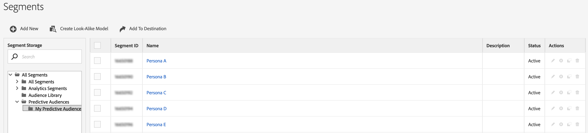
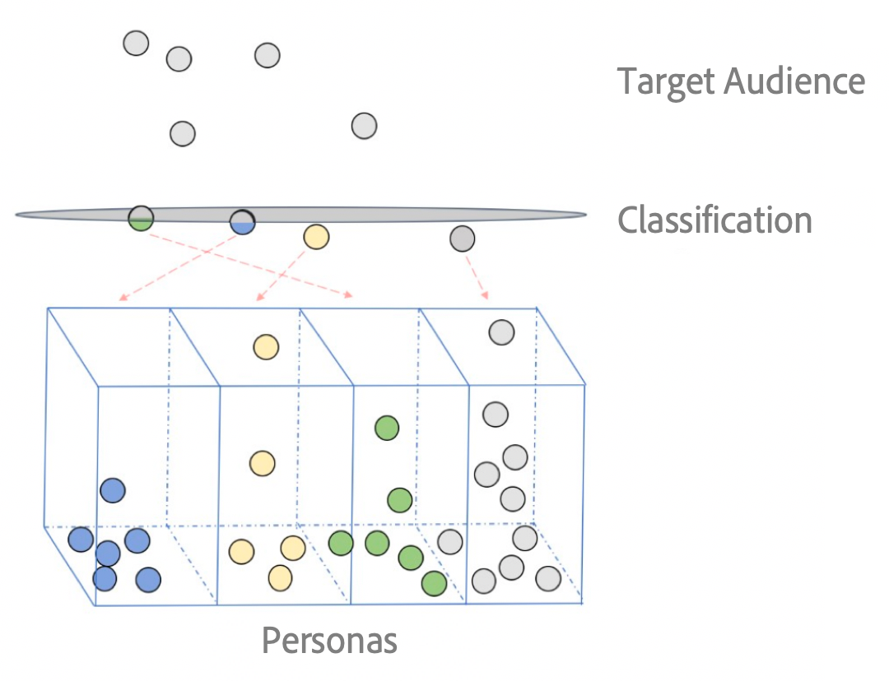

# [!UICONTROL Predictive Audiences] Panoramica {#predictive-audiences}

[!UICONTROL Predictive Audiences] consente di classificare un pubblico sconosciuto in persone distinte, in tempo reale, utilizzando tecniche avanzate di scienza dei dati.

>[!IMPORTANT]
>Questo articolo contiene la documentazione del prodotto destinata a guidarvi nella configurazione e nell&#39;utilizzo di questa funzione. Nulla di ciò è contenuto nella consulenza legale. Consulta il tuo consulente legale per ottenere assistenza legale.

 In un contesto di marketing, un utente tipo è un segmento di pubblico definito da visitatori, utenti o potenziali acquirenti che condividono un set specifico di caratteristiche come dati demografici, abitudini di navigazione, cronologia acquisti, ecc..

I modelli di [!UICONTROL Predictive Audiences] portano questo concetto a un livello successivo, consentendoti di utilizzare le funzionalità di machine learning di Audience Manager per classificare pubblici sconosciuti in utenti tipo distinti. Audience Manager ti consente di ottenere questo risultato calcolando la propensione del pubblico sconosciuto di prime parti per un set di pubblici noti di prime parti.

Quando create un [!UICONTROL Predictive Audiences] modello, il primo passo consiste nella scelta delle caratteristiche o dei segmenti di base per i quali desiderate classificare il pubblico di destinazione. Queste caratteristiche o segmenti definiranno le tue personalità.

Durante la fase di valutazione, il modello crea un nuovo [!UICONTROL Predictive Audiences] segmento per ogni caratteristica o segmento definito come linea di base. La volta successiva  Audience Manager vedrà un visitatore dal pubblico di destinazione che non è classificato per una persona (non era idoneo per nessuna delle caratteristiche o dei segmenti di base), il [!UICONTROL Predictive Audiences] modello determinerà a quale dei segmenti predittivi dovrebbe appartenere il visitatore e aggiungerà il visitatore a quel segmento.

Potete identificare i segmenti predittivi creati dal modello, nella [!UICONTROL Segments] pagina. Ogni [!UICONTROL Predictive Audiences] modello ha una propria cartella sotto la [!UICONTROL Predictive Audiences] cartella, e potete vedere i segmenti di ciascun modello facendo clic sulla cartella del modello.

## Casi d&#39;uso {#use-cases}

Per aiutarti a capire meglio come e quando potresti usare [!UICONTROL Predictive Audiences], ecco alcuni casi d’uso che  clienti del Audience Manager possono risolvere utilizzando questa funzione.

### Caso di utilizzo n. 1

In qualità di esperto di marketing in un&#39;azienda di e-commerce, voglio classificare tutti i visitatori Web e mobili in varie categorie di affinità del marchio, in modo da poter personalizzare la loro esperienza utente.

### Caso di utilizzo n. 2

In qualità di esperto di marketing in un&#39;azienda di media, voglio classificare i visitatori Web e mobili non autenticati in base ai generi preferiti, in modo da poter suggerire loro contenuti personalizzati su tutti i canali.

### Caso di utilizzo n. 3

In qualità di inserzionista per una compagnia aerea, voglio essere certo di classificare il mio pubblico in base al loro interesse per le destinazioni di viaggio, in modo da poter pubblicizzarlo in tempo reale, entro una breve finestra di retargeting.

### Caso di utilizzo n. 4

Come inserzionista, voglio classificare il mio pubblico di prime parti in tempo reale, in modo da poter reagire rapidamente alle notizie di tendenza.

### Caso di utilizzo n. 5

Come esperto di marketing, voglio prevedere in quale fase del percorso del cliente si trovano i visitatori del mio sito web, come scoperta, coinvolgimento, acquisto o conservazione, in modo da poterli indirizzare di conseguenza.

### Caso di utilizzo n. 6

Come azienda di media, voglio classificare il mio pubblico, in modo da poter vendere il mio spazio pubblicitario a prezzi vantaggiosi, offrendo al contempo ai miei visitatori annunci rilevanti.

## Come [!UICONTROL Predictive Audiences] funzionano i modelli {#how-predictive-audiences-models-work}

Quando create un [!UICONTROL Predictive Audiences] modello, potete eseguire tre passaggi:

1. Innanzitutto, selezionate almeno due caratteristiche o due segmenti che definiranno le vostre personalità.
1. Quindi, scegli una caratteristica o un segmento che definisca il pubblico di destinazione da classificare.
1. Infine, è possibile scegliere un nome per il modello, un&#39;origine dati che memorizzerà i segmenti predittivi e un nome [!UICONTROL Profile Merge Rule] per il modello.

### Criteri di selezione per le persone {#selection-personas}

Puoi scegliere una qualsiasi delle caratteristiche o dei segmenti di prime parti per definire le tue personalità. Tuttavia, per ottenere risultati ottimali, si consiglia di seguire una serie di procedure ottimali:

* Scegli le caratteristiche personali o i segmenti in modo che ogni persona abbia almeno un centinaio di ID dispositivo.
* Se le caratteristiche sono basate su ID cross-device, puoi racchiudere i segmenti con le regole [di unione](../profile-merge-rules/merge-rules-overview.md) profilo che utilizzano gli ID dispositivo, ad esempio [!UICONTROL Device Graph]. In questo modo, l&#39;algoritmo potrà acquisire una quantità sufficiente di ID  dispositivo.
* Consigliamo di scegliere caratteristiche o segmenti semplici per le vostre persone, composti da 1 a 3 caratteristiche.
* Scegliete caratteristiche o segmenti della linea di base con sovrapposizione minima.
* Accertatevi di acquisire caratteristiche granulari nelle proprietà digitali.

### Criteri di selezione per l&#39;audience di Target {#selection-audience}

Simile alla selezione di persona, è necessario scegliere il tipo [!UICONTROL trait] o [!UICONTROL segment] che definisce il pubblico di destinazione in modo che abbia utenti in tempo reale con set avanzati di [!UICONTROL traits], da classificare nel soggetto giusto.

Quando selezionate l&#39;audience di destinazione, analizzate il caso di utilizzo e stabilite i tipi di ID da classificare: [!UICONTROL device IDs] o [!UICONTROL cross-device IDs]. La [!UICONTROL Profile Merge Rule] scelta al momento della creazione del modello definisce i dati che verranno utilizzati per inserire ogni utente nel predittivo [!UICONTROL segments].

Come procedura ottimale, si consiglia di scegliere una configurazione [!UICONTROL Profile Merge Rule] con la stessa configurazione del pubblico di destinazione [!UICONTROL Profile Merge Rule], o una con il tipo di profilo (profilo dispositivo o profilo autenticato) del pubblico di destinazione.

### [!UICONTROL Predictive Audiences] Fase di formazione del modello {#model-training}

Prima che l&#39;algoritmo possa classificare il pubblico di prime parti nelle persone giuste, deve formarsi sui dati.

Per ogni persona definita dall&#39;utente, l&#39;algoritmo analizza il relativo pubblico e valuta qualsiasi attività relativa alle caratteristiche in tempo reale e/o registrate per i relativi utenti negli ultimi 30 giorni.
Questo passaggio ha luogo una volta ogni 24 ore, per tenere conto dei cambiamenti nel pubblico di prime parti.

### [!UICONTROL Predictive Audiences] Fase classificazione modello {#model-classification}

Quando un visitatore che fa parte del pubblico di destinazione viene visto in tempo reale, il modello valuta se il visitatore fa parte delle persone definite. Per ogni visitatore che non appartiene ad alcuna persona, il modello assegna un punteggio di qualifica personale.

Durante la valutazione dei tipi di pubblico di prime parti e l&#39;assegnazione dei punteggi, il modello utilizza il valore predefinito **[!UICONTROL Profile Merge Rule]** definito nel vostro account. Infine, il visitatore viene classificato nella persona per la quale ha ricevuto il punteggio più alto.

## Considerazioni e limitazioni {#considerations}

>[!IMPORTANT]
> Leggi attentamente questa sezione prima di passare alla fase di implementazione.

Durante la configurazione dei [!UICONTROL Predictive Audiences] modelli, tenere presente le considerazioni e le limitazioni seguenti:

* Puoi creare fino a 10 modelli [!UICONTROL Predictive Audiences]. 
* Per ciascun modello, potete scegliere fino a 50 tratti/segmenti di base.
* I dati di seconda e terza parte non sono attualmente supportati in [!UICONTROL Predictive Audiences].
* La classificazione dell&#39;audience viene effettuata solo per audience di prime parti in tempo reale. La classificazione dell&#39;audience di prime parti caricata potrebbe essere supportata in un aggiornamento futuro.
   >[!IMPORTANT]
   > Se aggiungete una caratteristica predittiva a un segmento regolare, questo diventa un segmento predittivo. Di conseguenza, tutti i profili associati non sono segmentati.

   >[!IMPORTANT]
   > Attualmente, i segmenti predittivi possono essere attivati solo in destinazioni in tempo reale. L&#39; [!UICONTROL Total Segment Population] e [!UICONTROL Addressable Audience] i segmenti predittivi sono visualizzati come 0, mentre i trasferimenti [di dati in uscita](../../integration/receiving-audience-data/batch-outbound-transfers/batch-outbound-overview.md) batch non sono supportati per [!UICONTROL Predictive Audiences]. Questo comportamento verrà modificato in un aggiornamento futuro.
* [!UICONTROL Predictive Audiences] esegue la classificazione dell&#39;audience in base alle caratteristiche di prime parti, da tutte le origini dati di prime parti.
* La valutazione dei segmenti per [!UICONTROL Predictive Audiences] utilizza le opzioni **[!UICONTROL Profile Merge Rule]** scelte durante la creazione del modello. Per ulteriori informazioni, [!UICONTROL Profile Merge Rules] consulta la [documentazione](../profile-merge-rules/merge-rules-overview.md)dedicata.
* Alcune caratteristiche e segmenti non sono supportati come linee di base o come audience di destinazione. [!UICONTROL Predictive Audiences] i modelli non verranno salvati quando si sceglie uno dei seguenti tipi di base o di pubblico target:
   * Caratteristiche predittive e segmenti creati con caratteristiche predittive;
   * [caratteristiche o segmenti Adobe Experience Platform](../integration/../../integration/integration-aep/aam-aep-audience-sharing.md) ;
   * caratteristiche algoritmiche;
   * Caratteristiche di seconda e terza parte.

## [!UICONTROL Data Export Controls] {#dec}

I segmenti predittivi creati dai [!UICONTROL Predictive Audiences] modelli ereditano i controlli [di esportazione dei](https://docs.adobe.com/content/help/en/audience-manager/user-guide/features/data-export-controls.html) dati dalle seguenti origini dati di prime parti:

1. L&#39;origine dati di prime parti scelta al momento della creazione del modello.
1. Le origini dati di prime parti del pubblico di destinazione. In modo specifico, i controlli per l&#39;esportazione dei dati dell&#39; [!UICONTROL traits] o [!UICONTROL segments] che costituiscono il pubblico di destinazione.
1. I controlli [di esportazione](https://docs.adobe.com/content/help/en/audience-manager/user-guide/features/data-export-controls.html) dei dati [!UICONTROL Profile Merge Rule] selezionati per il modello.

La nuova creazione predittiva [!UICONTROL traits] e [!UICONTROL segments] avrà le stesse restrizioni sulla privacy dell&#39;unione delle origini dati di prime parti descritte in precedenza.

Le caratteristiche con restrizioni aggiuntive che non fanno parte delle restrizioni sulla privacy del [!UICONTROL Predictive Audiences] segmento saranno escluse dalla fase di formazione e non diventeranno influenti per il modello.

## [!UICONTROL Profile Merge Rules] {#pmr}

A tutti i segmenti predittivi verrà assegnato quello [!UICONTROL Profile Merge Rule] selezionato al momento della creazione del modello. La scelta [!UICONTROL Profile Merge Rule] è importante per i seguenti motivi:

* Definisce quali dispositivi e/o profili autenticati devono essere presi in considerazione quando il modello analizza l&#39;influente [!UICONTROL traits], al momento di classificare un utente in un predicativo [!UICONTROL segment].
* Regola quali [!UICONTROL trait] tipi (livello dispositivo o livello cross-device) devono essere utilizzati durante la fase di formazione del modello e devono essere rivelati influenti [!UICONTROL traits]. Predictive [!UICONTROL segments] sono sottoinsiemi del pubblico di destinazione.
   * Se l&#39;audience di destinazione è un segmento, si consiglia di selezionare lo stesso [!UICONTROL Profile Merge Rule] per il modello di quello assegnato al pubblico di destinazione, o un [!UICONTROL Profile Merge Rule] che include il tipo di profilo del pubblico di destinazione.
   * Se l&#39;audience di destinazione è una [!UICONTROL trait], si consiglia di selezionare una [!UICONTROL Profile Merge Rule] che possa accedere allo stesso tipo di dati della caratteristica dell&#39;audience di destinazione (dati del profilo dispositivo o dati del profilo cross-device).

Selezionando un [!UICONTROL Profile Merge Rule] che utilizza sia i dati dispositivo che i dati cross-device, si ottiene il massimo numero di [!UICONTROL traits] dati utilizzabili per la formazione sui modelli e la classificazione degli utenti nel predictive [!UICONTROL segments].

## [!UICONTROL Role-Based Access Controls] {#rbac}

Le caratteristiche e i segmenti scelti per le persone e la classificazione dell&#39;audience sono soggetti  controlli [di accesso basati sul](https://docs.adobe.com/content/help/en/audience-manager/user-guide/features/administration/administration-overview.html)ruolo del Audience Manager.

 utenti di Audienci Manager possono selezionare solo caratteristiche o segmenti per le persone e i tipi di pubblico target, che dispongono dell&#39; [autorizzazione per visualizzare](https://docs.adobe.com/content/help/en/audience-manager/user-guide/features/administration/administration-overview.html#wild-card-permissions).
