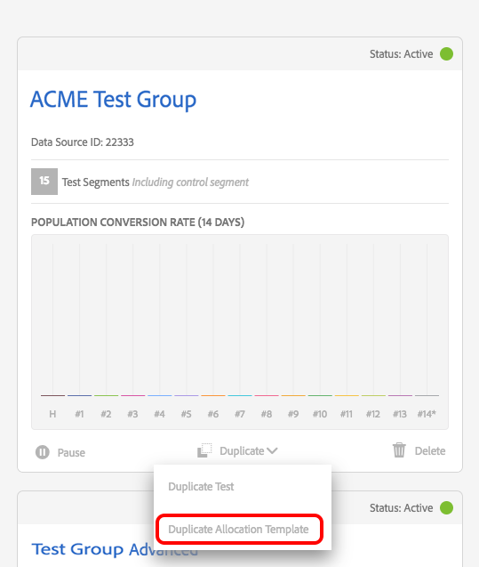

# [!DNL Audience Lab] Funzionalità avanzata  {#audience-lab-advanced-functionality}

Questo articolo descrive due funzioni che forniscono funzionalità avanzate per [!DNL Audience Lab]: [!DNL Duplicate Allocation Template] e [!DNL Segment Holdout].

## Modello di allocazione duplicato {#duplicate-allocation-template}

<!-- 

The <b>Allocation Template</b> represents how you split a test group into test segments and the way the test segments are mapped to destinations. 

 -->

In [!DNL Audience Lab], [!DNL Allocation Template] rappresenta le varie selezioni effettuate durante la creazione di un gruppo di test:

* La distribuzione dei dispositivi tra i segmenti di prova;
* La mappatura dei segmenti di test sulle destinazioni;
* Le caratteristiche di conversione utilizzate per un gruppo di test;
* L’intervallo di date in cui il gruppo di test pubblica nelle destinazioni selezionate.

Duplicando un modello di allocazione, puoi riutilizzare la stessa distribuzione di segmenti di test e destinazioni per un segmento di base diverso, in un nuovo gruppo di test. Di seguito è illustrato un esempio di modello di allocazione. L&#39;immagine viene presa dal passaggio [!UICONTROL Summary & Finalize] nel flusso di lavoro **Crea gruppo di test** .

<!--
With the option to duplicate allocation templates, you can increase your productivity when running multivariate tests as part of multivariate campaigns.
-->

### Utilizzo di un modello di allocazione duplicato

Crea un gruppo di test iniziale, quindi seleziona **[!UICONTROL Duplicate Allocation Template]** per riutilizzare le stesse impostazioni in più gruppi di test. Ad esempio, puoi utilizzare questa funzione se esegui un test in cui desideri determinare l’efficacia di diverse destinazioni per più segmenti.

1. Nella vista principale di Audience Lab, cerca il gruppo di test di cui desideri riprodurre il modello di allocazione in un nuovo gruppo di test. Nella casella a discesa , seleziona **[!UICONTROL Duplicate Allocation Template]**.

   

2. Nella procedura guidata [!UICONTROL Create Test Group] puoi specificare un segmento di base e rinominare i segmenti di test, se lo desideri.
3. *non è possibile* modificare:

   * La distribuzione dei dispositivi tra i segmenti di prova;
   * le caratteristiche di conversione;
   * Mappatura dei segmenti di test sulle destinazioni. Puoi compilare solo la chiave di mappatura, per le destinazioni che ne richiedono una.
   * L’intervallo di date in cui il gruppo di test eseguirà la pubblicazione nelle destinazioni selezionate.

4. Rivedi le informazioni aggiunte nei passaggi precedenti e seleziona **[!UICONTROL Finalize Group]**.

## Esclusione del segmento di test {#test-segment-holdout}

>[!NOTE]
>
>[!UICONTROL Test Segment Holdout] è una funzionalità avanzata attivata su richiesta del cliente. Contatta [!DNL Customer Care] o [!DNL Adobe Consulting] per attivare questa funzione.

Utilizza questa funzione per impedire che parte del pubblico venga inclusa nel test. La percentuale selezionata viene lasciata fuori dal test. In questo modo, puoi misurare e confrontare il numero di conversioni da tipi di pubblico di destinazione (attivati sulle destinazioni) e non di destinazione (gruppi di destinazione).

<!--

Note that this option is different to the control segment because it subtracts the percentage ................. You can withhold an audience group and still use a control segment. 

-->

### Utilizzo del blocco dei segmenti di test

1. Crea un nuovo gruppo di test utilizzando la procedura guidata [!UICONTROL Create Test Group].
1. Nel passaggio **[!UICONTROL Allocate Test Segment]** , puoi selezionare una parte del pubblico da escludere dal test.

   

1. Utilizzare il cursore per regolare quanti dispositivi si desidera tenere lontani dal test. Osserva come il segmento di test 1 e il segmento di test 2 ora rappresentano solo il 70% dei dispositivi totali.

   

1. Segui gli altri passaggi del flusso di lavoro **[!UICONTROL Create Test Group]** e seleziona **[!UICONTROL Finalize Group]** quando sei soddisfatto della selezione. Ora disponi di un gruppo di test con parte del pubblico che non è più disponibile ai test.
