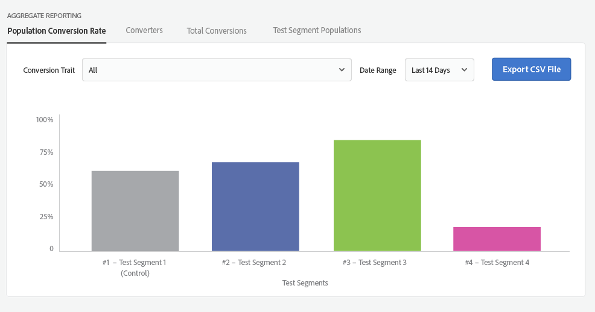
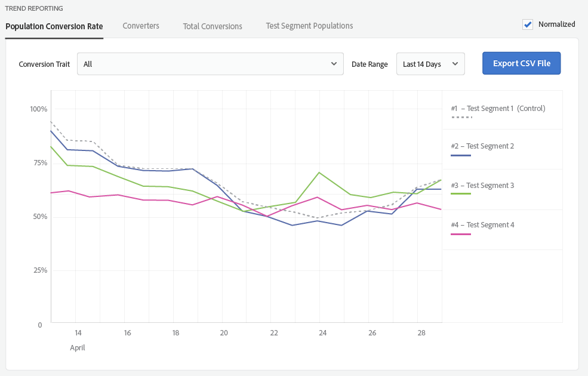

# Reporting sui gruppi di test {#test-group-reporting}

La sezione di reporting sul gruppo di test restituisce informazioni sulle conversioni del gruppo di test, consentendo un facile confronto dell&#39;efficacia del segmento di test. Per la visualizzazione dei dati sono disponibili numerosi filtri e dimensioni.

[!UICONTROL Audience Lab] restituisce informazioni di reporting dettagliate per i segmenti di test creati e consente di salvare i dati di reporting come file [!DNL CSV]. È possibile selezionare tra **[!UICONTROL Aggregate Reporting]** e **[!UICONTROL Trend Reporting]**.

**[!UICONTROL Aggregate Reporting]** restituisce i numeri assoluti per i segmenti di test. **[!UICONTROL Trend Reporting]** restituisce un grafico della tendenza *in un periodo specifico*. Quattro schede consentono di personalizzare i rapporti:

<table id="table_446384AE9A36408A9C570CB7DB72C3D6"> 
 <thead> 
  <tr> 
   <th colname="col1" class="entry"> Parametro </th> 
   <th colname="col2" class="entry"> Descrizione </th> 
  </tr> 
 </thead>
 <tbody> 
  <tr> 
   <td colname="col1"> 
 Tasso di conversione popolazione <b></b> 
 </td> 
   <td colname="col2"> 
Restituisce la percentuale di dispositivi appartenenti a un particolare segmento di test che sono stati convertiti. 
 </td> 
  </tr> 
  <tr> 
   <td colname="col1"> 
 <b> convertitori</b> 
 </td> 
   <td colname="col2"> 
Restituisce il numero di dispositivi che hanno presentato le caratteristiche di conversione selezionate nei gruppi di test. <a href="https://helpx.adobe.com/audience-manager/kt/using/creating-conversion-traits-feature-video-use.html" format="https" scope="external"> Guarda questo video</a> per scoprire come creare caratteristiche di conversione. 
 </td> 
  </tr> 
  <tr> 
   <td colname="col1"> 
 <b> conversioni totali</b> 
 </td> 
   <td colname="col2"> 
Restituisce il numero di conversioni generate dai segmenti di test. 
 </td> 
  </tr> 
  <tr> 
   <td colname="col1"> 
 <b> Popolazioni segmento di prova</b> 
 </td> 
   <td colname="col2"> 
Restituisce il numero di dispositivi appartenenti ai segmenti di test. Consente di passare da <b> popolazione totale</b> a <b> popolazione in tempo reale</b>. La differenza è spiegata nelle <a href="../../faq/faq-reporting.md"> Domande frequenti sul reporting</a>. 
 </td>
  </tr>
 </tbody>
</table>

Puoi selezionare una caratteristica di conversione specifica per la quale generare il rapporto oppure puoi selezionare tutte le caratteristiche combinate. È possibile definire un intervallo di date per il quale le informazioni devono essere restituite ed esportare il report come file [!DNL CSV].

>[!NOTE]
>
>* Il reporting per un gruppo di test verrà popolato il giorno successivo alla data di inizio.
>* Una conversione viene conteggiata solo per un dispositivo dopo la data di inizio di un test e dopo che il dispositivo è stato aggiunto a un segmento di test. Se si verifica una conversione per tale dispositivo prima che gli venga assegnato un gruppo di test, la conversione non verrà conteggiata.

Un grafico **[!UICONTROL Aggregate Reporting]** restituito potrebbe essere simile al seguente:

Un grafico **[!UICONTROL Trend Reporting]** restituito potrebbe essere simile al seguente. Selezionare **[!UICONTROL Normalized]** nella casella di controllo se si desidera ignorare i numeri assoluti e concentrarsi semplicemente sulle tendenze dei segmenti di test.

