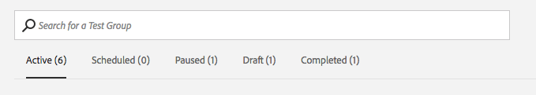

# [!UICONTROL Audience Lab] {#audience-lab}

Crea segmenti di test reciprocamente esclusivi in [!UICONTROL Segment Test Groups] per confrontare e misurare l’efficacia di destinazioni diverse. È possibile impostare un gruppo di controllo e dividere il segmento in percentuali di un intero, al fine di verificare l&#39;efficacia.

## Panoramica {#audience-lab-overview}

[!UICONTROL Audience Lab] utilizza  [il ](../../features/profile-merge-rules/merge-rules-overview.md) collegamento profilo per alimentare i test tra dispositivi. In questo modo un utente si qualifica per lo stesso segmento di test e riceve lo stesso trattamento tra i dispositivi. I segmenti di test nei gruppi di test erediteranno la [regola di unione profili](../../features/profile-merge-rules/merge-rules-dashboard.md) che il segmento di base gli è stato assegnato.

La visualizzazione predefinita [!UICONTROL Audience Lab] visualizza una scheda per ciascuno dei gruppi di test. Fai clic su una scheda per accedere alla visualizzazione **[!UICONTROL Test Group]**. Questa visualizzazione include le seguenti informazioni:

* **[Informazioni sui gruppi di test](../../features/audience-lab/audience-lab-information-view.md)**
* **[Reporting sui gruppi di test](../../features/audience-lab/audience-lab-reporting-view.md)**

Puoi creare **fino a 10 gruppi di test**, ciascuno con **fino a 15 segmenti di test**.

## Gruppi di test di ricerca e filtro {#search-and-filter}

Una volta avviata la creazione di più gruppi di test con più segmenti di test, potrebbe essere più semplice utilizzare la casella di ricerca per trovare un gruppo di test specifico. Puoi cercare un gruppo di test per:

* il nome del gruppo di prova;
* Nome di uno qualsiasi dei segmenti di test nel gruppo di test;
* Descrizione del gruppo di prova.

Puoi anche filtrare i gruppi di test per stato. Tutti gli stati disponibili sono descritti nella sezione [Stato](../../features/audience-lab/audience-lab.md#status) di seguito.

## [!UICONTROL Status] {#status}

Lo stato di un gruppo di test può essere attivo, pianificato, messo in pausa, bozza o completato. Ulteriori informazioni su ciascuno di essi nella tabella seguente:

<table id="table_7A0388BA02E045AC971C06A22DAC2C63"> 
 <thead> 
  <tr> 
   <th colname="col1" class="entry"> Stato </th> 
   <th colname="col2" class="entry"> Descrizione </th> 
  </tr> 
 </thead>
 <tbody> 
  <tr> 
   <td colname="col1"> 
 <b> Attivo </b> 
 </td> 
   <td colname="col2"> 
Un gruppo di test <i>attivo</i> indica che i dati sono attualmente inviati alle destinazioni. Premi <b> Sospendi test </b> nella scheda <b> Gruppo di test </b> per sospendere l’invio di dati alle destinazioni. 
 </td> 
  </tr> 
  <tr> 
   <td colname="col1"> 
 <b> Pianificato </b> 
 </td> 
   <td colname="col2"> 
Un gruppo di test <i>pianificato</i> non è ancora attivo ma non può più essere modificato. Diventerà attivo alla data di inizio selezionata nella procedura guidata <b>Crea gruppi di test</b>. 
 </td> 
  </tr> 
  <tr> 
   <td colname="col1"> 
 <b> In pausa  </b> 
 </td> 
   <td colname="col2"> 
Un gruppo di test <i>messo in pausa</i> al momento non invia dati alle destinazioni. Premi <b> Rendi attivo </b> nella scheda <b> Gruppo di test </b> per riprendere le caratteristiche di invio. 
 </td> 
  </tr> 
  <tr> 
   <td colname="col1"> 
 <b> Bozza </b> 
 </td> 
   <td colname="col2"> 
Un gruppo di test <i>bozza</i> non è ancora attivo e può essere modificato. Non invia ancora dati alle destinazioni mappate. 
 </td> 
  </tr> 
  <tr> 
   <td colname="col1"> 
 <b> Completato </b> 
 </td> 
   <td colname="col2"> 
Un gruppo di test <i>completato</i> ha raggiunto la data di fine selezionata nella procedura guidata <b> Crea gruppi di test </b> e ha interrotto l’invio dei dati di reporting. 
 </td>
  </tr>
 </tbody>
</table>

## [!UICONTROL Actions] {#actions}

<table id="table_481A411E2D2F4FE891595D00E775CF60"> 
 <thead> 
  <tr> 
   <th colname="col1" class="entry"> Azioni </th> 
   <th colname="col2" class="entry"> Descrizione </th>
  </tr>
 </thead>
 <tbody> 
  <tr> 
   <td colname="col1"> 
 <b> Modifica </b> 
 </td>
   <td colname="col2"> 
Disponibile <b>solo</b> per gruppi di test bozza. Consente di riprendere la procedura guidata <b> Crea nuovo gruppo di test </b>. 
 </td>
  </tr>
  <tr> 
   <td colname="col1"> 
 <b> Pausa  </b> 
 </td>
   <td colname="col2"> 
Disponibile per i gruppi di test attivi. Consente di mettere in pausa l’invio dei segmenti di test alle destinazioni. 
 </td>
  </tr>
  <tr> 
   <td colname="col1"> 
 <b> Rendi attivo  </b> 
 </td>
   <td colname="col2"> 
Disponibile per gruppi di test in pausa. Consente di riprendere l’invio dei segmenti di test alle destinazioni. 
 </td>
  </tr>
  <tr> 
   <td colname="col1"> 
 <b> Visualizzazione </b> 
 </td>
   <td colname="col2"> 
Disponibile per i gruppi di test completati. Consente di visualizzare le informazioni di reporting generate dal test. 
 </td>
  </tr>
  <tr> 
   <td colname="col1"> 
 <b> Duplica  </b> 
 </td>
   <td colname="col2"> 
Ti consente di creare un nuovo gruppo di test con la stessa configurazione di quello che stai duplicando. 
 </td>
  </tr>
  <tr> 
   <td colname="col1"> 
 <b> Elimina </b> 
 </td>
   <td colname="col2"> 
Consente di eliminare un gruppo di test. I segmenti di test non saranno mappati dalle destinazioni, il segmento della linea di base e le caratteristiche di conversione associate al gruppo di test sono completamente modificabili. Se lo desideri, viene richiesto di scaricare il file CSV quando elimini un gruppo di test per salvare il rapporto. 
 </td>
  </tr>
 </tbody>
</table>
