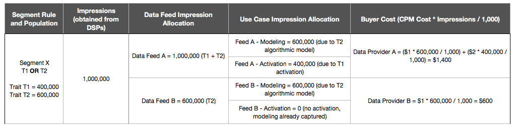

# Fatturazione per feed feed dati {#billing-for-data-feed-buyers}

Gli acquirenti di dati Audience Marketplace accettano di riportare tutte le ad impression servite utilizzando caratteristiche contenute nel feed di dati ridotto a una base costo per migliaia di impression ([!DNL CPM]). [!DNL CPM] l'utilizzo è previsto il 5 ° giorno di ogni mese del calendario e include dati per il mese precedente. Gli abbonati a tariffa fissa non devono utilizzare l'utilizzo del report.

  

## Come generare report sull'utilizzo CPM {#report-cpm-usage}

<!-- t_marketplace_report_cpm_usage.xml -->

[!UICONTROL Audience Marketplace] Gli acquirenti di dati accettano di riportare tutte le ad impression servite utilizzando caratteristiche contenute nel feed di dati a prezzi di base per migliaia di impressioni ([!DNL CPM]). [!DNL CPM] l'utilizzo scade il 5 giorno di ogni mese del calendario e include i dati per il mese precedente. Gli abbonati a tariffa fissa non devono utilizzare l'utilizzo del report.

[!UICONTROL Audience Marketplace] offre due modi per utilizzare [!DNL CPM] l'utilizzo:

* **Generazione di rapporti a livello di segmento**: questo è il metodo di generazione di rapporti [!DNL CPM] consigliato. Quando riporti [!DNL CPM] l'utilizzo a livello di segmento, la sezione di reporting a livello di feed dati viene compilata automaticamente con gli algoritmi di utilizzo corrispondenti, in base agli algoritmi descritti in [Attribuzione costi per feed dati CPM](#cost-attribution).
* **Rapporti a livello di feed di dati**: Questo metodo richiede di segnalare singolarmente [!DNL CPM] l'utilizzo per ogni feed di dati, in base agli algoritmi descritti in [Attribuzione costi per feed dati CPM](#cost-attribution). Tuttavia, questo metodo è più tedioso e si verifica un errore rispetto alla generazione di rapporti a livello di segmento.

  

## Report Utilizzo CPM a livello di segmento {#segment-level-report}

La [!UICONTROL Segment Usage] scheda consente di generare rapporti sull'utilizzo a livello di segmento, mostrando i segmenti raggruppati per le destinazioni a cui sono mappati.

Dopo aver utilizzato [!DNL CPM] il rapporto sul livello di segmento, [!UICONTROL Audience Marketplace] assegna automaticamente i dati corrispondenti, in base all'attribuzione [costi per i feed dati CPM](#cost-attribution).

Per generare un rapporto [!DNL CPM] sull'utilizzo a livello di segmento:

1. **[!UICONTROL Audience Marketplace > Payables]** Vai a.
2. Selezionare la **[!UICONTROL Segment Usage]** scheda.
3. Compilare l'utilizzo per i segmenti. Puoi utilizzare la [!UICONTROL Search] casella per filtrare i segmenti solo se hai bisogno di rapporti per alcuni di essi.
4. Fai clic su **[!UICONTROL Edit Segments Usage]**.
5. Inserite l'importo [!DNL CPM] di utilizzo nella [!UICONTROL Usage] colonna.
6. Fate clic **[!UICONTROL Save]** al termine e esaminate la finestra di dialogo di conferma.
   
7. Fai clic su **[!UICONTROL Confirm]**.

## Report Utilizzo CPM al livello feed dati {#feed-level-report}

Il reporting a livello di feed dati è un processo più tedioso e indirizzato a un processo, in quanto è necessario calcolare [!DNL CPM] singolarmente l'utilizzo per ogni feed di dati. Consigliamo di [riportare l'utilizzo CPM al livello](#segment-level-report) di segmento.

Per generare un rapporto [!DNL CPM] sull'utilizzo a livello di segmento:

1. **[!UICONTROL Audience Marketplace > Payables]** Vai a.
2. Selezionare la **[!UICONTROL Feed Usage]** scheda.
3. Utilizzate [!UICONTROL Search] la casella per filtrare i feed di dati e identificare quelli a cui dovete aggiungere dei rapporti.
4. Fai clic su **[!UICONTROL Edit Feeds Usage]**.
5. Calcola l [!DNL CPM] 'utilizzo per ogni feed di dati basato sull'attribuzione [costi per i feed](#cost-attribution)dati CPM e immetti nella [!UICONTROL Usage] colonna.
6. Fate clic **[!UICONTROL Save]** al termine e esaminate la finestra di dialogo di conferma.

   

7. Fai clic su **[!UICONTROL Confirm]**.

  

## Generazione di rapporti in massa

Per ridurre gli errori e il sovraccarico durante il reporting, [!DNL CPM] potete utilizzare l'opzione di generazione di rapporti in massa per scaricare un [!DNL CSV] file contenente feed di dati e segmenti, compilare l'uso e caricarlo nuovamente. [!DNL Audience Manager] Potete utilizzare la generazione di rapporti in blocco per riportare feed e utilizzo del segmento.

Per aggiornare [!DNL CPM] l'utilizzo in gruppo:

1. **[!UICONTROL Audience Marketplace > Payables]** Vai a.
1. Selezionate la **[!UICONTROL Feed Usage]****[!UICONTROL Segment Usage]** o la scheda, a seconda del tipo di rapporto che desiderate aggiornare.
1. Fate clic **[!UICONTROL Edit Feeds Usage]** o **[!UICONTROL Edit Segments Usage]**.
1. Fate clic su **[!UICONTROL download the current usage]** per usare un file CSV valido.
1. Aprite il file sul computer e compilate il rapporto sull'utilizzo.
1. Fate clic su **[!UICONTROL Choose a CSV file]** per caricare il rapporto sull'utilizzo aggiornato.

   

1. [!DNL Audience Manager] convalida il file non appena viene caricato e richiede se rileva eventuali errori presenti nel file.

  

### Errori di convalida in blocco

| Messaggio di errore | Descrizione | Correzione |
| ------------- | -------------| -----|
| Input non valido | [!DNL Audience Manager] rilevata una modifica nello schema [!DNL CSV] del file, ad esempio colonne mancanti o modifiche ai titoli delle colonne. | Evitare di modificare la struttura della tabella. |
| Non trovato | For [!UICONTROL Segment Level Reporting], [!DNL Audience Manager] impossibile identificare la combinazione [!UICONTROL Segment ID] e [!UICONTROL Destination ID] la combinazione. For [!UICONTROL Feed Level Reporting], [!DNL Audience Manager] impossibile identificare la [!UICONTROL Data Provider Name]combinazione, [!UICONTROL Feed Name]e [!UICONTROL Use Case] la combinazione. | Per [!UICONTROL Segment Level Reporting], verificate la validità della combinazione [!UICONTROL Segment ID] e [!UICONTROL Destination ID] della combinazione. Per [!UICONTROL Feed Level Reporting], verificate la validità della [!UICONTROL Data Provider Name], [!UICONTROL Feed Name]e [!UICONTROL Use Case] della combinazione. |
| Record duplicati trovati | [!DNL Audience Manager] rilevati record duplicati con valori di impression diversi. | Rivedete il rapporto e verificate di non aver segnalato valori di utilizzo diversi per lo stesso feed di dati o segmento. |
| Valori non supportati | [!DNL Audience Manager] rilevati valori non numerici nella [!DNL Audience Manager] colonna. | Controlla il rapporto e assicurati di immettere solo i valori numerici nella [!DNL Audience Manager] colonna. |
| Intestazioni per campi obbligatori mancanti | [!DNL Audience Manager] sono state rilevate intestazioni di tabella mancanti per campi obbligatori. Per [!UICONTROL Segment Level Reporting], i campi obbligatori sono: [!UICONTROL Segment ID][!UICONTROL Destination ID]. Per [!UICONTROL Feed Level Reporting], i campi obbligatori sono: [!UICONTROL Data Provider Name][!UICONTROL Data Feed Name], [!UICONTROL Use Case] | Controllare il rapporto e verificare che le intestazioni della tabella non siano state alterate. |

>[!NOTE]
>La rimozione delle righe dal rapporto [!DNL CSV] sull'utilizzo non ha alcun effetto sul rapporto sull'utilizzo esistente. [!DNL Audience Manager] elabora solo i campi inclusi nel rapporto.

  

## [!DNL CPM] Best practice per i rapporti

<table id="table_E68FA2130D1C495FAB8982DFB6A31FD9"> 
 <thead> 
  <tr> 
   <th colname="col1" class="entry"> Raccomandazioni </th> 
   <th colname="col2" class="entry"> Descrizione </th> 
  </tr>
 </thead>
 <tbody> 
  <tr> 
   <td colname="col1"> 
<b>Segnala sempre il numero totale di impression</b> 
 </td> 
   <td colname="col2"> 
Per i totali impression CPM: 

   
 Segnala il numero totale di impression, senza utilizzare i decimali. Audience Manager calcola automaticamente il CPM in base al numero totale di report.

Se hai bisogno di riportare 1,234,567 impression, segnalalo esattamente come. Non è necessario dividere il numero totale di impression per 1,000 per calcolare il CPM.

Le caratteristiche utilizzate per ottimizzare il contenuto Web o dell'app (ottimizzazione contenuto) mediante strumenti quali Adobe Target o una destinazione Analytics non contribuiscono ai totali d'uso per i piani CPM. I fornitori di dati vengono in genere compensati per l'ottimizzazione dei contenuti con piani a tariffa fissa.

Per <a href="#cost-attribution">ulteriori informazioni, consulta Attribuzione costi per feed</a> dati CPM. 
 </td>
  </tr>
  <tr> 
   <td colname="col1"> 
<b>Passa all'intervallo di reporting mensile</b> 
 </td> 
   <td colname="col2"> 
Il sistema di rapporti si chiude dopo il 5 di ogni mese. Se non riesci a generare un rapporto sull'utilizzo CPM per partire da quel momento, devi aggiungere tale importo al rapporto per il mese successivo. Ad esempio, supponiamo che a ottobre utilizzi 1000 impression, perderai la scadenza di reporting di ottobre e utilizzi 1000 impression a novembre. In questo caso, nel mese di dicembre, tra il 1 ° e il 5 ° settembre, segnalerete il totale di ottobre e di novembre (2000).

<b>Suggerimento</b>: Devi sempre tentare di riportare l'utilizzo CPM per il mese precedente tra il 1 ° e il 5 ° giorno del mese successivo.

Puoi riportare l'utilizzo CPM fino al 5 del nuovo mese di calendario, ma questo non è consigliato. La generazione di rapporti sull'utilizzo CPM prima del 5 di ogni mese fornisce ora di Audience Manager per controllare ed elaborare i dati.
 </td>
  </tr> 
 </tbody> 
</table>

  

## Attribuzione costi per feed dati CPM {#cost-attribution}

In ogni [!UICONTROL Audience Marketplace] mese, devi creare un rapporto sulle impression per ogni mese. Consigliamo di generare rapporti [!DNL CPM] sul livello di utilizzo a livello di segmento, in modo da effettuare automaticamente l'attribuzione costi.

<!-- marketplace_cpm_billing.xml -->

### Riepilogo fatturazione {#billing-summary}

È necessario inviare [!DNL CPM] importi di impression di feed dati tra il 1 ° e il 5 ° giorno di ogni mese del calendario. A questo scopo, ti consigliamo [di riportare l'utilizzo CPM a livello di segmento](#segment-level-report).

>[!TIP]
>Quando segnalate [!DNL CPM] l'utilizzo a livello di segmento, la sezione di reporting a livello di feed dati viene compilata automaticamente con gli importi di utilizzo corrispondenti.

Se necessario [!UICONTROL Report CPM Usage at Data Feed Level], dovete compilare singolarmente tutte le impression distribuite per ogni feed nel mese precedente, e generare rapporti in base all'allocazione di fatturazione descritta in questo articolo.

Dopo aver [!DNL CPM] impostato un numero per il mese precedente, [!DNL Adobe] effettua le seguenti operazioni:

* Create una fattura e fatturatela in base alla [!DNL CPM] frequenza di ciascun feed di dati sottoscritto.
* Paga i costi dei fornitori di dati (venditori) in base all'utilizzo indicato [!DNL CPM] .

>[!IMPORTANT]
>
>In qualità di acquirente, tutti i totali di impression segnalati devono essere true e precisi. Se non riesci a segnalare i totali delle impression entro il 5 di ogni mese, devi includere i totali per il mese non segnalato nel mese successivo.

  

## Assegnare impression a livello di feed in base alle regole di qualifica caratteristiche {#assign-impressions}

Il caso [!UICONTROL Activation] d'uso ti consente di utilizzare caratteristiche nel feed di dati corrispondente per creare segmenti in [Segment Builder](../../../features/segments/segment-builder.md#topic_E166819D26B94A868376BA54E10E4B74) (Generatore segmenti) e mappare tali segmenti su una destinazione. Gli operatori [!UICONTROL AND]booleani, [!UICONTROL OR]e [!UICONTROL NOT] consentono di impostare le condizioni per la caratteristica di caratteristica e segmento.

Quando [rapporti Utilizzo CPM al livello feed dati](#feed-level-report), devi allocare le impression proporzionalmente per ciascun feed di dati, in base agli [!DNL Boolean] operatori utilizzati nelle regole di qualificazione delle caratteristiche. Nella tabella seguente è indicato come allocare correttamente impression per regola booleana o per tipo di caratteristica.

>[!TIP]
>[Report Utilizzo CPM a livello segmento](#segment-level-report) per fare in modo che i rapporti sul livello di feed dati vengano inseriti automaticamente da Audience Manager.

<table id="table_BF00FE6740D2459DAFA62F2478492586"> 
 <thead> 
  <tr> 
   <th colname="col1" class="entry"> Logica o tipo di qualifica regola </th> 
   <th colname="col2" class="entry"> Distribuzione fatturazione </th> 
  </tr> 
 </thead>
 <tbody> 
  <tr> 
   <td colname="col1"> 
 AND 
 </td> 
   <td colname="col2"> 
Applica il 100% dei totali delle impression consegnati a tutte le caratteristiche del fornitore in un segmento basato su regole che utilizza una condizione  booleana AND . 
 </td> 
  </tr> 
  <tr> 
   <td colname="col1"> 
 OR 
 </td> 
   <td colname="col2"> 
Applica la ponderazione ponderata dei totali delle impression consegnati a tutte le caratteristiche del fornitore in un segmento basato su regole che utilizza una condizione OR booleana. L'allocazione ponderata viene calcolata utilizzando la formula seguente:

<code>(Popolazione caratteristica/Popolazione segmento) * Numero di impression * Costo di CPM</code>
 </td> 
  </tr>
  <tr> 
   <td colname="col1"> 
 NOT 
 </td> 
   <td colname="col2"> 
Applica il 100% dei totali delle impression consegnati a tutte le caratteristiche del fornitore in un segmento basato su regole che utilizza una condizione booleana  NOT . 
 </td> 
  </tr> 
  <tr> 
   <td colname="col1"> 
Segmenti algoritmici 
 </td> 
   <td colname="col2"> 
Applica il 100% dei totali delle impression consegnati a tutti i feed del fornitore in un segmento che contiene caratteristiche algoritmiche. 
 </td> 
  </tr>
 </tbody>
</table>

  

## Esempi di fatturazione {#billing-examples}

Gli esempi seguenti illustrano il modo in cui l'allocazione [!DNL CPM] di utilizzo viene realizzata al livello di feed di dati.

>[!IMPORTANT]
>Per far sì che questo processo venga eseguito automaticamente, [consigliamo di riportare l'utilizzo CPM al livello](#segment-level-report) segmento.

Prendiamo in considerazione il seguente scenario:

  

### Caso 1: Segmenti con regole di qualifica AND

Questo segmento contiene 3 caratteristiche da fornitori di dati separati. Poiché la qualifica del segmento è basata su una [!UICONTROL AND] condizione, i visitatori devono realizzare le caratteristiche da tutti e tre i feed per qualificarlo.

Con una [!UICONTROL AND] condizione, è necessario assegnare il 100% delle impression ricevute durante il mese a tutti e tre i fornitori di dati. Nella [!UICONTROL Audience Marketplace > Payables] sezione viene accreditato ogni fornitore con 1,000,000 impression.

Questo esempio si applica a segmenti che utilizzano [!DNL Boolean][!UICONTROL NOT] operatori o segmenti che contengono caratteristiche algoritmiche.

  

### Caso 2: Segmenti con regole di qualificazione OR

Questo segmento contiene 3 caratteristiche da fornitori di dati separati. Poiché la qualifica del segmento è basata su una [!UICONTROL OR] condizione, i visitatori devono realizzare almeno una delle tre caratteristiche per qualificarlo.

Non possiamo sapere a quale caratteristica è affidata un'impression perché la qualifica si basa su una [!UICONTROL OR] condizione. Come risultato, nella [!UICONTROL Audience Marketplace > Payables] sezione riconoscete ogni fornitore con un'allocazione ponderata delle impression totali, basate sulla popolazione di caratteristiche.

### Caso 3: Segmenti con casi di modellazione e attivazione

Questo esempio descrive l'attribuzione in base a due casi d'uso Feed dati - Modellazione e attivazione. Nell'esempio sono disponibili due fornitori di dati, con le seguenti informazioni:

Nella tabella successiva, Segmento X contiene due caratteristiche, T 1 e T 2, con la regola del segmento T 1 OR T 2, dove:

* T 1 è una caratteristica del feed dati A;
* T 2 è una caratteristica algoritmica progettata dopo tratti di terze parti da Feed dati A e Feed dati B.

Il segmento viene mappato a una destinazione e 1,000,000 impression vengono inserite per questo segmento in un mese, utilizzando [Reporting a livello di segmento](#segment-level-report).

Di queste 1,000,000 impression:

* T 1 rappresenta il 40% della popolazione dei segmenti, che converte 400,000 impression per Feed A.
* T 2 rappresenta il 60% della popolazione dei segmenti, che converte 600,000 impression per Feed A e Feed B.

A un livello di feed dati, il modo in cui le impression vengono allocate è:

* Feed Feed A riceve 600,000 impression dalla caratteristica T 2 (modellata sulle caratteristiche dei feed dati A e Feed dati B, in modo da ricevere entrambe le impression) e 400,000 impression da T 1 (che è una caratteristica di Feed di dati A), che totalizzano 1,000,000 impression.
* Feed dati B riceve 600,000 impression dalla caratteristica T 2 (vedere la spiegazione sopra) e 0 impression dalla caratteristica T 1.

La panoramica dettagliata per feed di dati e casi d'uso è la seguente:

  

## Fatturazione e allocazione impression per feed dati flat {#billing-flat-fee}

Un feed di dati a tariffa fissa addebita ogni mese un importo fisso, a prescindere dall'avvio dell'iscrizione o dal numero di impression utilizzate. Le tariffe non vengono suddivise in proporzione per uso mensile o intervalli. Come per la fatturazione CPM, Adobe genererà una fattura e la addebiterà al tasso mensile a tariffa fissa per i feed di dati iscritti.

Ad esempio, supponiamo che tu abbia deciso di attivare alcune caratteristiche in un feed a metà del mese. L'utente continuerà a essere addebitato sulla base della tariffa mensile, a prescindere dall'avvio della sottoscrizione o delle caratteristiche attivate.