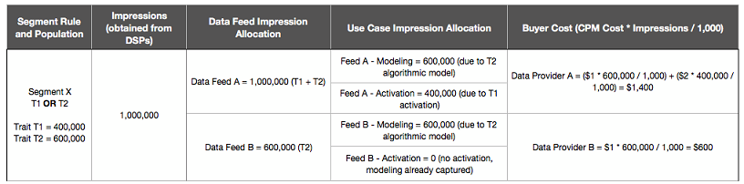

# Fatturazione per gli acquirenti di feed di dati {#billing-for-data-feed-buyers}

Gli acquirenti di dati di Audience Marketplace accettano di segnalare tutte le impression pubblicitarie servite utilizzando le caratteristiche contenute nel feed di dati al prezzo di un costo per migliaia di impression pubblicitarie ([!DNL CPM]). [!DNL CPM] La scadenza di utilizzo è il 5 di ogni mese di calendario e include i dati relativi al mese precedente. Gli abbonati con tariffa fissa non devono segnalare l’utilizzo.

  

## Come segnalare l’utilizzo di CPM {#report-cpm-usage}

<!-- t_marketplace_report_cpm_usage.xml -->

[!UICONTROL Audience Marketplace] gli acquirenti di dati accettano di segnalare tutte le impression pubblicitarie servite utilizzando le caratteristiche contenute nel feed di dati al prezzo di un costo per migliaia di impression pubblicitarie ([!DNL CPM]). [!DNL CPM] La scadenza di utilizzo è il 5 giorno di ogni mese di calendario e include i dati del mese precedente. Gli abbonati con tariffa fissa non devono segnalare l’utilizzo.

[!UICONTROL Audience Marketplace] offre due modi per generare rapporti [!DNL CPM] utilizzo:

* **Reporting a livello di segmento**: questo è il metodo consigliato [!DNL CPM] metodo di reporting sull’utilizzo. Quando esegui una segnalazione [!DNL CPM] utilizzo a livello di segmento, la sezione di reporting a livello di feed di dati viene compilata automaticamente con le quantità di utilizzo corrispondenti, in base agli algoritmi descritti in [Attribuzione costi per feed dati CPM](#cost-attribution).
* **Reporting a livello di feed dati**: questo metodo richiede di segnalare singolarmente il [!DNL CPM] per ogni feed di dati, in base agli algoritmi descritti in [Attribuzione costi per feed dati CPM](#cost-attribution). Tuttavia, questo metodo è più noioso e soggetto a errori rispetto al reporting a livello di segmento.

  

## Segnala l’utilizzo del CPM a livello di segmento {#segment-level-report}

Il [!UICONTROL Segment Usage] Questa scheda ti consente di segnalare l’utilizzo a livello di segmento, visualizzando al contempo i segmenti raggruppati per le destinazioni a cui sono mappati.

Dopo il reporting [!DNL CPM] utilizzo a livello di segmento, [!UICONTROL Audience Marketplace] assegna automaticamente ai feed di dati corrispondenti l’utilizzo corretto, in base al [Attribuzione costi per feed dati CPM](#cost-attribution).

Da segnalare [!DNL CPM] utilizzo a livello di segmento:

1. Vai a **[!UICONTROL Audience Marketplace > Payables]**.
1. Seleziona la **[!UICONTROL Segment Usage]** scheda.
1. Compila l’utilizzo per i segmenti. È possibile utilizzare [!UICONTROL Search] per filtrare i segmenti, se devi segnalare solo l’utilizzo di alcuni di essi.
1. Clic **[!UICONTROL Edit Segments Usage]**.
1. Inserisci il [!DNL CPM] quantità di utilizzo nel [!UICONTROL Usage] colonna.
1. Clic **[!UICONTROL Save]** al termine dell’operazione, controlla la finestra di dialogo di conferma.

   

1. Clic **[!UICONTROL Confirm]**.

Guarda anche il nostro video dimostrativo su come segnalare l’utilizzo a livello di segmento:

>[!VIDEO](https://video.tv.adobe.com/v/25522/)

 

## Segnala l’utilizzo del CPM a livello di feed dati {#feed-level-report}

La generazione di rapporti a livello di feed di dati è un processo più noioso e soggetto a errori, in quanto è necessario calcolare singolarmente [!DNL CPM] utilizzo per ogni feed di dati. Ti consigliamo di [Segnala l’utilizzo del CPM a livello di segmento](#segment-level-report) invece.

Da segnalare [!DNL CPM] utilizzo a livello di segmento:

1. Vai a **[!UICONTROL Audience Marketplace > Payables]**.
2. Seleziona la **[!UICONTROL Feed Usage]** scheda.
3. Utilizza il [!UICONTROL Search] per filtrare i feed di dati e identificare quelli per i quali è necessario segnalare l’utilizzo.
4. Clic **[!UICONTROL Edit Feeds Usage]**.
5. Calcola il [!DNL CPM] utilizzo per ogni feed di dati in base al [Attribuzione costi per feed dati CPM](#cost-attribution)e immetterlo nel [!UICONTROL Usage] colonna.
6. Clic **[!UICONTROL Save]** al termine dell’operazione, controlla la finestra di dialogo di conferma.

   

7. Clic **[!UICONTROL Confirm]**.

  

## Generazione rapporti in blocco

Per ridurre gli errori e il sovraccarico durante la generazione dei rapporti [!DNL CPM] utilizzo, puoi utilizzare l’opzione di reporting in blocco per scaricare un [!DNL CSV] file contenente i feed di dati e i segmenti, compila l’utilizzo e caricalo nuovamente su [!DNL Audience Manager]. Puoi utilizzare il reporting in blocco per segnalare sia l’utilizzo di feed che di segmenti.

Da aggiornare [!DNL CPM] utilizzo in blocco:

1. Vai a **[!UICONTROL Audience Marketplace > Payables]**.
1. Seleziona la **[!UICONTROL Feed Usage]** o **[!UICONTROL Segment Usage]** , a seconda del tipo di reporting che si desidera aggiornare.
1. Clic **[!UICONTROL Edit Feeds Usage]** o **[!UICONTROL Edit Segments Usage]**.
1. Clic **[!UICONTROL download the current usage]** per utilizzare un file CSV valido.
1. Apri il file sul computer e compila il rapporto di utilizzo.
1. Clic **[!UICONTROL Choose a CSV file]** per caricare il rapporto di utilizzo aggiornato.

   

1. [!DNL Audience Manager] convalida il file non appena viene caricato e richiede se vengono rilevati errori nel file.

  

### Errori di convalida della generazione di rapporti in blocco

| Messaggio di errore | Descrizione | Correzione |
| ------------- | -------------| -----|
| Input non valido | [!DNL Audience Manager] è stata rilevata una modifica in [!DNL CSV] schema di file, ad esempio colonne mancanti o modifiche ai titoli delle colonne. | Evita di modificare la struttura della tabella. |
| Non trovato | Per [!UICONTROL Segment Level Reporting], [!DNL Audience Manager] impossibile identificare il [!UICONTROL Segment ID] e [!UICONTROL Destination ID] combinazione. Per [!UICONTROL Feed Level Reporting], [!DNL Audience Manager] impossibile identificare il [!UICONTROL Data Provider Name], [!UICONTROL Feed Name], e [!UICONTROL Use Case] combinazione. | Per [!UICONTROL Segment Level Reporting], verifica la validità del [!UICONTROL Segment ID] e [!UICONTROL Destination ID] combinazione. Per [!UICONTROL Feed Level Reporting], verifica la validità del [!UICONTROL Data Provider Name], [!UICONTROL Feed Name], e [!UICONTROL Use Case] combinazione. |
| Record duplicati trovati | [!DNL Audience Manager] sono stati rilevati record duplicati con valori di impression diversi. | Esamina il rapporto e assicurati di non segnalare valori di utilizzo diversi per lo stesso feed di dati o segmento. |
| Valori non supportati | [!DNL Audience Manager] valori non numerici rilevati in [!DNL Audience Manager] colonna. | Esaminare il rapporto e assicurarsi di immettere solo valori numerici nel [!DNL Audience Manager] colonna. |
| Intestazioni per campi obbligatori mancanti | [!DNL Audience Manager] sono state rilevate intestazioni di tabella mancanti per i campi obbligatori. Per [!UICONTROL Segment Level Reporting], i campi obbligatori sono: [!UICONTROL Segment ID], [!UICONTROL Destination ID]. Per [!UICONTROL Feed Level Reporting], i campi obbligatori sono: [!UICONTROL Data Provider Name], [!UICONTROL Data Feed Name],  [!UICONTROL Use Case] | Esamina il rapporto e assicurati che le intestazioni della tabella non siano state manomesse. |

>[!NOTE]
>Rimozione di righe da [!DNL CSV] il rapporto di utilizzo non ha alcun effetto sul rapporto di utilizzo esistente. [!DNL Audience Manager] elabora solo i campi inclusi nel rapporto.

  

## [!DNL CPM] Best practice per la generazione di rapporti

<table id="table_E68FA2130D1C495FAB8982DFB6A31FD9"> 
 <thead> 
  <tr> 
   <th colname="col1" class="entry"> Raccomandazioni </th> 
   <th colname="col2" class="entry"> Descrizione </th> 
  </tr>
 </thead>
 <tbody> 
  <tr> 
   <td colname="col1"> 
<b>Segnala sempre il numero totale di impression</b> 
 </td> 
   <td colname="col2"> 
Per i totali delle impression CPM: 

   
 Segnala il numero totale di impression, senza l’utilizzo di decimali. Audience Manager calcola automaticamente il CPM in base al numero totale riportato.

Se devi segnalare 1.234.567 impression, segnalalo esattamente in questo modo. Per calcolare il CPM non è necessario dividere per 1.000 il numero totale di impression.

Le caratteristiche utilizzate per ottimizzare il contenuto web o dell’app (ottimizzazione del contenuto) utilizzando strumenti come Adobe Target o una destinazione di Analytics non contribuiscono ai totali di utilizzo per i piani CPM. I fornitori di dati ricevono in genere un compenso per l’ottimizzazione dei contenuti utilizzando piani tariffari fissi.

Consulta <a href="#cost-attribution">Attribuzione costi per feed dati CPM</a> per ulteriori informazioni. 
 </td>
  </tr>
  <tr> 
   <td colname="col1"> 
<b>Attieniti all’intervallo di reporting mensile</b> 
 </td> 
   <td colname="col2"> 
Il sistema di reporting viene chiuso dopo il 5 di ogni mese. Se non riesci a segnalare l’utilizzo di CPM entro tale data, devi aggiungere tale importo al rapporto per il mese successivo. Ad esempio, supponiamo che tu utilizzi 1000 impression in ottobre, che non rispetti la scadenza del reporting di ottobre e che utilizzi 1000 impression in novembre. In questo caso, si riporta il totale di ottobre e novembre (2000) in dicembre, tra il 1° e il 5.

<b>Suggerimento</b>: è sempre necessario provare a segnalare l’utilizzo di CPM per il mese precedente tra il primo e il quinto giorno del mese successivo.

È possibile segnalare l’utilizzo di CPM anche dopo il 5 del nuovo mese di calendario, ma questa operazione non è consigliata. La generazione di rapporti sull’utilizzo del CPM prima del 5 di ogni mese offre agli Audienci Manager il tempo di controllare ed elaborare i dati.
 </td>
  </tr> 
 </tbody> 
</table>

  

## Attribuzione costi per feed dati CPM {#cost-attribution}

In entrata [!UICONTROL Audience Marketplace] devi segnalare autonomamente gli importi delle impression ogni mese, per ciascuno dei tuoi segmenti. Consigliamo di generare rapporti [!DNL CPM] a livello di segmento, in modo che l’attribuzione dei costi venga eseguita automaticamente.

<!-- marketplace_cpm_billing.xml -->

### Riepilogo fatturazione {#billing-summary}

Devi inviare [!DNL CPM] le impression dei feed di dati sono comprese tra il primo e il quinto giorno di ogni mese di calendario. Per eseguire questa operazione correttamente, si consiglia di: [Segnala l’utilizzo del CPM a livello di segmento](#segment-level-report).

>[!TIP]
>Quando esegui una segnalazione [!DNL CPM] utilizzo a livello di segmento, nella sezione di reporting a livello di feed di dati vengono automaticamente inserite le quantità di utilizzo corrispondenti.

Dovresti [!UICONTROL Report CPM Usage at Data Feed Level], devi compilare singolarmente tutte le impression consegnate per ciascun feed nel mese di calendario precedente e segnalarle in base all’allocazione di fatturazione descritta in questo articolo.

Dopo la segnalazione [!DNL CPM] numero del mese civile precedente, [!DNL Adobe] eseguirà le operazioni seguenti:

* Creare una fattura e fatturarla in base al [!DNL CPM] tariffa per ciascun feed di dati sottoscritto.
* Paga le tariffe dei fornitori di dati (venditori) dovute in base al tuo segnalato [!DNL CPM] utilizzare.

>[!IMPORTANT]
>
>In qualità di acquirente, tutti i totali delle impression riportati devono essere veri e precisi. Se non riesci a segnalare i totali delle impression entro il 5° giorno di ogni mese, devi includere i totali per il mese non segnalato nel mese successivo.

  

## Assegnare impressioni a livello di feed in base alle regole di qualificazione delle caratteristiche {#assign-impressions}

Il [!UICONTROL Activation] caso d’uso consente di utilizzare le caratteristiche nel feed di dati corrispondente per creare segmenti in [Generatore di segmenti](../../../features/segments/segment-builder.md) e mappare tali segmenti su una destinazione. Operatori booleani [!UICONTROL AND], [!UICONTROL OR], e [!UICONTROL NOT] ti consente di impostare le condizioni per la qualifica di caratteristiche e segmenti.

Quando [Segnala l’utilizzo del CPM a livello di feed dati](#feed-level-report), è necessario allocare le impression in modo proporzionale per ogni feed di dati, in base al [!DNL Boolean] operatori utilizzati nelle regole di qualificazione delle caratteristiche. Nella tabella seguente viene illustrato come allocare correttamente le impression in base a una regola booleana o a un tipo di caratteristica.

>[!TIP]
>[Segnala l’utilizzo del CPM a livello di segmento](#segment-level-report) per fare in modo che la generazione rapporti a livello di feed dei dati venga eseguita automaticamente da Audience Manager.

<table id="table_BF00FE6740D2459DAFA62F2478492586"> 
 <thead> 
  <tr> 
   <th colname="col1" class="entry"> Logica o tipo di qualifica della regola </th> 
   <th colname="col2" class="entry"> Distribuzione fatturazione </th> 
  </tr> 
 </thead>
 <tbody> 
  <tr> 
   <td colname="col1"> 
 E 
 </td> 
   <td colname="col2"> 
Applica il 100% dei totali delle impression consegnate a tutte le caratteristiche del provider in un segmento basato su regole che utilizza un valore booleano  E condizione. 
 </td> 
  </tr> 
  <tr> 
   <td colname="col1"> 
 OPPURE 
 </td> 
   <td colname="col2"> 
Applica l’allocazione ponderata dei totali delle impression consegnate a tutte le caratteristiche del provider in un segmento basato su regole che utilizza una condizione booleana OR. L'allocazione ponderata viene calcolata utilizzando la seguente formula:

<code>(Trait Population / Segment Population) * Number of Impressions * Cost of CPM</code>
 </td> 
  </tr>
  <tr> 
   <td colname="col1"> 
 NOT 
 </td> 
   <td colname="col2"> 
Applica il 100% dei totali delle impression consegnate a tutte le caratteristiche del provider in un segmento basato su regole che utilizza un valore booleano  NOT condizione. 
 </td> 
  </tr> 
  <tr> 
   <td colname="col1"> 
Segmenti algoritmici 
 </td> 
   <td colname="col2"> 
Applica il 100% dei totali delle impression fornite a tutti i feed del provider in un segmento contenente caratteristiche algoritmiche. 
 </td> 
  </tr>
 </tbody>
</table>

  

## Esempi di fatturazione {#billing-examples}

Gli esempi seguenti illustrano come [!DNL CPM] l’allocazione dell’utilizzo viene eseguita a livello di feed dati.

>[!IMPORTANT]
>Ti consigliamo di [Segnala l’utilizzo del CPM a livello di segmento](#segment-level-report) affinché questo processo venga eseguito automaticamente.

Prendiamo in considerazione lo scenario seguente:

  

### Caso 1: segmenti con regole di qualificazione e

Questo segmento contiene 3 caratteristiche di fornitori di dati separati. Poiché la qualifica del segmento si basa su un [!UICONTROL AND] condizione, i visitatori devono realizzare le caratteristiche da tutti e tre i feed per qualificarsi per il segmento.

Con un [!UICONTROL AND] , è necessario assegnare il 100% delle impression ricevute durante il mese a tutti e tre i provider di dati. In [!UICONTROL Audience Marketplace > Payables] sezione, ad ogni fornitore vengono attribuite 1.000.000 impression.

Questo esempio si applica ai segmenti che utilizzano [!DNL Boolean] [!UICONTROL NOT] o per segmenti che contengono caratteristiche algoritmiche.

  

### Caso 2: segmenti con regole di qualificazione OR

Questo segmento contiene 3 caratteristiche di fornitori di dati separati. Poiché la qualifica del segmento si basa su un [!UICONTROL OR] condizione, i visitatori devono realizzare almeno una delle tre caratteristiche per qualificarsi per il segmento.

Non possiamo dire quale caratteristica è responsabile di un’impression perché la qualifica si basa su un [!UICONTROL OR] condizione. Di conseguenza, nella [!UICONTROL Audience Marketplace > Payables] sezione ogni fornitore viene accreditato con un’allocazione ponderata delle impression totali, in base alla popolazione delle caratteristiche.

  

### Caso 3: segmenti con casi di utilizzo di modellazione e attivazione

Questo esempio descrive l’attribuzione in base a due casi di utilizzo di feed dati: Modeling e Activation. Nell’esempio, vengono esaminati due fornitori di dati, con le seguenti informazioni:

Nella tabella seguente, il segmento X contiene due caratteristiche, T1 e T2, con la regola del segmento T1 o T2, dove:

* T1 è una caratteristica del feed di dati A;
* T2 è una caratteristica algoritmica modellata sulle caratteristiche di terze parti dai feed di dati A e B.

Il segmento è mappato su una destinazione e vengono immesse 1.000.000 impression per questo segmento in un mese, utilizzando [Generazione di rapporti a livello di segmento](#segment-level-report).

Di queste 1.000.000 impression:

* T1 rappresenta il 40% della popolazione del segmento, che si traduce in 400.000 impression per il feed A.
* T2 rappresenta il 60% della popolazione del segmento, che si traduce in 600.000 impression per Feed A e Feed B.

A livello di feed di dati, il modo in cui vengono allocate le impression è:

* Il feed di dati A riceve 600.000 impression dalla caratteristica T2 (modellata sulle caratteristiche dal feed di dati A e dal feed di dati B, in modo che entrambi ricevano le impression) e 400.000 impression dalla caratteristica T1 (una caratteristica dal feed di dati A), per un totale di 1.000.000 di impression.
* Il feed di dati B riceve 600.000 impression dalla caratteristica T2 (vedi spiegazione qui sopra) e 0 impression dalla caratteristica T1.

La suddivisione immediata per feed di dati e caso d’uso è la seguente:

>[!NOTE]
>
>Per il caso di utilizzo della modellazione, è necessario segnalare solo l’utilizzo di CPM al momento dell’attivazione. Se esegui solo un modello ma non lo attivi, non è necessario alcun rapporto sull’utilizzo.

  

## Allocazione fatturazione e impression per feed di dati a tariffa fissa {#billing-flat-fee}

Un feed di dati a canone fisso ti fattura un importo fisso ogni mese, indipendentemente da quando inizia l’abbonamento o dal numero di impression utilizzate. Le tariffe non vengono ripartite proporzionalmente per l&#39;utilizzo o gli intervalli di mesi parziali. Come per la fatturazione CPM, Adobe genera una fattura e la fattura alla tariffa mensile forfettaria per i feed di dati sottoscritti.

Ad esempio, supponiamo che tu abbia deciso di attivare alcune caratteristiche in un feed a metà mese. Verrai comunque fatturato alla tariffa piena mensile indipendentemente da quando hai iniziato l’abbonamento o hai attivato caratteristiche specifiche.
