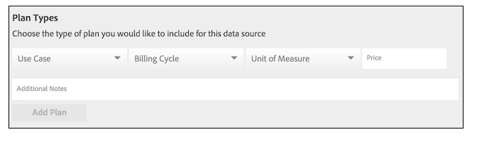

# Creazione, prezzo e gestione dei feed dati {#create-price-and-manage-data-feeds}

Un feed di dati richiede un nome, una descrizione, un&#39;origine dati e un tipo di piano. I feed sono disattivati finché non salvate e attivate il feed. Configurare feed di dati pubblici o privati in [!UICONTROL Audience Marketplace] &gt; [!UICONTROL My Shared Data]. Disponibile solo per i venditori di dati.

## Creare un feed dati pubblico o privato {#create-public-private-data-feed}

Un feed di dati richiede un nome, una descrizione, un&#39;origine dati e un tipo di piano. I feed sono disattivati finché non salvate e attivate il feed. Configurare feed di dati pubblici o privati in **[!UICONTROL Audience Marketplace > My Shared Data]**. Disponibile solo per i venditori di dati.

<!-- t_data_feed.xml -->

Per creare un feed di dati pubblico o privato dovete disporre dei diritti di amministratore.
Per creare un feed di dati:

1. Fai clic su **[!UICONTROL New Data Feed]**.
1. Denominate il feed di dati. Gli acquirenti di dati possono cercare i feed in base al nome.
1. Fornite una breve descrizione (massimo 255 caratteri).

   Una buona descrizione dovrebbe descrivere il feed con precisione. Ad esempio, potete includere testo per categorie di marketing, elementi demografici e copertura geografica (ad es. [!DNL US] o Nord America). Il testo descrittivo è ricercabile e aiuta gli acquirenti a trovare o valutare il feed. Una buona descrizione è una parte importante dell&#39;attirare gli abbonati al feed di dati.
1. Selezionate un&#39;origine dati dalle **[!UICONTROL Data Source]** opzioni.

   >[!IMPORTANT]
   >
   >Tutte le caratteristiche correnti e future che appartengono a questa origine dati saranno condivise con gli acquirenti di dati, come parte di questo feed.

1. In [!UICONTROL Plan Types], selezionate le opzioni da utilizzare e fate clic **[!UICONTROL Add Plan]** su.

   I feed possono contenere più piani. I piani possono contenere più casi d&#39;uso. Per informazioni dettagliate, consultate [Tipi di pianificazione per feed dati](../../../features/audience-marketplace/marketplace-data-providers/marketplace-create-manage-feeds.md#plan-types).

1. Fai clic su **[!UICONTROL Save]** per salvare la tariffa *dati senza* attivarla.
1. Per salvare e attivare un feed di dati:
   1. Spostare il **[!UICONTROL Availability]** cursore in **[!UICONTROL Active]**.
   1. Fai clic su **[!UICONTROL Save]**.
   >[!NOTE]
   >
   >* I feed di dati salvati e attivati non possono essere eliminati.
   >* Gli acquirenti possono vedere solo i feed attivi.

### Facoltativo: Creare un feed dati privato

Nella [!UICONTROL Settings] sezione, spostate il cursore su:

* **[!UICONTROL Private]** e **[!UICONTROL Branded]**: L&#39; [!UICONTROL Marketplace] elenco dell&#39;acquirente mostra il nome del venditore nella colonna del fornitore e tutti gli altri dati sono nascosti.

* **[!UICONTROL Private]** e **[!UICONTROL Unbranded]**: [!UICONTROL Marketplace] L&#39;elenco dell&#39;acquirente mostra solo il nome del feed dati e la descrizione. Il nome del provider di dati viene visualizzato come [!UICONTROL Private Seller].

Per vedere l&#39;aspetto di un feed privato agli acquirenti, consulta la sezione degli acquirenti in [Feed dati privati](../../../features/audience-marketplace/marketplace-private-feeds.md).

>[!MORE_ LIKE_ THIS]
>
>* [Feed dati privati](../../../features/audience-marketplace/marketplace-private-feeds.md)

## Disattivazione dei feed dati di un abbonato {#deactivate-data-feed}

In qualità di provider [!UICONTROL Audience Marketplace] di dati, puoi revocare l&#39;accesso degli acquirenti a un feed di dati sottoscritto. Potrebbe essere utile rimuovere un acquirente da un feed per motivi quali pagamento o mancato pagamento delle tariffe o se utilizzano dati di caratteristica non corretti.

<!-- marketplace-deactiva4te-subscribers.xml -->

Per revocare un utente iscritto:

1. In [!UICONTROL My Shared Data], trova il feed utilizzato dall&#39;utente iscritto.

   >[!NOTE]
   >
   >I feed di dati con account in ritardo sono contrassegnati con un&#39;icona triangolare/esclamativo.

1. Nella [!UICONTROL Subscribers] colonna, fai clic sul numero blu che conta gli abbonati per quel feed. Viene aperta la pagina dei dettagli iscrizione.
1. Spostare il **[!UICONTROL Subscription]** cursore in **[!UICONTROL Off]**. Viene aperta una finestra di dialogo di conferma.
1. [!UICONTROL Confirmation] A questo punto, fate clic su **[!UICONTROL Yes]** per disattivare un abbonamento o **[!UICONTROL Cancel]** uscire senza apportare modifiche di iscrizione.

### Cosa accade dopo la disattivazione di un utente iscritto

La revoca dell&#39;accesso a un feed di dati invia un messaggio e-mail a tutti gli utenti dell&#39;amministratore nell&#39;account dell&#39;acquirente dati. Il messaggio e-mail contiene un allegato in cui sono elencate le caratteristiche revocate. Questo elenco consente agli utenti iscritti di trovare e rimuovere tratti disattivati dai propri segmenti e modelli.

### Fatturazione e disattivazione feed

Dopo aver rimosso l&#39;accesso a un feed di dati, gli utenti iscritti sono responsabili delle tariffe relative al mese precedente o in corso, a seconda di quando è stato disattivato il feed.

## Tipi di pianificazione per feed dati {#plan-types}

[!DNL Plan types] sono componenti essenziali in un [!UICONTROL Audience Marketplace] feed di dati. In qualità di fornitore di dati, puoi creare più casi di utilizzo e opzioni relative ai prezzi per i feed. Inoltre, può essere una strategia valida per creare alcuni piani per ogni feed di dati. In questo modo, gli acquirenti possono scegliere diverse opzioni da quando desiderano visualizzare i dati o inviarli a una destinazione.

[Creare un feed di dati](../../../features/audience-marketplace/marketplace-data-providers/marketplace-create-manage-feeds.md#create-public-private-data-feed) da selezionare [!UICONTROL Plan Types].

## Tipi di piani e opzioni caso d&#39;uso {#plan-types-use-cases}

<!-- c_feed_options.xml -->

[!UICONTROL Use Case] Le impostazioni consentono ai venditori di controllare in che modo gli acquirenti possono utilizzare i dati.

### Segmenti e sovrapposizione

Un caso **[!UICONTROL Segments and Overlap]** d&#39;uso crea un piano che consente agli acquirenti di confrontare i dati delle caratteristiche in un [rapporto di sovrapposizione caratteristica-caratteristica](../../../reporting/dynamic-reports/trait-trait-overlap-report.md#trait-to-trait-overlap-report). Inoltre, gli acquirenti possono aggiungere i dati ai segmenti ed eseguire confronti con i [report segmento-to-trait](../../../reporting/dynamic-reports/segment-trait-overlap-report.md) e [segmento-to-segmento](../../../reporting/dynamic-reports/segment-segment-overlap-report.md) .

Ogni feed di dati deve includere almeno un [!UICONTROL Segments and Overlap] caso d&#39;uso. Gli acquirenti non possono iscriversi ad altri piani in un feed di dati se il feed non contiene un caso [!UICONTROL Segments and Overlap] d&#39;uso, singolarmente o in combinazione con un altro caso d&#39;uso.

I confronti di sovrapposizione possono aiutare gli acquirenti:

* **Ampliare la portata dell&#39;audience:** La sovrapposizione Bassa suggerisce che le caratteristiche contengano utenti che l&#39;acquirente non ha visto prima. Di conseguenza, gli acquirenti potrebbero desiderare che queste caratteristiche aggiungano nuovi utenti ai loro segmenti di pubblico.
* **Ottimizzazione dell&#39;audience esistente:** La sovrapposizione alta suggerisce che le caratteristiche contengano utenti simili a quelli già noti a un acquirente. Di conseguenza, gli acquirenti potrebbero desiderare di utilizzare queste caratteristiche per aiutare a apportare miglioramenti mirati e incrementali al pubblico sviluppato.

Prezzo di questo esempio di utilizzo:

* Unità di misura: Tariffa flat
* Prezzo: Gratuito ($ 0.00)

### Modellazione

Un caso **[!UICONTROL Modeling]** d&#39;uso crea un piano che consente agli acquirenti di confrontare le caratteristiche con la modellazione [algoritmica](../../../features/algorithmic-models/understanding-models.md#understanding-models). Gli acquirenti guardano i risultati del modello per trovare nuovi tipi di pubblico nei dati che condividono attributi di conversione simili. Prezzo di questo esempio di utilizzo:

* Unità di misura: Tariffa flat
* Prezzo: Prezzo scontato o prezzo di mercato

### Activation

Un caso **[!UICONTROL Activation]** d&#39;uso consente agli acquirenti di inviare dati a [una destinazione](../../../features/destinations/destinations.md). Con questo caso d&#39;uso, gli acquirenti non possono confrontare i dati con un rapporto di sovrapposizione o con un modello algoritmico. Prezzo di questo esempio di utilizzo:

* Unità di misura: [!DNL CPM]
* Prezzo: [!DNL CPM] tasso di mercato

## Opzioni di fatturazione e prezzi {#billing}

Le opzioni di fatturazione e prezzo controllano in che modo gli acquirenti pagano i dati.

<table id="table_CCEAAF24295942EA82F20753827D1A23"> 
 <thead> 
  <tr> 
   <th colname="col1" class="entry"> Opzione </th> 
   <th colname="col2" class="entry"> Descrizione </th>
  </tr> 
 </thead>
 <tbody> 
  <tr> 
   <td colname="col1"> <b> Ciclo di fatturazione</b> </td> 
   <td colname="col2"> <b> Mensile in Mora</b> è l'unica opzione. Il ciclo di fatturazione termina il 10 di ogni mese. </td> 
  </tr> 
  <tr> 
   <td colname="col1"> <b> Unità di misura</b> </td> 
   <td colname="col2">Addebitare gli acquirenti di dati a una tariffa CPM o a una tariffa semplice. 
    <ul id="ul_D5F125E0F7364C568D9F3107E090059D"> 
     <li id="li_A79F47FFC1DC4B9DADC014621A9C12A1"> Con prezzi CPM, gli acquirenti di dati sono necessari per l'uso autonomo. </li> 
     <li id="li_DFED3194854A492F9DD0E7BA1A655E96">Prezzi con tariffe piatte, gli acquirenti di dati non vengono utilizzati per il report perché vengono addebitati una tariffa fissa. </li> 
    </ul> </td>
  </tr> 
  <tr> 
   <td colname="col1"> <b> Prezzo</b> </td>
   <td colname="col2"> Importo addebitato dal venditore come prezzo CPM o prezzo tariffa semplice, in dollari. </td>
  </tr> 
 </tbody> 
</table>

## Note sul piano {#plan-notes}

Nel **[!UICONTROL Additional Notes]** campo, dedica un po&#39; di tempo a descrivere ogni piano dati in un feed. Una breve descrizione dettagliata aiuta gli acquirenti a capire il contenuto o lo scopo di ogni piano in un feed di dati. Gli acquirenti possono leggere feed di dati e descrizioni pianificate durante la ricerca o la valutazione di nuove origini dati.

## Gestire le richieste di feed dati privati {#manage-private-requests}

Flussi di lavoro fornitori per la gestione delle richieste di feed private dagli acquirenti.

Per esaminare, approvare o rifiutare le richieste dell&#39;acquirente, vai a [!UICONTROL My Shared Data] e:

<!-- t_private_feed_workflows.xml -->

1. Fai clic sul nome del feed di dati privato.
2. Fai clic su **[!UICONTROL Access Requests]** per rivedere tutti gli acquirenti che desiderano accedere al feed di dati.
3. Nella [!UICONTROL Allow Access] sezione di ogni casella di richiesta, fate clic sul segno di spunta per approvare una richiesta o sulla X per negare l&#39;accesso.
4. Conferma o annulla l&#39;azione selezionata nel popup di conferma.

>[!MORE_ LIKE_ THIS]
>
>* [Feed dati privati](../../../features/audience-marketplace/marketplace-private-feeds.md)

## Sconti per i fornitori di dati {#discounts}

In [!UICONTROL Audience Marketplace], gli sconti consentono di ridurre il prezzo pubblicato di un feed di dati per i singoli abbonati. Potete offrire sconti agli utenti iscritti che hanno inviato una richiesta di iscrizione o agli abbonati che hanno richiesto dettagli su un feed di dati. Si applicano sconti [!DNL CPM] a feed di rate flat. Gli sconti possono essere utili quando desideri fornire incentivi di iscrizione per nuovi clienti o per premiare la fidelizzazione dei clienti.

## Applicazione di sconti a un feed dati {#apply-discounts}

<!-- marketplace-seller-discounts.xml -->

Per sconto su un feed, aggiungi un importo di sconto come % al campo sconto e conferma le modifiche. I fornitori di dati possono utilizzare uno sconto su feed di dati in [!UICONTROL Audience Marketplace] :

* **[!UICONTROL My Shared Data > Potential Subscribers]**
* **[!UICONTROL My Shared Data > Details Requests]**

In questi esempi, il venditore ha aggiunto il 10% sconto al feed [!UICONTROL Software Audience] di dati.

## Revisione dei feed scontati {#review-discounted-feeds}

I fornitori di dati possono vedere tutti gli abbonati e i feed scontati in **[!UICONTROL Audience Marketplace > My Shared Data > Current Subscribers]**.

