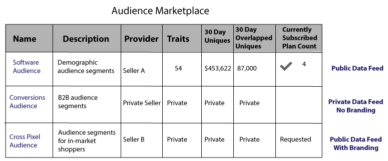

# Audience Marketplace per provider di dati {#audience-marketplace-for-data-providers}

Panoramica e flusso di lavoro per i provider di dati che desiderano vendere dati da [!DNL Audience Manager].

<!-- c_marketplace_provider.xml -->

>[!NOTE]
>
>[Le ](../../../reporting/reports-dashboard.md) autorizzazioni basate sul ruolo controllano l’accesso alle  [!UICONTROL Audience Marketplace] funzioni.
>
>* Gli amministratori possono creare feed di dati, gestire gli abbonati e abbonarsi ai feed di dati.
>* Gli utenti possono cercare e visualizzare solo i feed.

## Dati personali condivisi: Informazioni su {#my-shared-data-about}

[!UICONTROL My Shared Data] è una  [!UICONTROL Audience Marketplace] funzionalità per i provider di dati (venditori). In qualità di fornitore, ti consente di raggruppare le caratteristiche in feed di dati e di venderle a pagamento o a [!DNL CPM] tasso agli acquirenti entro [!DNL Audience Manager]. Una volta attivato, gli acquirenti possono iscriversi a un feed con pochi clic del mouse. Inoltre, semplici strumenti di reporting registrano le entrate e gestiscono gli abbonati. Infine, con [!UICONTROL Audience Marketplace], [!DNL Adobe] si occupa di pagamenti relativi a fatture, fatturazione e tariffe. Queste funzioni consentono di concentrarsi sulla creazione di feed di dati efficaci e redditizi che gli acquirenti desiderano.

<!-- c_myshared_data.xml -->

Le funzioni includono:

* **Ricerca:** i campi di ricerca consentono di trovare feed di dati per nome o per descrizione del testo.
* **Nome:** il nome del feed di dati. Puoi nasconderlo agli acquirenti con un feed di dati privato e senza marchio.
* **Descrizione:** informa gli acquirenti del contenuto del feed di dati.
* **Caratteristiche:** il numero di caratteristiche in ciascun feed di dati. Puoi nasconderlo agli acquirenti con un feed di dati privato.
* **Ultimi 30 giorni di analisi:** il numero di utenti univoci visti negli ultimi 30 giorni. Puoi nasconderlo agli acquirenti con un feed di dati privato.
* **Tariffe totali del mese scorso:** L&#39;importo sottoscritto gli acquirenti di dati vi devono. Il periodo di reporting termina il 10 di ogni mese. Gli account scaduti vengono contrassegnati con l&#39;icona del triangolo/punto esclamativo. Puoi [disattivare il feed dati di un utente iscritto](../../../features/audience-marketplace/marketplace-data-providers/marketplace-create-manage-feeds.md#deactivate-data-feed) se utilizza in modo improprio i tuoi dati o se il suo account è scaduto.
* **Stato:**  mostra se un feed è attivo, inattivo, privato o pubblico.
* **Sottoscrittori:** mostra quanti acquirenti utilizzano un feed di dati. Fai clic sul numero in questa colonna per visualizzare il nome società, gli abbonamenti, la fatturazione e lo stato di abbonamento di un acquirente.
* **Richieste:** il numero di richieste di accesso per un feed di dati.

## Feed di dati privati {#private-data-feeds}

In [!UICONTROL My Shared Data], a volte lo stato di un feed è contrassegnato come privato. Indica un feed di dati privato. Un feed di dati privato consente ai venditori di limitare l’accesso dell’acquirente ai propri dati e persino al nome del feed di dati. I venditori possono rendere i feed privati quando offrono offerte speciali, sconti o quando la privacy e il controllo degli accessi sono importanti. Con i feed di dati privati, i fornitori rivedono e approvano tutte le richieste di accesso degli acquirenti. Per ulteriori informazioni, consulta [Feed dati privati](../../../features/audience-marketplace/marketplace-private-feeds.md). Per creare un feed di dati pubblico o privato, consulta [Creare un feed di dati pubblico o privato](../../../features/audience-marketplace/marketplace-data-providers/marketplace-create-manage-feeds.md#create-public-private-data-feed).

>[!MORELIKETHIS]
>
>* [Sconti per provider di dati](../../../features/audience-marketplace/marketplace-data-providers/marketplace-create-manage-feeds.md#discounts)

