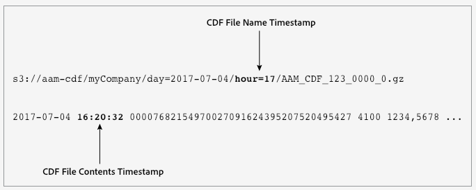

# Feed dati cliente {#customer-data-feeds}

Informazioni di base su [!UICONTROL Customer Data Feed] ([!UICONTROL CDF]) file e istruzioni su come iniziare. Iniziate qui se siete interessati a ricevere [!UICONTROL CDF] i file o solo a desiderate ulteriori informazioni.

## Contenuto e scopo del file {#file-contents-purpose}

<!-- cdf-intro.xml -->

Un [!UICONTROL CDF] file contiene gli stessi dati inviati da una [!DNL Audience Manager] chiamata di evento ( `/event`) ai server. Ciò include dati come ID utente, ID caratteristica, ID segmento e tutti gli altri parametri acquisiti da una chiamata dell&#39;evento. I sistemi interni [!DNL Audience Manager] elaborano i dati dell&#39;evento in un [!UICONTROL CDF] file con contenuto organizzato in campi che vengono visualizzati in un ordine impostato. [!DNL Audience Manager] tenta di generare [!UICONTROL CDF] i file oraria e li memorizza in un bucket sicuro per un cliente su un [!DNL Amazon S3] server. Questi file consentono di lavorare con [!DNL Audience Manager] i dati oltre i limiti imposti dall&#39;interfaccia utente.

>[!NOTE]
>
>Non devono essere utilizzati [!UICONTROL CDF] come proxy per monitorare il traffico delle pagine, conciliare discrepanze dei report, o fatturazione, ecc.

## Introduzione {#getting-started}

Non esiste un processo self-service per avviare [!UICONTROL CDF] la distribuzione dei file. Contatta il [!DNL Audience Manager] tuo consulente o l&#39;Assistenza clienti per iniziare. Durante l&#39;implementazione, il [!DNL Audience Manager] rappresentante sarà in grado di:

* Configurate il [!DNL Amazon S3] bucket dell&#39;archiviazione.
* Fornire le credenziali [!DNL S3] di autenticazione in sola lettura al bucket dell&#39;archivio del file. Non potrete visualizzare o accedere a directory e file appartenenti ad altri clienti.

Le notifiche e [!UICONTROL CDF] i file dei file compariranno nel [!DNL S3] bucket quando saranno pronti per il download. Siete responsabili del monitoraggio e del download dei file dalla [!DNL S3] directory assegnata. Consultate [Notifiche di elaborazione dei file feed dati cliente](#cdf-file-processing-notifications).

## Passaggi successivi {#next-steps}

Le sezioni riportate di seguito e le [domande frequenti](../faq/faq-cdf.md) sui feed dei dati cliente consentono di acquisire familiarità con questo servizio.

## Contenuto feed dati cliente definito {#cdf-defined}

Elenca e definisce gli elementi di dati e gli array di un [!UICONTROL CDF] file, ordinati in base all&#39;aspetto. Le definizioni includono tipi di dati, ma queste informazioni non fanno parte di un [!UICONTROL CDF] file.

## Definizioni {#definitions}

<!-- cdf-contents-defined.xml -->

Un [!UICONTROL CDF] file include alcuni o tutti i campi definiti di seguito. Per informazioni sull&#39;organizzazione dei file interni, vedi [Struttura file feed dati cliente](#cdf-file-structure).

<table id="table_46BC897A30C2469AB5911F5B85A3FAA7"> 
 <thead> 
  <tr> 
   <th colname="col1" class="entry"> Campo </th> 
   <th colname="col2" class="entry"> Tipo di dati </th> 
   <th colname="col3" class="entry"> Descrizione </th> 
  </tr> 
 </thead>
 <tbody> 
  <tr> 
   <td colname="col1"> <p><code> Ora evento</code> </p> </td> 
   <td colname="col2"> <p>Marca temporale </p> </td> 
   <td colname="col3"> <p>L'ora in cui un file CDF è stato elaborato dai server di raccolta <span class="wintitle"> dati</span> (DCS). La marca temporale utilizza <i>aaaa-mm-gg hh: mm: ss</i> ed è impostato nel fuso orario UTC. </p> <p> <p>Nota: L'ora <i>evento non</i>è: <p> 
       <ul id="ul_41ABC813FAAC4659AC8DA13F4A6DD7EB"> 
        <li id="li_0192D253EA4C49C4BF2E8BA62CEE028E">L'ora dell'evento pagina o della chiamata dell'evento, anche se potrebbe essere vicino a tali orari. </li> 
        <li id="li_271DF14395BC495FBF17186588A554A8">Correlato all'ora DCS nel nome del file. Vedi anche <a href="#different-processing-times"> Times Data Feed Name Name and File Content Times…</a> </li> 
       </ul> </p> </p> </p> </td> 
  </tr> 
  <tr> 
   <td colname="col1"> <p><code> Dispositivo</code> </p> </td> 
   <td colname="col2"> <p>Stringa </p> </td> 
   <td colname="col3"> <p>This is the <span class="wintitle"> Unique User ID</span> (UUID), which is a 38-digit device ID for your site visitor. Vedi anche <a href="../reference/ids-in-aam.md"> Indice degli ID in Audience Manager</a>. </p> </td> 
  </tr> 
  <tr> 
   <td colname="col1"> <p><code> ID contenitore</code> </p> </td> 
   <td colname="col2"> <p>Numeriche </p> </td> 
   <td colname="col3"> <p>L'ID del contenitore che attiva le sincronizzazioni ID. </p> </td> 
  </tr> 
  <tr> 
   <td colname="col1"> <p><code> Caratteristiche realizzate</code> </p> </td> 
   <td colname="col2"> <p>Matrice numerica </p> </td> 
   <td colname="col3"> <p>Un array di ID caratteristiche che contiene tutte le caratteristiche realizzate (qualificate per) nella chiamata dell'evento. </p> <p>Notate che l'array può contenere caratteristiche per le quali il visitatore aveva diritto prima e per cui riqualificano tramite questa chiamata dell'evento. </p> </td> 
  </tr> 
  <tr> 
   <td colname="col1"> <p><code> Segmenti realizzati</code> </p> </td> 
   <td colname="col2"> <p>Matrice numerica </p> </td> 
   <td colname="col3"> <p>Un array di ID segmento che contiene tutti i segmenti realizzati (qualificati per) nella chiamata dell'evento. </p> </td> 
  </tr> 
  <tr> 
   <td colname="col1"> <p><code> Parametri di richiesta</code> </p> </td> 
   <td colname="col2"> <p>Stringa </p> </td> 
   <td colname="col3"> <p>Stringa che acquisisce tutti i parametri (variabili, ID, coppie chiave-valore, ecc.) trasmesso sulla chiamata dell'evento. </p> <p>Esempio abbreviato: </p> <p> <code> d_ rtbd: json, c_ contextdata. a. carriername: mobile, c_ contextdata. a. adid: 92 D 56353-49 C 5-431 E-B 474-FC 528 D 585810, c_ contextdata. a, runmode: Applicazione, c_ contextdata. a. dayssincelastupgrade: 61, d_ cid_ ic: xid % 01 EACB 6 E 40-AC 65-4012-9 FE 9-ABD 59965 E 9 C 4% 011, c_ contextdata. a. prevsessionlength: 583</code> </p> </td> 
  </tr> 
  <tr> 
   <td colname="col1"> <p><code> Tipo dati referente</code> </p> </td> 
   <td colname="col2"> <p>Stringa </p> </td> 
   <td colname="col3"> <p>L'URL non codificato della pagina di provenienza (se presente). </p> </td> 
  </tr> 
  <tr> 
   <td colname="col1"> <p><code> Tipo dati IP</code> </p> </td> 
   <td colname="col2"> <p>Stringa </p> </td> 
   <td colname="col3"> <p>L'indirizzo IP del visitatore acquisito nella chiamata dell'evento. </p> </td> 
  </tr> 
  <tr> 
   <td colname="col1"> <p><code> Mcdevice </code> </p> </td> 
   <td colname="col2"> <p>Stringa </p> </td> 
   <td colname="col3"> <p>L'identificatore <span class="keyword"> Experience Cloud</span> ID (MID) assegnato al visitatore del sito. Vedi anche <a href="https://marketing.adobe.com/resources/help/en_US/mcvid/mcvid_cookies.html" format="https" scope="external"> Cookie e il servizio Experience Cloud ID</a>. </p> </td> 
  </tr> 
  <tr> 
   <td colname="col1"> <p><code> Tutti i segmenti</code> </p> </td> 
   <td colname="col2"> <p>Matrice numerica </p> </td> 
   <td colname="col3"> <p>Array di ID segmento che contiene segmenti precedentemente considerati e nuovi segmenti per i quali il visitatore è qualificato. </p> </td> 
  </tr> 
  <tr> 
   <td colname="col1"> <p><code> Tutte le caratteristiche</code> </p> </td> 
   <td colname="col2"> <p>Matrice numerica </p> </td> 
   <td colname="col3"> <p>Array di ID tratti iniziali e terze parti che contiene caratteristiche precedentemente realizzate e nuove caratteristiche idonee a partire dall'ultimo feed di dati generato. </p> </td> 
  </tr> 
 </tbody> 
</table>

## Struttura file feed dati cliente {#cdf-file-structure}

Elenca e definisce la struttura dati di un [!UICONTROL CDF] file. Comprende sequenza di dati, delimitatori di campo e separatori, una mappa di file dati e file di esempio.

## Identificatori dei campi dati e sequenza {#identifiers-and-sequence}

<!-- cdf-file-structure.xml -->

[!UICONTROL CDF] i file non contengono colonne etichettate o intestazioni campo. Al contrario, un [!UICONTROL CDF] file definisce campi e array con [!DNL ASCII] caratteri non stampabili. Inoltre, il [!UICONTROL CDF] file elenca ogni campo e matrice in un ordine specifico. La comprensione degli identificatori dei campi e dell&#39;ordine facilita la corretta analisi del file.

<table id="table_D2C8786DF7CE47E5ADB8930EC825F8F6"> 
 <thead> 
  <tr> 
   <th colname="col1" class="entry"> Elemento file CDF </th> 
   <th colname="col2" class="entry"> Descrizione </th> 
  </tr> 
 </thead>
 <tbody> 
  <tr> 
   <td colname="col1"> <p>Separatori di campo e delimitatori </p> </td> 
   <td colname="col2"> <p>Questi caratteri non stampabili definiscono gli elementi e la struttura del file CDF: </p> <p> 
     <ul id="ul_056A9B90AC88405CBB5F81A56CD6E4C9"> 
      <li id="li_B9DA15DCB6A445D781B8753C1C4262B0">Ctrl + A (ASCII <code> 001</code> o <code> ^ A</code>) separa i dati nei singoli campi con un indicatore dello spazio non stampabile. </li> 
      <li id="li_E68D0CC065B34AC9AF91F166CAA2A67C">Ctrl + B (ASCII <code> 002</code> o <code> ^ B</code>) separa i dati un array e i parametri di richiesta. </li> 
      <li id="li_6C32D927FEF04CDE9887374E8C2688E7">Ctrl + C (ASCII <code> 003</code> o <code> ^ C</code>) definisce coppie chiave-valore. </li> 
     </ul> </p> </td> 
  </tr> 
  <tr> 
   <td colname="col1"> <p>Sequenza campi </p> </td> 
   <td colname="col2"> <p> <p>Importante: <span class="keyword"> Audience Manager</span> si riserva il diritto di aggiungere nuovi campi alla fine del file CDF in rilasci futuri. Questo significa che la progettazione tecnica del sistema di analisi dei file non deve presupporre un numero fisso di colonne, ma può presupporsi un ordine fisso per le colonne esistenti. </p> </p> <p>I dati nel file CDF vengono visualizzati nell'ordine indicato di seguito. </p> <p> 
     <ol id="ol_1FDF4A7F089448ED8A724378C23009C8"> 
      <li id="li_CB97D90B54EB4F95861583D4A5F660C7">Ora evento </li> 
      <li id="li_C44E8CCB1A964B7A941FD772FB8A7608">Dispositivo </li> 
      <li id="li_F8AE0D4CA19D411686A240FE06F56147">ID contenitore </li> 
      <li id="li_660D17989BE54610A01229C47894E8A9">Caratteristiche realizzate </li> 
      <li id="li_1591180564374204852785C6FFCA4F74">Segmenti realizzati </li> 
      <li id="li_FE38DA4969EE4E19B39124E77E2EA5F9">Parametri di richiesta </li> 
      <li id="li_9AC25DA883214FBC902D7CE9DACFAE28">Referente </li> 
      <li id="li_BA05F1C33B5B4625B450425FF1911B30">Indirizzo IP </li> 
      <li id="li_08E632FB135F42B5830D5CBFE6EE6BE8">ID dispositivo Experience Cloud (MID). Vedi anche <a href="https://marketing.adobe.com/resources/help/en_US/mcvid/mcvid_cookies.html" format="https" scope="external"> Cookie e il servizio Experience Cloud ID</a> </li> 
      <li id="li_7A05AF4790A1425A90D019681DF4A595">Tutti i segmenti </li> 
      <li id="li_1B5A6F076A354BA0A931CB260E6D2675">Tutte le caratteristiche </li> 
     </ol> </p> <p>Per le descrizioni dei campi, consultate <a href="#cdf-defined"> Contenuti feed dati cliente definiti</a>. </p> </td> 
  </tr> 
 </tbody> 
</table>

## Mappa file CDF {#cdf-file-map}

[!UICONTROL CDF] i dati del file vengono visualizzati nell&#39;ordine indicato di seguito.


## Identificazione degli array

Gli array [!UICONTROL CDF] vengono avviati e terminati con il `Ctrl + a` separatore di campo. Questo rende il primo elemento di un array come un campo di dati standalone. Ad esempio, inizia con `^A1234`l&#39;array tra. Il carattere di delimitazione dell&#39;array e l&#39;ID `^B5678` seguono questa voce. Di conseguenza, potreste essere tentati di ritenere che il primo elemento nell&#39;array realized sia ID 5678 (perché inizia con `^B`). Questo non è il caso, per questo è necessario avere familiarità con la sequenza e la struttura di un file di dati. Anche se il primo elemento nell&#39;array delle caratteristiche (o nessuno degli altri array in un [!UICONTROL CDF] file) inizia con, `^A`l&#39;ordine di aspetto o posizione nel file definisce l&#39;inizio di un array. And, the first element in an array is always separated from the preceding entry by `^A`.

## File CDF di esempio {#sample-file}

Un [!UICONTROL CDF] file di esempio potrebbe assomigliare a quanto segue. Abbiamo inserito interruzioni di riga in questo esempio per adattarla alla pagina.


## Convenzioni di denominazione dei file feed dati cliente {#cdf-naming-conventions}

Le sezioni riportate sotto e definiscono gli elementi nel nome [!UICONTROL CDF] del file.

## Nome file CDF: Sintassi e esempio {#cdf-file-name}

<!-- cdf-file-name.xml -->

Un nome [!UICONTROL CDF] di file tipico contiene gli elementi elencati di seguito. Nota: *il corsivo* indica un segnaposto variabile:

* **Sintassi**

<pre><code>s 3: //aam-cdf/your<i>s 3 bucket name</i>/day =<i>yyyy-mm-gg</i>/hour =<i>hh</i>/<i>AAM_ CDF_ partner ID_ AAM process ID</i>_0.gz</code>
</pre>

* **Esempio**

```
s3://aam-cdf/dataCompany/day=2017-09-14/hour=17/AAM_CDF_1234_000058_0.gz
```

Nel bucket [!DNL S3] dell&#39;archivio, i file vengono ordinati in ordine crescente per ID partner ([!UICONTROL PID]), giorno e ora.

## Elementi nome file CDF definiti {#cdf-file-name-elements}

Nella tabella seguente sono elencati e definiti gli elementi del nome di un [!UICONTROL CDF] file.

<table id="table_4AC4F90C1C7D43E2A93CB3B6908D7E94"> 
 <thead> 
  <tr> 
   <th colname="col1" class="entry"> Elemento nome file </th> 
   <th colname="col2" class="entry"> Descrizione </th> 
  </tr> 
 </thead>
 <tbody> 
  <tr> 
   <td colname="col1"> <p> <code> s 3: //aam-cdf/</code> </p> </td> 
   <td colname="col2"> <p>Questo è il bug predefinito archivio principale per il file CDF su un server Amazon S 3. </p> </td> 
  </tr> 
  <tr> 
   <td colname="col1"> <p> <code><i>your S 3 bucket name</i></code> </p> </td> 
   <td colname="col2"> <p>Nome del bucket di sola lettura, S 3 bucket che contiene i file CDF. </p> </td> 
  </tr> 
  <tr> 
   <td colname="col1"> <p> <code>day =<i>yyyy-mm-dd</i></code> </p> </td> 
   <td colname="col2"> <p>Data di elaborazione del file. </p> </td> 
  </tr> 
  <tr> 
   <td colname="col1"> <p> <code>hour =<i>hh</i></code> </p> </td> 
   <td colname="col2"> <p>Un valore di tempo espresso nella notazione di 24 ore e impostato nel fuso orario UTC. Vedi anche <a href="#different-processing-times"> Times Data Feed Name Name and File Content Times…</a> </p> </td> 
  </tr> 
  <tr> 
   <td colname="col1"> <p> <code><i>ID partner</i></code> </p> </td> 
   <td colname="col2"> <p>Il tuo ID partner. </p> </td> 
  </tr> 
  <tr> 
   <td colname="col1"> <p> <code><i>ID processo AAM</i>_ 0</code> </p> </td> 
   <td colname="col2"> <p>ID processo interno <span class="keyword"> Audience Manager</span> . </p> </td> 
  </tr> 
  <tr> 
   <td colname="col1"> <p> <code> .gz</code> </p> </td> 
   <td colname="col2"> <p>Un'estensione di file gzip. I file CDF sono compressi gzip. </p> </td> 
  </tr> 
 </tbody> 
</table>

## Notifiche elaborazione file feed dati cliente {#cdf-file-processing-notifications}

[!DNL Audience Manager] scrive un `.info` file nella [!DNL S3] directory per segnalare quando ( [!UICONTROL Customer Data File][!UICONTROL CDF]) è pronto per il download. `.info` Il file include [!DNL JSON] anche metadati formattati sui contenuti dei [!UICONTROL CDF] file. Consultate questa sezione per informazioni sulla sintassi e sui campi utilizzati dal file di notifica.

## File di informazioni campione {#sample-info-file}

<!-- cdf-notifications.xml -->

Ogni `.info` file contiene una sezione `Files` e `Totals` una sezione. La `Files` sezione contiene un array che contiene metriche specifiche per ogni file orario. La `Totals` sezione contiene metriche aggregate in tutti [!UICONTROL CDF] i file per un giorno particolare. Il contenuto del `.info` file potrebbe essere simile al seguente esempio.

```js
{
    "Files": [
        {
            "FileByteSize": 2709730,
            "FileChecksumMD5": "a9ea418e79511642cff11c2a898037dc-1",
            "FileName": "AAM_CDF_1109_000000_0.gz",
            "FileSequenceNumber": 1
        },
        {
            "FileByteSize": 2783351,
            "FileChecksumMD5": "7b469485d60274b6991acd0817855840-3",
            "FileName": "AAM_CDF_1109_000001_0.gz",
            "FileSequenceNumber": 2
        }
    ],
    "Totals": {
        "Day": "2017-09-26",
        "Hour": "18",
        "TotalByteSize": 150092997,
        "TotalNumberFiles": 2
    }
}
```

## Campi file Info definiti {#info-file-fields-defined}

L&#39;elenco delle tabelle seguenti e definisce gli elementi di un [!UICONTROL CDF]`.info` file.

### Oggetto file

<table id="table_582101B414864DA991CE813A7937ECC6"> 
 <thead> 
  <tr> 
   <th colname="col1" class="entry"> Campo </th> 
   <th colname="col2" class="entry"> Descrizione </th> 
  </tr> 
 </thead>
 <tbody> 
  <tr> 
   <td colname="col1"> <p> <code> File</code> </p> </td> 
   <td colname="col2"> <p>Avvia l'array che contiene i metadati sui file CDF. </p> </td> 
  </tr> 
  <tr> 
   <td colname="col1"> <p> <code> Filebytesize</code> </p> </td> 
   <td colname="col2"> <p>Dimensione file in byte. </p> </td> 
  </tr> 
  <tr> 
   <td colname="col1"> <p> <code> FileChecksumMD5</code> </p> </td> 
   <td colname="col2"> <p>The Amazon S 3 etag. Il numero che segue il trattino mostra il numero di parti utilizzate per creare il file durante il caricamento multiparte. <code> Etag</code> non è identico al checksum MD 5 del file. </p> </td> 
  </tr> 
  <tr> 
   <td colname="col1"> <p> <code> Filename</code> </p> </td> 
   <td colname="col2"> <p>Il nome del file. Consultate <a href="#cdf-naming-conventions"> Convenzioni di denominazione dei file dei feed di dati cliente</a>. </p> </td> 
  </tr> 
  <tr> 
   <td colname="col1"> <p> <code> Filesequencenumber</code> </p> </td> 
   <td colname="col2"> <p>Un numero indice per ciascun file. </p> </td> 
  </tr> 
 </tbody> 
</table>

### Oggetto Totals

<table id="table_44F0B2D229E84A5DB3041760B1A50858"> 
 <thead> 
  <tr> 
   <th colname="col1" class="entry"> Campo </th> 
   <th colname="col2" class="entry"> Descrizione </th> 
  </tr> 
 </thead>
 <tbody> 
  <tr> 
   <td colname="col1"> <p> <code> Totali</code> </p> </td> 
   <td colname="col2"> <p>Avvia l'oggetto che contiene dati aggregati su tutti i file CDF. </p> </td> 
  </tr> 
  <tr> 
   <td colname="col1"> <p> <code> Giorno</code> </p> </td> 
   <td colname="col2"> <p>Il giorno per il quale sono disponibili i dati. Utilizza <i>il formato aaaa-mm</i> -dd. </p> </td> 
  </tr> 
  <tr> 
   <td colname="col1"> <p> <code> Ora</code> </p> </td> 
   <td colname="col2"> <p>L'ora per cui sono disponibili i dati. Utilizza un formato di 24 ore impostato nel fuso orario UTC. </p> </td> 
  </tr> 
  <tr> 
   <td colname="col1"> <p> <code> Totalbytesize</code> </p> </td> 
   <td colname="col2"> <p>Dimensione totale di tutti i file CDF per quella data, in byte. </p> </td> 
  </tr> 
  <tr> 
   <td colname="col1"> <p> <code> Totalnumberfiles</code> </p> </td> 
   <td colname="col2"> <p>Numero totale dei file caricati nella directory S 3. </p> </td> 
  </tr> 
 </tbody> 
</table>

## Times Data Feed File Name and File Content Times are Different {#different-processing-times}

[!UICONTROL CDF] Il file contiene marche temporali nel nome file e nel contenuto del file. Queste marche temporali registrano processi di eventi diversi per lo stesso [!UICONTROL CDF] file. Non è raro visualizzare marche temporali diverse nel nome e nel contenuto dello stesso file. La comprensione di ogni marca temporale può aiutarti a evitare errori comuni quando si lavora con tali dati o si tenta di ordinarlo in base a tale data.

## Individuazione della marca temporale del file CDF {#locating-timestamps}

<!-- cdf-time-differences.xml -->

[!UICONTROL CDF] i file registrano in modo diverso in 2 posizioni separate.



## Comprensione della differenza tra Marca temporale {#understanding-timestamps}

La tabella seguente fornisce ulteriori dettagli sulle marche temporali [!UICONTROL CDF] del file e su come utilizzarli correttamente.

| Posizione marca temporale | Descrizione |
|--- |--- |
| Nome file | Il timestamp nel nome del file CDF indica l&#39;ora in cui è [!DNL Audience Manager] iniziata la preparazione del file per la consegna. Questa marca temporale è impostata nel fuso orario UTC. Utilizza il `hour=` parametro, con il formato impostato come ora di 2 cifre nella notazione di 24 ore. Questa volta può essere diversa dall&#39;ora dell&#39;evento registrata nel contenuto del file. Breakwhen in caso di file CDF, a volte si noterà che il bucket S 3 è vuoto per un&#39;ora particolare. Un esempio di bucket vuoto può significare una delle seguenti:<ul><li>Non sono disponibili dati per quell&#39;ora particolare. </li><li> I server sono in carico e non possono elaborare i file per un&#39;ora particolare. Quando il server viene arrestato, inserisce i file che dovrebbero trascorrere in un determinato intervallo di tempo in un bucket con un valore successivo. Ad esempio, si vedrà questo quando un file che dovrebbe essere compreso nell&#39;ora di 17 viene visualizzato nell&#39;ora 18 (con `hour=18` nel nome del file). In questo caso, il server ha iniziato a elaborare il file nell&#39;ora 17 ma non è stato possibile completarlo entro tale intervallo. Al contrario, il file viene inviato all&#39;intervallo orario successivo.</li></ul><br>**Importante**: Non utilizzare la marca temporale del nome file per raggruppare gli eventi per volta. Se è necessario raggruppare per volta, utilizzare la `EventTime` marca temporale nei contenuti del file. |
| Contenuto file | Il timestamp nel contenuto del file CDF contrassegna l&#39;ora in cui i server di raccolta dati hanno iniziato a elaborare il file. Questa marca temporale è impostata nel fuso orario UTC. Utilizza il `EventTime` campo, con formato formattato come *`yyyy-mm-dd hh:mm:ss`*. Questa volta è simile all&#39;ora effettiva dell&#39;evento sulla pagina, ma può essere diversa dall&#39;indicatore dell&#39;ora nel nome del file. <br> **Suggerimento**: A differenza della `hour=` marca temporale nel nome del file, potete utilizzare `EventTime` per raggruppare i dati per volta. |

>[!MORE_ LIKE_ THIS]
>
>* [Domande frequenti sui feed dei dati cliente](../faq/faq-cdf.md)

