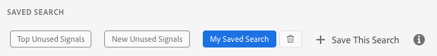

# Salva criterio di ricerca {#save-search-criteria}

Ottimizza le attività di ricerca del segnale salvando fino a 10 set di criteri di ricerca da utilizzare ogni volta che ne hai bisogno e tenerne traccia in [!UICONTROL Signals Dashboard]. Audience Manager ricarica le ricerche salvate ogni volta che si carica [!UICONTROL Signals Dashboard].

1. Vai a **[!UICONTROL Audience Data > Signals > Search]** ed esegui un **[!UICONTROL Signals Search]** con le coppie chiave-valore e/o i filtri che desideri salvare per le ricerche future.
1. Una volta ottenuti i risultati della ricerca, fai clic su **[!UICONTROL Save this Search]**.

   
1. Immettere un nome suggerito per la ricerca, in modo da poterla identificare in un secondo momento.
1. (Facoltativo) Abilitare l&#39;opzione **[!UICONTROL Track this search result in the dashboard]** se si desidera che il dashboard dei segnali includa i segnali nel set di ricerca corrente.
1. Selezionare i criteri **[!UICONTROL Default Sorting]**:
   * **[!UICONTROL Total Counts]**
   * **[!UICONTROL Key Name]**
1. Scegliere la modalità **[!UICONTROL Default Sorting]**:
   * **[!UICONTROL Descending]**
   * **[!UICONTROL Ascending]**
1. Fare clic su **[!UICONTROL Save]**. Puoi visualizzare la ricerca salvata nella sezione [!UICONTROL Saved Search] e utilizzarla quando necessario.

Guarda il video seguente per scoprire come salvare le ricerche dei segnali.

>[!VIDEO](https://video.tv.adobe.com/v/25147/)
