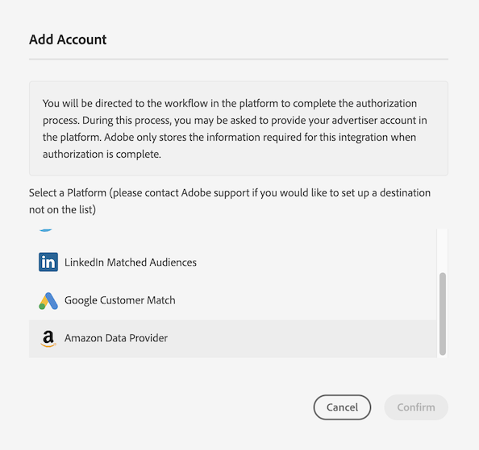

# Configura [!DNL Amazon Advertising] come destinazione self-service basata su dispositivo {#configure-amazon}

Questo articolo spiega come configurare un&#39;integrazione con [Amazon Advertising](https://advertising.amazon.com/API/docs/en-us).

## Prerequisiti {#prerequisites}

Prima di configurare la destinazione [!DNL Amazon Advertising], verificare di soddisfare i seguenti prerequisiti.

* L&#39;account [!DNL Amazon] deve essere idoneo per la pubblicità.
* Quando crei la prima destinazione [!DNL Amazon Advertising] nell&#39;istanza di Audience Manager, contatta Adobe Consulting o l&#39;Assistenza clienti per abilitare la sincronizzazione ID [!DNL Amazon] (ID Data Source = 139200) per il tuo account. Necessario per la sincronizzazione corretta tra Audience Manager e [!DNL Amazon].
* Dopo la creazione dei nuovi tipi di pubblico del provider di dati, è necessario [aggiornare i relativi metadati](https://advertising.amazon.com/API/docs/en-us/data-provider/openapi#tag/Metadata/paths/~1v2~1dp~1audiencemetadata~1%7BaudienceId%7D/put) e aggiungere **[!DNL audience fees]**. Per questa operazione puoi utilizzare l&#39;[API di Amazon Ads](https://advertising.amazon.com/API/docs/en-us/guides/onboarding/apply-for-access) o la [interfaccia utente di Amazon Advertising](https://advertising.amazon.com/).

## Aggiungi una nuova destinazione [!DNL Amazon Advertising] {#add-new-amazon-destination}

Questa sezione descrive i passaggi da seguire per configurare una nuova destinazione basata su dispositivo per [!DNL Amazon Advertising]. Questo scenario presuppone che non sia già stata configurata alcuna destinazione [!DNL Amazon Advertising] tramite il tuo consulente Adobe o l&#39;Assistenza clienti.

### Passaggio 1: Autentica con [!DNL Amazon Advertising] {#step1-authenticate-with-amazon}

Prima di poter aggiungere la destinazione basata su dispositivo, devi collegare Audience Manager e il tuo account [!DNL Amazon Advertising]. Ecco come eseguire questa operazione:

1. Accedi al tuo account Audience Manager e passa a **[!UICONTROL Administration > Integrated Accounts]**. Se disponi di un’integrazione configurata in precedenza con una piattaforma di destinazione, dovresti visualizzarla in questa pagina. In caso contrario, la pagina è vuota.
1. Selezionare **[!UICONTROL Add Account]**.
1. Selezionare [!UICONTROL Amazon Data Provider].

   

1. Selezionare una delle opzioni **[!UICONTROL Amazon Data Provider]** a seconda dell&#39;area geografica in cui è stato creato l&#39;account [!DNL Amazon Ads] (Nord America, Europa o Estremo Oriente) e fare clic su **[!DNL Confirm]** per essere reindirizzato alla pagina di autenticazione.

   

1. Dopo l’autenticazione, vieni reindirizzato ad Audience Manager per visualizzare gli account pubblicitari associati. Selezionare l&#39;account pubblicitario che si desidera utilizzare e fare clic su **[!UICONTROL Confirm]**. In questo modo hai autorizzato l’accesso ad Audience Manager per l’invio di aggiornamenti per i tuoi tipi di pubblico.

### Passaggio 2: Creare una nuova destinazione basata su dispositivo {#step2-create-new-destination}

Dopo aver collegato Audience Manager e l&#39;account [!DNL Amazon Advertising], puoi creare la nuova destinazione. Ecco come eseguire questa operazione:

>[!NOTE]
>
>Non è possibile modificare il nome di una destinazione basata su dispositivo esistente. Assicurati di fornire un nome che ti aiuti a identificare correttamente la destinazione.

1. Accedi al tuo account Audience Manager, passa a **[!UICONTROL Audience Data > Destinations]** e seleziona **[!UICONTROL Create Destination]**.
1. Nella sezione **[!UICONTROL Basic Information]** immettere **[!UICONTROL Name]** e **[!UICONTROL Description]** per la nuova destinazione e utilizzare le impostazioni seguenti:

   

1. Selezionare **[!UICONTROL Next]**.
1. Scegliere le [etichette di esportazione dati](/help/using/features/data-export-controls.md#controls-labels) che si desidera impostare per questa destinazione.
1. Selezionare **[!UICONTROL Save]**.
1. Nella sezione **[!UICONTROL Segment Mappings]**, seleziona i segmenti di pubblico che desideri inviare a questa destinazione.
1. Salva la destinazione.

## Considerazioni sulle percentuali di corrispondenza {#match-rates-considerations}

L&#39;integrazione tra Audience Manager e [!DNL Amazon Advertising] supporta i backfill cronologici del pubblico. Tutte le qualifiche dei segmenti vengono inviate a [!DNL Amazon] quando si crea la destinazione.

## Risoluzione dei problemi {#troubleshooting}

Durante la configurazione o l&#39;invio di dati alla destinazione [!DNL Amazon Advertising], è possibile che si verifichino gli errori descritti di seguito. Questa sezione spiega cosa può causare gli errori e come correggerli.

| Messaggio di errore | Occorrenza/Motivo | Risoluzione |
|---|---|---|
| `Internal server error` | Questo messaggio di errore viene visualizzato nell&#39;interfaccia utente di Audience Manager quando si tenta di aggiungere un nuovo account [!DNL Amazon] utilizzando una versione obsoleta dell&#39;API di Amazon. | Contatta l’Assistenza clienti di Adobe. |
| `Amazon Error: Account XXXXXXXXX was not found` | Questo messaggio di errore viene visualizzato nell’interfaccia utente di Audience Manager quando le credenziali configurate per la destinazione non sono autorizzate ad accedere all’account Amazon Ads corrispondente. | <ul><li>Assicurati che le credenziali dell&#39;account utilizzate soddisfino i [prerequisiti](#prerequisites).</li><li>Passa all’interfaccia utente di Amazon Ads utilizzando le stesse credenziali e verifica se i tipi di pubblico corretti sono visualizzati nell’account corrispondente. </li></ul> |
