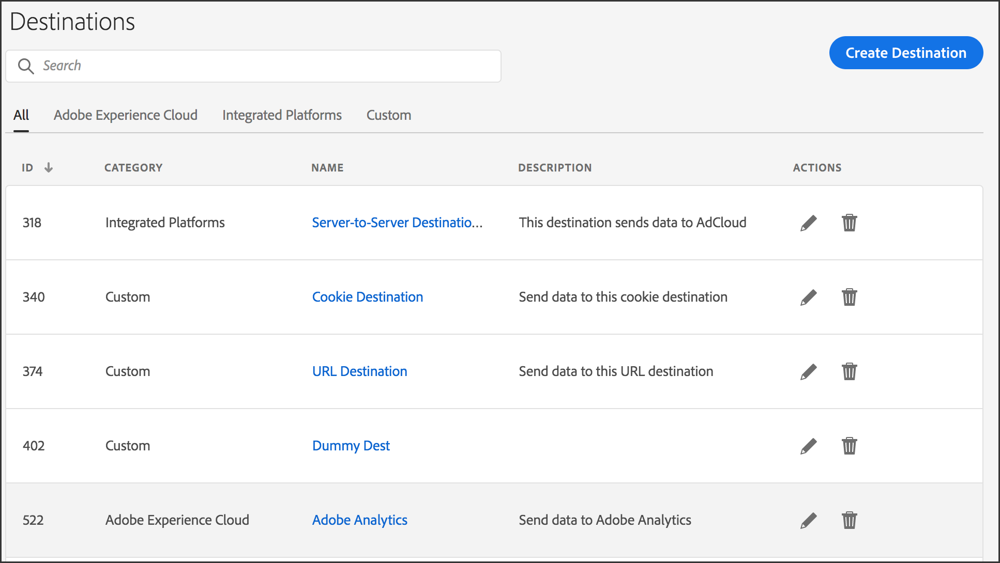

# Home page delle destinazioni {#destinations-home}

Nella pagina di destinazione di [!UICONTROL Destination] sono elencate tutte le destinazioni di [!DNL URL], cookie e server-to-server. Fornisce funzioni che consentono di creare, modificare, cercare e generare rapporti sulle destinazioni. Pagina di destinazione in **[!UICONTROL Audience Data > Destinations]**.

## Pagina di destinazione predefinita {#default-landing-page}

<!-- destinations-home.xml -->

Nella pagina di destinazione predefinita sono elencate le destinazioni in base al tipo. Puoi filtrare le destinazioni utilizzando le quattro schede disponibili:

* **All**: mostra tutti i tipi di destinazioni.
* **Adobe Experience Cloud**: mostra le destinazioni che inviano dati ad altre soluzioni Adobe Experience Cloud. Attualmente, l’unica opzione supportata è Adobe Analytics. Consulta [Configurare una destinazione di Analytics](/help/using/features/destinations/create-analytics-destination.md).
* **Piattaforme integrate**: mostra le destinazioni basate su persone e dispositivi (denominate anche destinazioni da server a server).
* **Personalizzato**: mostra le destinazioni dei cookie e degli URL.

## Pagina di destinazione Tipi di pubblico utilizzabili {#audiences-landing-page}

Per visualizzare i dati sul pubblico e le percentuali di corrispondenza per la destinazione da server a server, selezionare **[!UICONTROL Integrated Platforms > Device-Based]**.

Per ulteriori informazioni sulle informazioni visualizzate, vedere [Interfaccia tipi di pubblico utilizzabili](/help/using/features/addressable-audiences.md#addressable-audience-interface).

