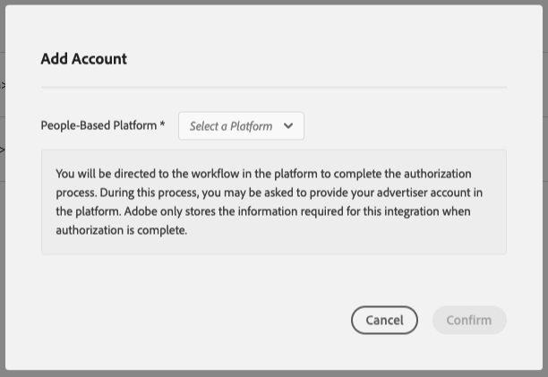

# Autenticazione con piattaforme basate su persone {#authentication-with-people-based-platforms}

>[!IMPORTANT]
>Questo articolo contiene la documentazione del prodotto e illustra come configurare e utilizzare questa funzione. Niente di ciò che è contenuto in questo documento rappresenta un parere legale. Consulta il tuo consulente legale per ricevere assistenza legale.

Questa pagina contiene istruzioni su come configurare e gestire l’integrazione
tra Audience Manager e le piattaforme basate sulle persone.

>[!NOTE]
>Questo è un passaggio obbligatorio per le destinazioni basate su persone, indipendentemente dallo scenario di implementazione.

## Configurare l’autenticazione della piattaforma basata sulle persone {#configure-authentication}

1. Accedi al tuo account Audience Manager e passa a **[!UICONTROL Administration]** > **[!UICONTROL Integrated Accounts]**. Se disponi di un’integrazione configurata in precedenza con una piattaforma social, dovresti visualizzarla in questa pagina. In caso contrario, la pagina è vuota.
   
2. Fare clic su **[!UICONTROL Add Account]**.
3. Utilizza il menu a discesa **[!UICONTROL People-Based Platform]** per selezionare la piattaforma con cui configurare l&#39;integrazione.
   
4. Fare clic su **[!UICONTROL Confirm]** per essere reindirizzato alla pagina di autenticazione della piattaforma selezionata.
5. Dopo aver eseguito l’autenticazione all’account della piattaforma social, vieni reindirizzato ad Audience Manager per visualizzare gli account pubblicitari associati. Selezionare l&#39;account pubblicitario che si desidera utilizzare e fare clic su **[!UICONTROL Confirm]**.
6. Audience Manager visualizza una notifica nella parte superiore della pagina per comunicare se l’account è stato aggiunto correttamente. La notifica ti consente inoltre di aggiungere un indirizzo e-mail di contatto per ricevere notifiche da Adobe quando l’autenticazione della piattaforma social network sta per scadere.

## Gestione della scadenza e delle notifiche del token di autenticazione {#token-expiration-notification}

Audience Manager gestisce l’integrazione con le piattaforme social tramite token di autenticazione che scadono dopo un certo periodo di tempo. La durata della validità del token è soggetta alle regole di integrazione di ogni piattaforma social. Una volta scaduto il token di autenticazione, Audience Manager non è in grado di inviare i segmenti di pubblico alla destinazione. Per evitare questo scenario, ti consigliamo di aggiungere almeno un indirizzo e-mail di contatto all’integrazione, in modo da ricevere una notifica non appena il token di autenticazione sta per scadere. In questo caso, puoi ripetere l’autenticazione per garantire che la destinazione continui a ricevere i segmenti di pubblico.

Ecco come aggiungere indirizzi e-mail alle integrazioni esistenti:

1. Accedi al tuo account Audience Manager e passa a **[!UICONTROL Administration]** > **[!UICONTROL Integrated Accounts]**.
1. Identificare l&#39;integrazione per la quale si desidera ricevere notifiche di scadenza del token e fare clic sull&#39;icona **[!UICONTROL Edit]**.
1. Inserisci gli indirizzi e-mail a cui desideri ricevere le notifiche di scadenza del token, separati da virgole.
1. Fare clic su **[!UICONTROL Save]**.

## Rinnovo del token di autenticazione {#token-renewal}

Quando un token di autenticazione scade, l’integrazione tra Audience Manager e la piattaforma social corrispondente viene interrotta, pertanto Audience Manager non può più inviare segmenti di pubblico alla destinazione. La pagina [!UICONTROL Integrated Accounts] mostra lo stato di scadenza di ogni integrazione nella colonna [!UICONTROL Expiration] e consente di rinnovare l&#39;autenticazione in qualsiasi momento.

Di seguito viene illustrato come rinnovare un’autenticazione scaduta o in scadenza:

1. Accedi al tuo account Audience Manager e passa a **[!UICONTROL Administration]** > **[!UICONTROL Integrated Accounts]**.
1. Identifica l’integrazione per la quale è necessario rinnovare l’autenticazione. Le autenticazioni scadute sono contrassegnate come [!UICONTROL Expired], mentre le autenticazioni che stanno per scadere mostrano il numero rimanente di giorni di autenticazione.
1. Fare clic sull&#39;icona **[!UICONTROL Renew]** corrispondente nella colonna [!UICONTROL Expiration]. In questo modo viene attivato il flusso di lavoro **[!UICONTROL Renew Account]**, che ti riporta alla pagina di autenticazione della piattaforma social. Dopo l’autenticazione, il token viene rinnovato con la nuova data di scadenza.

   
