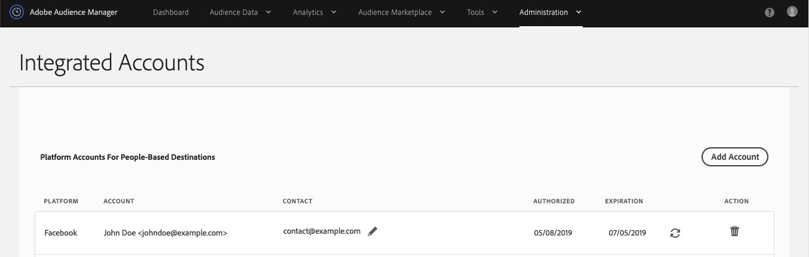

# Flusso di lavoro C: personalizzazione basata su attività autenticate combinate con dati offline {#workflow-c}

>[!IMPORTANT]
>Questo articolo contiene la documentazione del prodotto e illustra come configurare e utilizzare questa funzione. Niente di ciò che è contenuto in questo documento rappresenta un parere legale. Consulta il tuo consulente legale per ricevere assistenza legale.

Questa pagina include istruzioni dettagliate su come combinare in modalità offline [!DNL CRM] dati comportamentali in tempo reale che consentono agli utenti autenticati di creare segmenti di pubblico, e quindi di inviarli a [!DNL People-Based Destinations].

## Passaggio 1: configurare le impostazioni dell’origine dati {#configure-data-source-settings}

A seconda che [DPUUID](../../reference/ids-in-aam.md) sono indirizzi e-mail con hash in minuscolo; potrebbe essere necessario configurare l’origine dati in cui verranno memorizzati gli indirizzi e-mail con hash.

 

**Scenario 1: il tuo [DPUUID](../../reference/ids-in-aam.md) sono già indirizzi e-mail con hash in minuscolo.**

In questo caso, vai a [Passaggio 5: configurare l’autenticazione della piattaforma basata sulle persone](#configure-authentication).

 

**Scenario 2: [DPUUID](../../reference/ids-in-aam.md) non sono indirizzi e-mail con hash in minuscolo.**

In questo caso, devi creare una nuova origine dati multi-dispositivo che memorizzerà gli indirizzi e-mail con hash. Ecco come eseguire questa operazione:

1. Accedi al tuo account Audience Manager e vai a **[!UICONTROL Audience Data]** -> **[!UICONTROL Data Sources]** e fai clic su **[!UICONTROL Add New]**.
1. Immetti un **[!UICONTROL Name]** e **[!UICONTROL Description]** per la nuova origine dati.
1. In **[!UICONTROL ID Type]** menu a discesa, seleziona **[!UICONTROL Cross Device]**.
1. In **[!UICONTROL Data Source Settings]** , selezionare entrambe le opzioni **[!UICONTROL Inbound]** e **[!UICONTROL Outbound]** e abilitare **[!UICONTROL Share associated cross-device IDs in people-based destinations]** opzione.
1. Utilizza il menu a discesa per selezionare **[!UICONTROL Emails(SHA256, lowercased)]** etichetta per questa origine dati.
   >[!IMPORTANT]
   >
   >Questa opzione etichetta l’origine dati solo come contenente dati con hash con quell’algoritmo specifico. L’Audience Manager non esegue l’hashing dei dati in questo passaggio. Assicurati che gli indirizzi e-mail che intendi archiviare in questa origine dati abbiano già un hash con [!DNL SHA256] algoritmo. In caso contrario, non potrai utilizzarlo per [!DNL People-Based Destinations].

   

   >[!NOTE]
   >
   > Consulta [Onboarding dei dati](people-based-destinations-prerequisites.md#data-onboarding) per le domande frequenti su come inserire i dati offline in Audience Manager per Destinazioni basate su persone.

Guarda il video seguente per un tutorial video su come creare un’origine dati per [!UICONTROL People-Based Destinations].

>[!VIDEO](https://video.tv.adobe.com/v/29006/)

## Passaggio 2: utilizzare gli ID dichiarati per associare i DPUUID agli indirizzi e-mail con hash tramite chiamate HTTP in tempo reale {#match-email-addresses}

Per qualificare gli utenti autenticati per le caratteristiche basate su regole, devi inviare la qualifica delle caratteristiche tramite [ID dichiarati](../declared-ids.md).

### Esempio

Supponiamo che tu abbia creato le due seguenti origini dati.

| ID origine dati | Contenuti dell’origine dati |
| -------------- | -------------------------- |
| 999999 | DPUUID esistenti (ID CRM) |
| 987654 | Indirizzi e-mail con hash |

 

Quindi, desideri qualificare gli ID del sistema di gestione delle relazioni con i clienti sottostanti per la caratteristica nella tabella.

| DPUUID (ID CRM) | Indirizzo e-mail | Indirizzo e-mail con hash | Caratteristica |
| -------------------------------------- | --------------------- | ---------------------------------------------------------------- | ------------- |
| 68079982765673198504052656074456196039 | `johndoe@example.com` | 55e79200c1635b37ad31a378c39feb12f120f116625093a19bc32fff15041149 | location = US |

 

L’ID dichiarato deve seguire questa sintassi:

`https://yourDomain.demdex.net/event?d_cid_ic=HashedEmailDataSourceIntegrationCode%01myHashedEmail&d_cid_ic=CRMDataSourceIntegrationCode%01myCRMID&key=value`

 

Nell’esempio precedente, la chiamata dell’ID dichiarato dovrebbe essere simile alla seguente:

`https://yourDomain.demdex.net/event?d_cid_ic=MyHashedEmailDataSource%0155e79200c1635b37ad31a378c39feb12f120f116625093a19bc32fff15041149&d_cid_ic=MyCRMDataSource%0168079982765673198504052656074456196039&location=US`

## Passaggio 3: creare una regola di unione profili per la segmentazione {#create-profile-merge-rule-segmentation}

Il passaggio successivo consiste nella creazione di una nuova regola di unione che ti aiuterà a creare i segmenti di pubblico da inviare al tuo [!DNL People-Based Destinations].

>[!IMPORTANT]
>
>Se hai già definito una regola con **[!UICONTROL Current Authenticated Profiles]** o **[!UICONTROL Last Authenticated Profiles]** opzioni, è possibile passare a [Passaggio 4: creare segmenti di pubblico](#create-audience-segments).

1. Accedi al tuo account Audience Manager e vai a **[!UICONTROL Audience Data]** -> **[!UICONTROL Profile Merge Rules]**.
2. Clic **[!UICONTROL Add New Rule]**.
3. Inserisci una regola di unione profili **[!UICONTROL Name]** e **[!UICONTROL Description]**.
4. In **[!UICONTROL Profile Merge Rule Setup]** , seleziona la sezione **[!UICONTROL Current Authenticated Profiles]** o **[!UICONTROL Last Authenticated Profiles]** regola da **[!UICONTROL Cross-Device Options]** elenco.
5. In **[!UICONTROL Cross-Device Profile Options]** , seleziona le origini dati sulle quali desideri eseguire la segmentazione. Queste dovrebbero essere le origini dati contenenti gli attuali DPUUID.
   

## Passaggio 4: creare segmenti di pubblico {#create-audience-segments}

Per creare nuovi segmenti, utilizza [Generatore di segmenti](../segments/segment-builder.md). Se sono presenti segmenti di pubblico che desideri inviare a [!DNL People-Based Destinations], vai a [Passaggio 5: configurare l’autenticazione della piattaforma basata sulle persone](#configure-authentication).

## Passaggio 5: configurare l’autenticazione della piattaforma basata sulle persone {#configure-authentication}

1. Accedi al tuo account Audience Manager e vai a **[!UICONTROL Administration]** > **[!UICONTROL Integrated Accounts]**. Se disponi di un’integrazione configurata in precedenza con una piattaforma social, dovresti visualizzarla in questa pagina. In caso contrario, la pagina è vuota.
   
2. Clic **[!UICONTROL Add Account]**.
3. Utilizza il **[!UICONTROL People-Based Platform]** menu a discesa per selezionare la piattaforma con cui configurare l’integrazione.
   
4. Clic **[!UICONTROL Confirm]** per essere reindirizzato alla pagina di autenticazione della piattaforma selezionata.
5. Dopo aver eseguito l’autenticazione all’account della piattaforma social, vieni reindirizzato all’Audience Manager in cui dovresti visualizzare gli account pubblicitari associati. Seleziona l’account dell’inserzionista che desideri utilizzare e fai clic su **[!UICONTROL Confirm]**.
6. In Audience Manager, nella parte superiore della pagina viene visualizzata una notifica per comunicare se l’account è stato aggiunto correttamente. La notifica ti consente inoltre di aggiungere un indirizzo e-mail di contatto per ricevere notifiche quando l’autenticazione della piattaforma social network sta per scadere.

>[!IMPORTANT]
>
>Audience Manager gestisce l’integrazione con le piattaforme social tramite token di autenticazione che scadono dopo un certo periodo di tempo. Consulta Rinnovo del token di autenticazione per informazioni su come rinnovare i token scaduti.

## Passaggio 6: creare una destinazione basata su persone {#create-destination}

1. Accedi al tuo account Audience Manager e vai a **[!UICONTROL Audience Data]** > **[!UICONTROL Destinations]** e fai clic su **[!UICONTROL Create Destination]**.
1. In **[!UICONTROL Basic Information]** , immetti un **[!UICONTROL Name]** e **[!UICONTROL Description]** per la nuova origine dati e utilizzare le impostazioni seguenti:
   * **[!UICONTROL Category]**: Piattaforme Integrate;
   * **[!UICONTROL Type]**: Basato Sulle Persone;
   * **[!UICONTROL Platform]**: seleziona la piattaforma basata sulle persone a cui desideri inviare i segmenti di pubblico;
   * **[!UICONTROL Account]**: seleziona l’account dell’inserzionista desiderato associato alla piattaforma selezionata.
      
1. Clic **[!UICONTROL Next]**.
1. Scegli la **[!UICONTROL Data Export Labels]** che desideri impostare per questa destinazione.
1. In **[!UICONTROL Configuration]** , selezionare l&#39;origine dati che contiene le origini dati con hash.
1. In **[!UICONTROL Segment Mappings]** , seleziona i segmenti che desideri inviare a questa destinazione. Si tratta dei segmenti creati in [Passaggio 4: creare segmenti di pubblico](#create-audience-segments).
1. Salva la destinazione.
