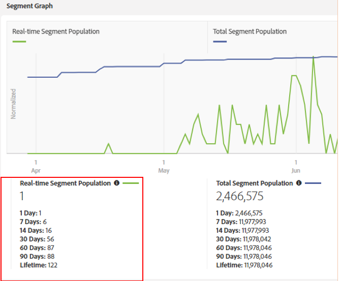
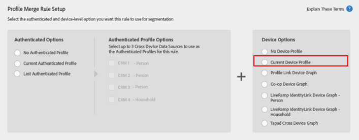

# Considerazioni importanti per le regole di unione dei profili con i grafici del dispositivo {#important-considerations-for-profile-merge-rules-with-device-graphs}

Evitare di utilizzare [!UICONTROL Profile Merge Rules] con un [!UICONTROL Device Graph] per segmenti con popolazione di segmenti in tempo reale ridotta o inesistente.

>[!IMPORTANT]
>
>Se la configurazione non [!UICONTROL Profile Merge Rule] è corretta, la popolazione del segmento esportata nelle destinazioni batch potrebbe essere significativamente inferiore al previsto.

I segmenti che utilizzano una regola di unione dei [profili con Device Graph](../../features/profile-merge-rules/merge-rule-targeting-options.md#device-graph-options) vengono valutati solo rispetto ai dispositivi visualizzati in tempo reale sui server [periferici di](../../reference/system-components/components-edge.md) Audience Manager dopo la creazione del segmento.

Ricordate, [!UICONTROL Profile Merge Rule] con una [!UICONTROL Device Graph] delle seguenti opzioni di dispositivo selezionate, come mostrato di seguito.

I dispositivi idonei per un segmento in tempo reale sono misurati dalla popolazione [in tempo reale del](../../features/segments/segment-builder-data.md#segment-populations)segmento.

Una popolazione di segmenti in tempo reale ridotta indica che pochissimi dispositivi idonei per il segmento vengono visti in tempo reale. Per ottenere prestazioni ottimali, i segmenti con popolazione in tempo reale limitata o nulla devono utilizzare un [!UICONTROL Profile Merge Rule] set per valutare i risultati, come nell' *[!UICONTROL Current Device]* immagine seguente.

L’impostazione [!UICONTROL Profile Merge Rule] per valutare l’ *[!UICONTROL Current Device]* garantisce che tutti i dispositivi (non solo quelli visti in tempo reale) vengano valutati per il segmento. Tutti i dispositivi idonei per il segmento sono definiti dalla popolazione totale del segmento, come mostrato di seguito.

