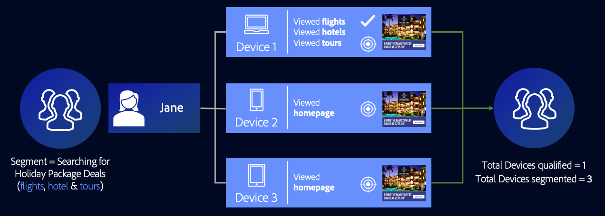

# Casi d'uso dei grafici dei dispositivi esterni {#external-device-graph-use-cases}

Raccomandazioni e casi di utilizzo per la ricerca, il retargeting e la personalizzazione per utenti sconosciuti con un grafico del dispositivo esterno. Un grafico del dispositivo esterno è definito come un grafico del dispositivo separato da Audience Manager. Ciò include le [!DNL Adobe Experience Cloud Device Co-op] e altre integrazioni di cui Adobe dispone con società di grafici di dispositivi deterministici o probabilistici di terze parti.

## Consigli {#recommendations}

Considerare le opzioni del grafico dei dispositivi [!DNL Experience Cloud Device Co-op] e di terze parti per le campagne che:

* Avere un livello di autenticazione basso nelle loro proprietà digitali. Utilizzatelo [!UICONTROL Profile Link Device Graph option] se disponete di un numero elevato di utenti autenticati.
* Esegue il targeting di audience di grandi dimensioni. I grafici dei dispositivi [!DNL Experience Cloud Device Co-op] e di terze parti contengono dati autenticati e non autenticati.
* Segmento di visitatori autenticati e/o non autenticati a livello di singola e famiglia.

<!-- 
## Prospecting/Branding Use Case {#prospecting-branding-use-cases}

A branding campaign is designed to reach as many people as possible. It places few limits on segment qualification. But, these campaigns can waste budget and impressions by constantly targeting people who see your content multiple times and don't convert. A [!UICONTROL Profile Merge] rule that uses the [!DNL Device Co-op] or third-party option can help you create an efficient branding campaign. For example, you can add these unknown users to a "not in-market" segment after seeing them across multiple devices for your set frequency cap.

<table id="table_00F6EED172574E80A38CADA8A92A23B1"> 
 <thead> 
  <tr> 
   <th colname="col1" class="entry"> Use Case </th> 
   <th colname="col2" class="entry"> Description </th> 
  </tr> 
 </thead>
 <tbody> 
  <tr> 
   <td colname="col1"> 
 <b>Conditions</b> 
 </td> 
   <td colname="col2">This use case assumes these conditions: 
 
     <ul id="ul_F5CA7EE525774F7EBA5FBB5F94E4EDC8"> 
      <li id="li_81AE304924724146A24FAB5B6533AD8E">You want to deliver a maximum of 10 impressions to an anonymous user for a specific ad campaign. </li> 
      <li id="li_E371F989735245B0B82433DE240D56D0">A user has 4 devices and may or may not have authenticated on your site. </li> 
      <li id="li_9231ABE15CA249E6B79D8BF0E511FD33">An anonymous user sees the ad a total of 10 times while browsing in an unauthenticated state on their current device and 3 devices linked to the current device by an external device graph. </li> 
      <li id="li_8C276C07019C49EFA3A0D0D54CF73C31">You have defined an  Audience Manager segment to qualify anonymous users after they have seen 10 impressions. </li> 
     </ul> 
 </td> 
  </tr> 
  <tr> 
   <td colname="col1"> 
 <b>Results</b> 
 </td> 
   <td colname="col2"> 
Given these conditions,  Audience Manager: 
 
 
     <ul id="ul_8E988B1005324526BC6DC6637BBACCFB"> 
      <li id="li_C9DD546754914BACB8F4C92C7D4ED70E">Merges the anonymous, unauthenticated activity collected from the current device and the 3 devices linked by the external device graph (the ad impressions from each device). </li> 
      <li id="li_FB55CB9116074525BA30FF062D1136AE">Evaluates the unauthenticated user for segment qualification based on a combination of anonymous activity across all 3 devices linked by the external device graph and the current device. </li> 
      <li id="li_B28EB32F718145A7ABBDAC0AF75E2AFC">Sends the segment to any real-time destination for use as a suppression segment on the current device and all 3 devices linked by the external device graph. </li> 
     </ul> 
 </td> 
  </tr> 
 </tbody> 
</table>

## Retargeting or Site Personalization Use Case {#retargeting-use-case}

These strategies are designed to bring an unauthenticated or unknown user back to your site or personalize their browsing experience while they're on-site.

<table id="table_0EE2052AA3E744B3B76036FC06B5A453"> 
 <thead> 
  <tr> 
   <th colname="col1" class="entry"> Use Case </th> 
   <th colname="col2" class="entry"> Description </th> 
  </tr> 
 </thead>
 <tbody> 
  <tr> 
   <td colname="col1"> 
 <b>Conditions</b> 
 </td> 
   <td colname="col2">This use case assumes these conditions: 
 
     <ul id="ul_FD0B869B4AF3453FAEC9BA3A45ABF039"> 
      <li id="li_8E30BAED42E94AB3B81FCB1C7464E5FC">You want to deliver a personalized on-site and/or off-site experience to an anonymous user based on their activity on your site while in an unauthenticated state. </li> 
      <li id="li_3DBE53BA94324F1BA1C52A37AD4E426C">A user has multiple devices and may or may not have authenticated to your site. </li> 
      <li id="li_F867AFBDC1A54CD6A68AB0EC196E27C9">A user views multiple pages on your site while browsing in an unauthenticated state on their current device and 3 other devices linked by an external device graph. </li> 
      <li id="li_7E35D77949CE4E69BD51655AA4C40BEE">You have defined an  Audience Manager segment to qualify users after they have viewed multiple pages on your site while browsing in an unauthenticated state.</li>
     </ul> 
 </td> 
  </tr> 
  <tr> 
   <td colname="col1"> 
 <b>Results</b> 
 </td> 
   <td colname="col2"> 
Given these conditions,  Audience Manager: 
 
 
     <ul id="ul_301339426B0643B295DC5B17E1939CFB"> 
      <li id="li_7E8BC3B179804F4A929497DE81E76911">Merges the anonymous, unauthenticated activity collected from the current devices and the 3 devices linked by the external device graph (the multiple page views from each device). </li> 
      <li id="li_803EFD58AA124A5BBC8279C4DC695544">Evaluates the unauthenticated user for segment qualification based on a combination of anonymous activity across all 3 devices linked by the external device graph and the current device. </li> 
      <li id="li_98D749268CC5456CBC9CF3BF5EB91BA8">Sends the segment to any real-time destination to deliver a personalized on-site and/or off-site experience across the current device and all 3 devices linked by the external device graph. </li>
     </ul> 
 </td>
  </tr>
 </tbody>
</table> -->

## Targeting esteso dei dispositivi {#audience-expansion}

Questo caso d’uso illustra come ampliare le dimensioni del pubblico indirizzabile con una precisa personalizzazione tra dispositivi, attraverso [!DNL Adobe Co-Op Device Graph] o altro [!DNL External Device Graphs].

Diciamo che Jane possiede tre dispositivi che usa regolarmente per cercare offerte pacchetto vacanze: il suo laptop ([!DNL Device 1]), il suo smartphone ([!DNL Device 2]) e il suo tablet ([!DNL Device 3]). Durante l'utilizzo del laptop, Jane ha cercato voli, hotel e visite guidate. Quando ha usato smartphone e tablet, ha visitato solo la homepage dell'agenzia di viaggi.

Utilizzando la regola [!UICONTROL No Cross-Device Profile] + [!UICONTROL Adobe Co-op Device Graph] , l'agenzia di viaggi può unire tutti e tre i profili dei dispositivi, in quanto sono collegati allo stesso proprietario tramite [!UICONTROL Adobe Co-op Device Graph].

Nel nostro esempio, sono state raccolte tutte le caratteristiche necessarie per qualificarsi per il segmento [!DNL Device 1]. Poiché Audience Manager qualifica ogni profilo dispositivo che ha partecipato all'unione del profilo per un segmento, tutti e tre i profili dispositivo di Jane ora sono segmentati.

Attraverso questa regola, il grafico del dispositivo ha aumentato il numero di profili dispositivo idonei per il segmento da uno a tre e ha consentito all'agenzia di viaggi di inviare un messaggio coerente a tutti e tre i dispositivi di proprietà di Jane.

## Targeting cross-device avanzato {#advanced-graph-expansion}

Questo caso d'uso mostra come espandere il targeting del pubblico per i visitatori autenticati con dispositivi da un grafico del dispositivo esterno o da [!DNL Adobe Co-Op Device Graph], utilizzando la regola **[!UICONTROL Last Authenticated Profiles]** + **[!UICONTROL Adobe Co-Op Device Graph]** .

Nell'esempio seguente, la società Acme Inc. vuole rivolgersi a tutte le famiglie con redditi superiori a $100.000/anno, che hanno [!DNL Acme Inc.] abbonati su [!DNL Data Plan A], che utilizzano un [!DNL iPhone 7] dispositivo.

John utilizza il suo iPhone 7 sul piano A per l'autenticazione sul sito Web Acme Inc. Allo stesso tempo, il [!DNL Co-Op Device Graph] cluster di John contiene due dispositivi aggiuntivi che utilizza regolarmente: il suo laptop ([!DNL Device 1]) e il suo smartphone secondario [!DNL Device 2] (un [!DNL Samsung S7] on [!DNL Data Plan B]).

Utilizzando il **[!UICONTROL Last Authenticated Profiles]** + **[!UICONTROL Adobe Co-Op Device Graph]**, [!DNL Acme Inc.] è possibile inviare messaggi personalizzati a tutti e tre i dispositivi dal cluster di grafici per dispositivi di John, anche se solo uno di questi è inizialmente idoneo per il segmento.

>[!MORE_LIKE_this]
>
>* [Casi di utilizzo del grafico dei collegamenti profilo](profile-link-use-case.md)
>* [Casi di utilizzo generali per le regole di unione dei profili](merge-rule-targeting-options.md)
>* [Domande frequenti sulle regole di unione dei profili](faq-profile-merge.md)

