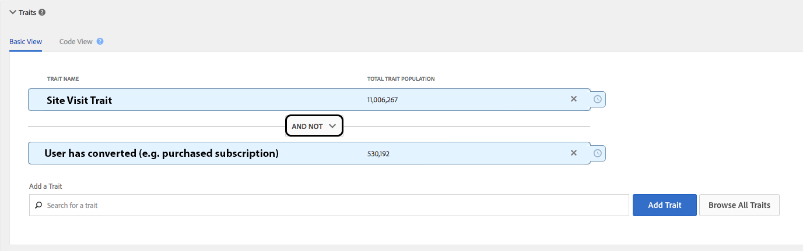

# Soppressione immediata su diversi dispositivi {#instant-cross-device-suppression}

[!UICONTROL Instant Cross-Device Suppression] è la capacità di sopprimere gli utenti su più dispositivi connessi quando si verifica un&#39;esperienza particolare su uno qualsiasi di questi dispositivi. Utilizzate [!UICONTROL Instant Cross-Device Suppression] la funzionalità per offrire ai vostri utenti un&#39;esperienza coerente tra dispositivi. Ciò è possibile grazie alle capacità di rimozione da un segmento in tempo reale di Audience Manager.

## Panoramica {#overview}

[!UICONTROL Instant Cross-Device Suppression] sono disponibili due casi d&#39;uso principali: esperienza utente migliorata e efficienza dei supporti.

* **Un&#39;esperienza utente migliorata**: Gli utenti che hanno già acquistato il prodotto o il servizio non vedono gli stessi creativi prima dell&#39;acquisto. Puoi invece visualizzare messaggi upselling o cross-selling per prodotti o servizi che sai che non hanno acquistato.
* **Efficienza file multimediali**: Ottimizzate la spesa delle campagne applicando un berretto globale della frequenza tra tutte [!DNL DSP]le s. Il limite di frequenza può essere eseguito in tempo reale per più dispositivi appartenenti a un utente.

I dettagli tecnici dell&#39;unsegmentazione in tempo reale sono descritti in lunghezza in Regole di unione [profili e Processi](../../features/profile-merge-rules/merge-rule-unsegment.md)di annullamento della segmentazione dei dispositivi. Continua a leggere per l&#39;implementazione pratica dei casi di utilizzo descritti in precedenza.

## Non eseguire il targeting una volta convertito {#do-not-target-once}

Assicurati che gli utenti che hanno già effettuato la conversione (acquistato un prodotto, acquisiscano un abbonamento, ecc.) siano non vedranno gli stessi messaggi di prima della conversione. Potete ottenere questo risultato utilizzando la [!UICONTROL AND NOT] logica, come segue.

1. Crea un segmento utilizzando due caratteristiche e usa la [!UICONTROL AND NOT] logica, come mostrato nell&#39;immagine seguente. È necessario utilizzare una caratteristica basata su regole per definire l&#39;evento di conversione affinché il segmento venga attivato in tempo reale. Ulteriori informazioni su come [creare caratteristiche basate su regole](../../features/traits/create-onboarded-rule-based-traits.md#create-rules-based-or-onboarded-traits).
1. Mappate il segmento su un numero qualsiasi di destinazioni server-to-server in tempo reale. Informazioni su come aggiungere segmenti alle [destinazioni server-to-server](../../features/destinations/manage-destinations.md#add-edit-segments).

I visitatori si qualificano per il segmento purché non siano stati convertiti. Non appena sono idonei per la caratteristica di conversione, cessano di seguire la regola del segmento e vengono immediatamente rimossi dal segmento.

## Non eseguire il targeting dopo l&#39;x impression {#do-not-target-after-x}

Potete assicurarvi di non estendere gli utenti con gli stessi elementi creativi impostando i controlli di recency e frequenza. In questo scenario, crea un segmento con due caratteristiche, come descritto nella procedura seguente.

1. Crea un segmento utilizzando due caratteristiche e usa la [!UICONTROL AND] logica, come mostrato nell&#39;immagine seguente. Devi usare una caratteristica basata su regole per definire l&#39;evento di impression affinché il segmento venga attivato in tempo reale. Ulteriori informazioni su come [creare caratteristiche basate su regole](../../features/traits/create-onboarded-rule-based-traits.md#create-rules-based-or-onboarded-traits).
   >[!NOTE]
   >
   >Potete utilizzare [!UICONTROL Actionable Log Files] o [!UICONTROL Pixel Calls] creare caratteristiche in base alle impression dell&#39;utente. Ulteriori informazioni su [File di registro fruibili](../../integration/media-data-integration/actionable-log-files.md) e [chiamate pixel](../../integration/media-data-integration/impression-data-pixels.md).
1. Applicate controlli di frequenza alla seconda caratteristica. Se lo desideri, puoi anche aggiungere controlli di recency. Ulteriori informazioni [su come applicare i controlli di aggiornamento e frequenza](../../features/segments/recency-and-frequency.md).
1. Mappate il segmento su un numero qualsiasi di destinazioni server-to-server in tempo reale. Informazioni su come aggiungere segmenti alle [destinazioni server-to-server](../../features/destinations/manage-destinations.md#add-edit-segments).

In questo scenario, dopo che gli utenti hanno accumulato più di tre impression, queste verranno rimosse da questo segmento e non saranno più visibili.

## Aspetti importanti per nota - Elaborazione {#processing-notes}

Considerate questi aspetti relativi all&#39;elaborazione:

* Per il corretto funzionamento della funzionalità di annullamento del segmento, devi mappare i segmenti desiderati in destinazioni server-to-server in tempo reale.
* Per i dispositivi collegati a un dispositivo da un grafico del dispositivo, si applica un limite di quattro dispositivi relativamente alla valutazione e all&#39;annullamento della segmentazione. Questa limitazione è descritta in [Opzioni grafico dispositivo e Unsegmentazione dispositivo](../../features/profile-merge-rules/merge-rule-unsegment.md#device-graph-options-unsegmentation).
* Il comando di annullamento del segmento verrà incluso in un file batch, inviato alle destinazioni ogni 24 ore, per più dispositivi collegati dal grafico del dispositivo.
* Il dispositivo deve essere visualizzato in tempo reale (sul [bordo](../../reference/system-components/components-edge.md)) per richiedere la valutazione dei segmenti. Per le caratteristiche che hanno [!UICONTROL time-to-live (TTL)] un valore, anche se una caratteristica [!DNL TTL] è soddisfatta, il dispositivo *non* verrà automaticamente segmentato finché il dispositivo non viene visualizzato in tempo reale. Ulteriori informazioni [su come impostare un intervallo di scadenza caratteristiche](../../features/traits/create-onboarded-rule-based-traits.md#set-expiration-interval).
* Se usi le caratteristiche [!UICONTROL DCS API] basate su regola in tempo reale, puoi attivare il segmento con l&#39;utilizzo della [!UICONTROL AND NOT] logica. Ulteriori informazioni sull [&#39;invio di dati all&#39;API DCS](../../api/dcs-intro/dcs-event-calls/dcs-url-send.md).

## Aspetti importanti per nota - Tempo {#timing-notes}

Considerate questi aspetti relativi alla temporizzazione:

* Un segmento verrà memorizzato sul [Edge](../../reference/system-components/components-edge.md) per lo stesso periodo di tempo di un profilo dispositivo memorizzato in [!UICONTROL Edge], ovvero 14 giorni dall&#39;ultima interazione in tempo reale. Ulteriori informazioni sulla conservazione dei dati nelle domande frequenti sulla conservazione [dei dati](../../faq/faq-privacy.md#data-retention-faq).
* La propagazione tra [!UICONTROL DCS] le diverse aree richiede circa 24 ore. Leggi ulteriori informazioni sulle [!UICONTROL DCS] nostre regioni [qui](../../reference/system-components/components-data-collection.md) e [qui](../../api/dcs-intro/dcs-api-reference/dcs-regions.md).