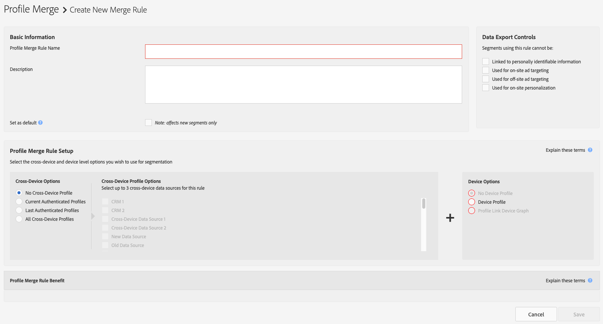

# Profile Merge Rules Options Defined {#profile-merge-rule-options-defined}

Le opzioni della regola di unione consentono di controllare il tipo di dati utilizzato da Audience Manager per la segmentazione. Una regola di unione può includere profili dispositivo mappati dal grafico del [!UICONTROL Profile Link] dispositivo, dai fornitori di grafici [!UICONTROL Adobe Experience Cloud Device Co-op]di dispositivi e/o da altri fornitori di grafici di terze parti integrati con Audience Manager. Potete creare un massimo di 4 [!UICONTROL Profile Merge Rules]. Il quarto [!UICONTROL Profile Merge Rule] è disponibile esclusivamente per i clienti che hanno acquistato il [!UICONTROL People-Based Destinations] componente aggiuntivo.

Per creare un [!UICONTROL Profile Merge Rule] oggetto, selezionate una delle opzioni descritte di seguito, in [!UICONTROL Profile Merge Rule Setup].

## Profile Merge Rule Options Overview {#overview}

Le regole di unione dei profili consentono una serie di combinazioni di regole, ciascuna adattata a casi di utilizzo specifici. Per informazioni dettagliate sull'utilizzo di ogni combinazione di regole, vedere la tabella seguente.

| Opzione multi-dispositivo | Opzione dispositivo | Disponibilità | Tipo di valutazione | Supporto di Audience Lab | Casi d'uso |
| ------------------------------ | --------------------------------------------------- | ------------------------------------------------------------------------------------------------------------------------------------------------------------------------------------------------- | ------------------- | ----| -------------------- |
| Nessun profilo multi-dispositivo | Profilo dispositivo | Tutti i clienti | Tempo reale e batch | Sì | [Targeting dei dispositivi](merge-rule-targeting-options.md#device-personalization) |
| Nessun profilo multi-dispositivo | Device Graph esterno (include Co-op Device Graph) | Tutti i clienti | Tempo reale e batch | No | [Targeting esteso dei dispositivi](external-graph-use-cases.md#audience-expansion) |
| Profili autenticati correnti | Nessun profilo dispositivo | Tutti i clienti | Solo in tempo reale | No | [Targeting dei dispositivi condivisi](merge-rule-targeting-options.md#target-shared-devices) |
| Ultimi profili autenticati | Profilo dispositivo | Tutti i clienti | Tempo reale e batch | Sì | [Targeting online/offline](merge-rule-targeting-options.md#device-household-targeting) |
| Ultimi profili autenticati | Grafico dispositivo di collegamento profilo | Solo Nord America e Canada | Tempo reale e batch | Sì | [Targeting tra dispositivi](profile-link-use-case.md#cross-device-personalization) |
| Ultimi profili autenticati | Device Graph esterno (include Co-op Device Graph) | Tutti i clienti | Tempo reale e batch | No | [Targeting cross-device avanzato](external-graph-use-cases.md#advanced-graph-expansion) |
|  Tutti i profili multi-dispositivo | N/D | Esclusivo ai clienti delle destinazioni [basate sulle](../destinations/people-based-destinations-overview.md) persone | Solo batch | No | [Targeting basato su persone](merge-rule-targeting-options.md#all-cross-device) |

## Valutazione segmento regola unione profilo {#segment-evaluation}

A seconda della [!UICONTROL Profile Merge Rules] configurazione, Audience Manager può eseguire la valutazione dei segmenti in tempo reale, in batch o in entrambi.

* La valutazione dei segmenti in tempo reale richiede che [!DNL DCS] i visitatori accedano alle proprie proprietà digitali in tempo reale, per qualificarsi per il segmento.
* La valutazione del segmento batch viene eseguita rispetto alle caratteristiche precedentemente qualificate.
* [!UICONTROL Profile Merge Rules] che supportano sia la valutazione in tempo reale che la valutazione dei segmenti batch, combinano l’attività dei visitatori in tempo reale con caratteristiche precedentemente qualificate.

## Latenza rapporti regole unione profilo {#reporting-latency}

La valutazione dei segmenti in tempo reale viene immediatamente riflessa nei [!UICONTROL Profile Merge Rules] rapporti.

La valutazione del segmento batch può richiedere fino a 24 ore per essere riflessa nei rapporti [sulle regole di unione dei](profile-link-metrics.md)profili.

## Opzioni multi-dispositivo {#auth-options}

Consente di [!UICONTROL Cross-Device Options] selezionare utenti autenticati e non autenticati e di sfruttare il loro profilo cross-device per la segmentazione. Queste opzioni consentono di identificare e raggiungere utenti specifici su un dispositivo condiviso. Per ulteriori informazioni sugli utenti anonimi e autenticati, consulta Stati di autenticazione [visitatore in Audience Manager](../../reference/visitor-authentication-states.md).

<table id="table_4CE2DD312F54480E96BEAF72800789FB"> 
 <thead> 
  <tr> 
   <th colname="col1" class="entry"> Opzione multi-dispositivo </th> 
   <th colname="col2" class="entry"> Descrizione </th> 
  </tr> 
 </thead>
 <tbody> 
  <tr> 
   <td colname="col1"> 
 <b> Nessun profilo multi-dispositivo</b> 
 </td> 
   <td colname="col2"> 
Indica ad  Audience Manager di non utilizzare i dati raccolti dagli utenti autenticati. 
 </td> 
  </tr> 
  <tr> 
   <td colname="col1"> 
 <b> Profili autenticati correnti</b> 
 </td> 
   <td colname="col2"> 
Indica ad  Audience Manager di leggere e scrivere i dati nel profilo autenticato se un visitatore ha eseguito l'accesso al sito. 
 </td> 
  </tr> 
  <tr> 
   <td colname="col1"> 
 <b> Ultimi profili autenticati</b> 
 </td> 
   <td colname="col2"> 
Indica ad  Audience Manager di leggere i dati dal profilo autenticato dell'ultimo utente che ha eseguito l'accesso sul dispositivo. 
 
Se questa opzione è selezionata,  Audience Manager non scriverà nuovi dati sulle caratteristiche nel profilo autenticato se l'utente è anonimo. Al momento dell'autenticazione, i nuovi dati sulle caratteristiche vengono scritti nel profilo autenticato dell'utente. 
 </td>
  </tr> 
  <tr> 
   <td colname="col1"> 
 <b> Tutti i profili multi-dispositivo</b> 
 </td> 
   <td colname="col2"> 
Indica ad Audience Manager di leggere i dati da tutti i profili cross-device, indipendentemente dallo stato di autenticazione. Questa opzione è disponibile solo per i clienti di Audience Manager che hanno acquistato il componente aggiuntivo Destinazioni basate su persone.
 </td>
  </tr>
 </tbody>
</table>

## Opzioni profilo multi-dispositivo {#profile-options}

Vengono [!UICONTROL Cross-Device Profile Options] elencate le origini dati cross-device. Queste opzioni utilizzano i nomi forniti al momento della creazione di un'origine dati multi-dispositivo (vedere [Creazione di un'origine](merge-rules-start.md#create-data-source)dati multi-dispositivo). Puoi selezionare fino a 3 origini dati cross-device da utilizzare con ciascuna regola di profilo. Le opzioni [!UICONTROL Authenticated Profile Options] sono disponibili quando scegliete **[!UICONTROL Current Authenticated Profiles]** o **[!UICONTROL Last Authenticated Profiles]**.

## Opzioni dispositivo {#device-options}

Consente [!UICONTROL Device Options] di selezionare il tipo di *`device profile`* utilizzato da un [!UICONTROL Profile Merge Rule]. Un profilo dispositivo è basato sulle caratteristiche raccolte dall'attività di navigazione anonima. Come minimo, una regola di unione dei profili include un'opzione autenticata e un'opzione dispositivo.

<table id="table_D373FB787D1A4E3485C02C4A76F03395"> 
 <thead> 
  <tr> 
   <th colname="col1" class="entry"> Opzione dispositivo </th> 
   <th colname="col2" class="entry"> Descrizione </th> 
  </tr> 
 </thead>
 <tbody> 
  <tr> 
   <td colname="col1"> 
 <b> Nessun profilo dispositivo</b> 
 </td> 
   <td colname="col2"> 
Indica ad  Audience Manager di non utilizzare per la segmentazione le caratteristiche contenute nel profilo anonimo. 
 </td> 
  </tr> 
  <tr> 
   <td colname="col1"> 
 <b> Profilo dispositivo</b> 
 </td> 
   <td colname="col2"> 
Indica ad  Audience Manager di utilizzare il profilo dispositivo anonimo per la segmentazione. 
 </td> 
  </tr> 
  <tr> 
   <td colname="col1"> 
 <b> Grafico dispositivo di collegamento profilo</b> 
 </td> 
   <td colname="col2"> 
Indica ad  Audience Manager di leggere i profili dal dispositivo corrente e fino a 100 altri dispositivi da cui l'utente ha eseguito l'autenticazione. Questo grafico del dispositivo è basato sui dati di prime parti in  Audience Manager. È ideale per i clienti che hanno un elevato livello di autenticazione nelle loro proprietà digitali. Il grafico del dispositivo Collegamento  profilo viene aggiornato in tempo reale. Questa opzione è disponibile quando selezionate <b> Profilo</b> autenticato corrente o <b> Ultimo profilo</b>autenticato. Quando utilizzate questa opzione, potete scegliere un solo profilo autenticato ( Audience Manager ne visualizza automaticamente gli altri). Vedi anche <a href="profile-link-use-case.md"> Casi</a>di utilizzo di Profile Link Device Graph. 
 </td>
  </tr> 
  <tr> 
   <td colname="col1"> 
 <b> Co-op Device Graph</b> 
 </td> 
   <td colname="col2"> 
Indica ad  Audience Manager di leggere i profili dal dispositivo corrente e fino a 100 altri dispositivi utilizzando i collegamenti forniti da <a href="https://marketing.adobe.com/resources/help/en_US/mcdc/" format="https" scope="external"> Experience Cloud Device Co-op</a>. 
 
 Device Co-op è una cooperativa digitale in cui i clienti partecipanti condividono informazioni sul collegamento dei dispositivi. Device Co-op  elabora questi dati in un grafico del dispositivo. Un grafico a dispositivi collega i dispositivi ai cluster di dispositivi. Questi collegamenti sono generati da dati probabilistici e deterministici. I cluster rappresentano un gruppo di dispositivi utilizzati da una persona sconosciuta. Device Co-op condivide i cluster tra i suoi membri, aiutandoli a fornire ai loro clienti esperienze cross-device coerenti e di valore. 
 
 Per ulteriori informazioni su  Device Co-op, vedi: 
 
 
     <ul id="ul_8EDA7D092ECD444C8C19CDC7534D84DE"> 
      <li id="li_323BC5993D6A4BA3962169BF0ED37C55"> <a href="https://marketing.adobe.com/resources/help/en_US/mcdc/mcdc-overview.html" format="https" scope="external"> Panoramica di Device Co-op</a> </li> 
      <li id="li_0BDB2144EC584002B3B9F1D64B6CD580"> <a href="https://marketing.adobe.com/resources/help/en_US/mcdc/mcdc-requirements.html" format="https" scope="external"> Requisiti di iscrizione</a> </li> 
      <li id="li_632D1014909146758F07CFAC79B90CFE"> <a href="https://marketing.adobe.com/resources/help/en_US/mcdc/mcdc-processes.html" format="https" scope="external"> Device Graph: Processi e output interni</a> </li> 
      <li id="li_9DF8876BFBC043948D3E82BD081AAF9F"><a href="https://marketing.adobe.com/resources/help/en_US/aam/downloads/AAM_Device_Graphs.pdf" format="https" scope="external"> Grafici</a> Audience Manager e dispositivi esterni (download PDF). </li>
     </ul> 
 </td>
  </tr> 
  <tr> 
   <td colname="col1"> 
<b>Opzioni</b> di Device Graph di terze parti (Persona e Famiglia) 
 </td>
   <td colname="col2"> 
Queste opzioni consentono di creare regole di unione basate sulla tecnologia del grafico del dispositivo fornita da un fornitore di terze parti. Un grafico dei dispositivi di terze parti fornisce: 
 
 
     <ul id="ul_5BA0D940BA15484FADF134A5A73815D5"> 
      <li id="li_389ACEBBF79A47499B6119B0F9CB3B5D"> Dati probabilistici e/o deterministici. </li> 
      <li id="li_E8606D3871A145A68E87BDC3554AC4EF">Dati a livello di persona o di famiglia. </li> 
     </ul> 
 
Per utilizzare queste opzioni, devi essere un cliente di un grafico del dispositivo che fornisce chi è già integrato con  Audience Manager. Per ulteriori informazioni o per iniziare, contatta il tuo account manager. 
 </td>
  </tr>
 </tbody>
</table>

>[!MORE_LIKE_this]
>
>* [Domande frequenti sulle regole di unione dei profili](../../faq/faq-profile-merge.md)

