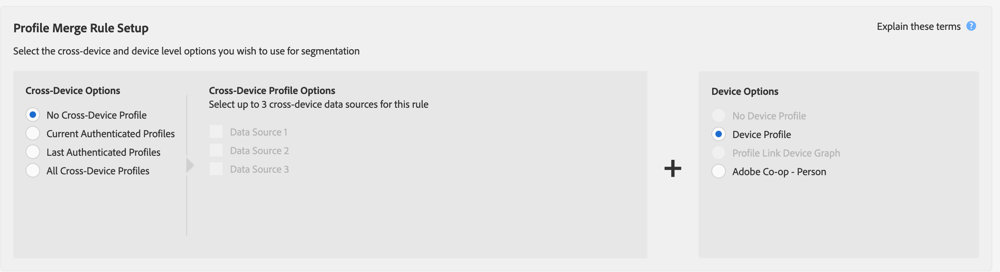

# Casi d’uso generali per le regole di unione profili {#general-use-cases-for-profile-merge-rules}

Le opzioni [!UICONTROL Profile Merge Rules] ti consentono di espandere o rendere più mirato il pubblico a tipi di pubblico specifici in base alle esigenze o agli obiettivi aziendali. In questi casi d’uso generali viene illustrato come utilizzare le opzioni disponibili e creare regole di unione per il targeting individuale, familiare e tra dispositivi. [!UICONTROL Profile Merge Rules] funzionano con destinazioni in tempo reale e batch.

>[!TIP]
>
>Per le definizioni e le descrizioni di queste impostazioni di [!UICONTROL Merge Rule], vedere [Opzioni delle regole di unione profili definite](merge-rule-definitions.md).

## Targeting dei dispositivi {#device-personalization}

Questo scenario si applica agli esperti di marketing che desiderano valutare un singolo profilo di dispositivo per un segmento di pubblico definito in Audience Manager, al fine di fornire un’esperienza coerente al dispositivo utilizzando piattaforme di targeting che supportano gli ID dispositivo (DSP, piattaforme di personalizzazione nel sito e altre piattaforme di targeting basate su dispositivi), senza tenere conto dell’autenticazione degli utenti.

Per creare una regola che esegua il targeting solo dei profili dispositivo, selezionare **[!UICONTROL No Cross-Device Profile]** + **[!UICONTROL Device Profile]**.

Diciamo che John possiede tre smartphone. Due di loro sono iPhone 7s sul piano dati A, e uno di loro è un Samsung sul piano dati B. Non tenendo conto del suo stato di autenticazione su nessuno dei tre dispositivi, il gestore di telefonia mobile di John vuole offrirgli un aggiornamento del piano dati, ma solo per i dispositivi iPhone 7 che eseguono il piano dati A.

Utilizzando la regola **[!UICONTROL No Cross-Device Profile]** + **[!UICONTROL Device Profile]**, [!DNL Device 1] e [!DNL Device 3] sono entrambi idonei per il segmento, mentre il dispositivo 2 viene ignorato.

## Targeting dei dispositivi condivisi {#target-shared-devices}

Diciamo che John e sua moglie, Jane, usano lo stesso portatile per visitare un negozio online e ordinare vari articoli.

John usa il proprio account per prenotare biglietti di viaggio e offerte speciali, mentre Jane usa il proprio account per acquistare musica e film.

Il team marketing dello store può utilizzare la regola **[!UICONTROL Current Authenticated Profiles]** + **[!UICONTROL No Device Profile]** per eseguire il targeting di John e Jane con offerte specifiche, in base esclusivamente alla loro attività autenticata.

Utilizzando questa regola, Audience Manager ignora completamente il profilo del dispositivo, qualificando l’ID del sistema di gestione delle relazioni con i clienti di John per il segmento e non qualificando l’ID del sistema di gestione delle relazioni con i clienti di Jane.

## Targeting online/offline {#device-household-targeting}

Questo caso d’uso riguarda la gestione dell’identità della famiglia. Un&#39;azienda può unire un singolo profilo dispositivo con l&#39;ultimo profilo autenticato su tale dispositivo, utilizzando la regola **[!UICONTROL Last Authenticated Profiles]** + **[!UICONTROL Device Profile]**.

Consideriamo un segmento di famiglie con redditi superiori a 100.000 dollari/anno, contenente almeno un dispositivo che è un [!DNL iPhone 7] su [!DNL Data Plan B]. Abbiamo due profili di famiglia (profili multi-dispositivo), ciascuno connesso a due diversi profili dispositivo. Le caratteristiche necessarie per qualificarsi per il segmento sono distribuite tra i profili dispositivo e multidispositivo.

Audience Manager unisce ogni coppia di profili dispositivo + multi-dispositivo per verificare se il set di caratteristiche unito è idoneo per il segmento. Poiché Audience Manager valuta ogni profilo incluso nell’unione, è possibile segmentare sia un profilo dispositivo che un profilo famiglia.

Il collegamento tra il dispositivo e il profilo di famiglia consente ad Audience Manager di qualificare [!DNL Household 2] per il segmento, ma non [!DNL Household 1]. Da [!DNL Household 2], solo [!DNL Device 3] è idoneo per il segmento. [!UICONTROL Profile Merge Rule] ha consentito all&#39;addetto marketing di inviare un messaggio di marketing coerente a un singolo dispositivo ([!DNL Device 3]) e alla famiglia ([!DNL Household 2]).

## Targeting per destinazioni basate su persone {#all-cross-device}

>[!IMPORTANT]
>
>Questo articolo contiene la documentazione del prodotto e illustra come configurare e utilizzare questa funzione. Niente di ciò che è contenuto in questo documento rappresenta un parere legale. Consulta il tuo consulente legale per ricevere assistenza legale.

Questo scenario di targeting è disponibile solo per i clienti che hanno acquistato il componente aggiuntivo [!DNL People-Based Destinations]. Questa regola consente agli esperti di marketing di raggiungere i clienti in base ai propri dati autenticati.

Supponiamo che una retailer online desideri raggiungere i clienti esistenti tramite piattaforme social e mostrare loro offerte personalizzate basate sui loro ordini precedenti. Con [!UICONTROL People-Based Destinations], è possibile acquisire indirizzi e-mail con hash dal proprio [!DNL CRM] in Audience Manager, creare segmenti dai dati offline e inviare questi segmenti alle piattaforme social sulle quali desiderano fare pubblicità, utilizzando l&#39;identificatore con hash, ottimizzando le spese pubblicitarie.

Per ulteriori informazioni su questa opzione, consulta [Destinazioni basate sulle persone](../destinations/people-based-destinations-overview.md).

## Opzioni di Device Graph {#device-graph-options}

La scelta dell&#39;opzione [!UICONTROL device graph] per una regola [!UICONTROL Profile Merge] dipende da condizioni specifiche per le proprietà digitali e gli obiettivi aziendali. Queste linee guida generali possono aiutarti a capire quando utilizzare un tipo di grafico rispetto a un altro. Per utilizzare queste opzioni, è necessario disporre di una relazione contrattuale con un grafico dei dispositivi esterno. Per informazioni generali su quando scegliere un’opzione del grafico dei dispositivi, consulta la tabella seguente. Per casi d&#39;uso specifici, vedi [Casi d&#39;uso del grafico dei dispositivi di collegamento dei profili](profile-link-use-case.md) e [Casi d&#39;uso del grafico dei dispositivi esterno](external-graph-use-cases.md).

<table id="table_66D9152D4FF040A186003272D456625D"> 
 <thead> 
  <tr> 
   <th colname="col1" class="entry"> Tipo di grafico del dispositivo </th> 
   <th colname="col2" class="entry"> Descrizione </th> 
  </tr>
 </thead>
 <tbody> 
  <tr> 
   <td colname="col1"> 
Grafico dei dispositivi di collegamento del profilo  
 </td> 
   <td colname="col2"> 
Le regole di unione dei profili  create con l'opzione  collegamento profilo sono ideali per: 
 
 
     <ul id="ul_FF44FA894BB2448887C8EDA9C8407EF9"> 
      <li id="li_E22505210C664FE6A9AA7C61244B36DA">Proprietà digitali con un alto livello di autenticazione del cliente. </li> 
      <li id="li_BE7112EE611E4DEB95B5C0A2852BFA97">Campagne mirate e a bassa portata. Il grafico del dispositivo  Profile Link è basato solo su dati deterministici. Questo pool di profili dispositivo sarà sempre più piccolo rispetto al pool di utenti e dispositivi non autenticati. </li> 
      <li id="li_5FD9E936A72A4EFE80E694FA2E08E385">Casi di utilizzo in cui i clienti devono essere in stato di autenticazione per qualificarsi per la segmentazione. </li> 
     </ul> 
 </td> 
  </tr> 
  <tr> 
   <td colname="col1"> 
Opzioni del grafico dei dispositivi esterno 
 </td> 
   <td colname="col2"> 
Le regole di unione dei profili  create con qualsiasi grafico dei dispositivi esterno integrato con  Audience Manager sono ideali per: 
 
 
     <ul id="ul_D76D773988604A619FA4A3BF37F910F0"> 
      <li id="li_969A0755A9E34CBEB2F7331C137B9A26">Proprietà digitali con un basso livello di autenticazione del cliente. </li> 
      <li id="li_AC78C8B4AD5340FFAC44FE851096C6A6">Campagne per marchi ad ampia portata. </li> 
      <li id="li_14AEC54CE34440889A3A36324EC6F497">Casi di utilizzo in cui i clienti non devono essere in stato di autenticazione per qualificarsi per la segmentazione. </li> 
     </ul> 
 </td> 
  </tr> 
 </tbody> 
</table>

Guarda il video seguente per una panoramica dei possibili casi d&#39;uso per [!UICONTROL Profile Merge Rules].

>[!VIDEO](https://video.tv.adobe.com/v/34897?captions=ita)

>[!MORELIKETHIS]
>
>* [Casi di utilizzo del grafico dei dispositivi di collegamento dei profili](profile-link-use-case.md)
>* [Casi d’uso del grafico dei dispositivi esterno](external-graph-use-cases.md)
>* [Domande frequenti sulle regole di unione profili](../../faq/faq-profile-merge.md)
