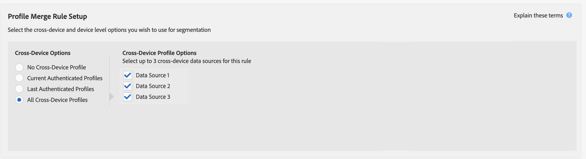

# Casi d’uso generali per le regole di unione profili {#general-use-cases-for-profile-merge-rules}

[!UICONTROL Profile Merge Rules] le opzioni ti consentono di espandere o rendere più mirato il pubblico a specifici tipi di pubblico in base a esigenze o obiettivi aziendali. In questi casi d’uso generali viene illustrato come utilizzare le opzioni disponibili e creare regole di unione per il targeting individuale, familiare e tra dispositivi. [!UICONTROL Profile Merge Rules] lavorare con destinazioni in tempo reale e batch.

>[!TIP]
>
>Per le definizioni e le descrizioni di queste impostazioni [!UICONTROL Merge Rule], consulta [Opzioni delle regole di unione dei profili definite](merge-rule-definitions.md).

## Targeting dei dispositivi {#device-personalization}

Questo scenario si applica agli esperti di marketing che desiderano valutare un singolo profilo dispositivo per un segmento di pubblico definito in Audience Manager, al fine di fornire un’esperienza coerente al dispositivo utilizzando piattaforme di targeting che supportano ID dispositivo (DSP, piattaforme di personalizzazione sul sito e altre piattaforme di targeting basate su dispositivi), senza considerare l’autenticazione degli utenti.

Per creare una regola per il targeting dei soli profili dispositivo, selezionare **[!UICONTROL No Cross-Device Profile]** + **[!UICONTROL Device Profile]**.

Diciamo che John possiede tre smartphone. Due di loro sono iPhone 7s sul piano A dati, e uno di loro è un Samsung sul piano B dati. Non tenendo conto del suo stato autenticato su uno qualsiasi dei tre dispositivi, il vettore mobile di John vuole offrirgli un aggiornamento del piano dati, ma solo per iPhone 7 dispositivi che eseguono sul piano A dati.

Utilizzando la regola **[!UICONTROL No Cross-Device Profile]** + **[!UICONTROL Device Profile]**, [!DNL Device 1] e [!DNL Device 3] sono entrambi qualificati per il segmento, mentre il dispositivo 2 viene ignorato.

## Targeting dei dispositivi condivisi {#target-shared-devices}

Diciamo che John e sua moglie, Jane, usano lo stesso portatile per visitare un negozio online e ordinare vari oggetti.

John utilizza il suo account per prenotare biglietti di viaggio e offerte speciali, mentre Jane utilizza il suo account per fare acquisti di musica e film.

Il team marketing del negozio può utilizzare la regola **[!UICONTROL Current Authenticated Profiles]** + **[!UICONTROL No Device Profile]** per eseguire il targeting di John e Jane con offerte specifiche, in base esclusivamente alla loro attività autenticata.

Utilizzando questa regola, Audience Manager ignora completamente il profilo dispositivo, qualificando l’ID CRM di John per il segmento e non qualificando l’ID CRM di Jane.

## Targeting online/offline {#device-household-targeting}

Questo caso d’uso riguarda la gestione dell’identità delle famiglie. Un&#39;azienda può unire un singolo profilo dispositivo con l&#39;ultimo profilo autenticato su quel dispositivo, utilizzando la regola **[!UICONTROL Last Authenticated Profiles]** + **[!UICONTROL Device Profile]**.

Consideriamo un segmento fatto di famiglie con redditi superiori a $100.000/anno, contenente almeno un dispositivo che è un [!DNL iPhone 7] su [!DNL Data Plan B]. Abbiamo due profili domestici (profili multi-dispositivo), ciascuno dei quali è collegato a due profili dispositivo diversi. Le caratteristiche necessarie per qualificarsi per il segmento sono distribuite tra i profili del dispositivo e tra i dispositivi.

Audience Manager unisce ogni coppia di profili dispositivo + multi-dispositivo per vedere se il set di caratteristiche unito è idoneo per il segmento. Poiché Audience Manager valuta ogni profilo incluso nell’unione, è possibile segmentare sia un profilo dispositivo che un profilo famiglia.

Il collegamento tra il dispositivo e il profilo della famiglia consente ad Audience Manager di qualificare [!DNL Household 2] il segmento, ma non [!DNL Household 1]. Da [!DNL Household 2], solo [!DNL Device 3] è idoneo per il segmento. Questo [!UICONTROL Profile Merge Rule] ha consentito all’addetto al marketing di inviare un messaggio di marketing coerente a un singolo dispositivo ([!DNL Device 3]) e alla famiglia più ampia ([!DNL Household 2]).

## Targeting per destinazioni basate su persone {#all-cross-device}

>[!IMPORTANT]
>
>Questo articolo contiene la documentazione del prodotto destinata a guidarti nella configurazione e nell’utilizzo di questa funzione. Nulla in essa contenuto è costituito da una consulenza legale. Consulta il tuo consulente legale per una guida legale.

Questo scenario di targeting è disponibile solo per i clienti che hanno acquistato il componente aggiuntivo [!DNL People-Based Destinations] . Questa regola consente agli esperti di marketing di raggiungere i clienti in base ai propri dati autenticati.

Supponiamo che un rivenditore online voglia raggiungere i clienti esistenti tramite piattaforme social e mostrare loro offerte personalizzate in base ai loro ordini precedenti. Con [!UICONTROL People-Based Destinations], possono inserire indirizzi e-mail con hash dal proprio [!DNL CRM] nell’Audience Manager, creare segmenti dai dati offline e inviare tali segmenti alle piattaforme social sulle quali desiderano pubblicizzare, utilizzando quell’identificatore con hash, ottimizzando la spesa pubblicitaria.

Per ulteriori informazioni su questa opzione, consulta [Destinazioni basate sulle persone](../destinations/people-based-destinations-overview.md).

## Opzioni del grafico dei dispositivi {#device-graph-options}

La scelta di un&#39;opzione [!UICONTROL device graph] per una regola [!UICONTROL Profile Merge] dipende dalle condizioni specifiche delle proprietà digitali e degli obiettivi aziendali. Queste linee guida generali possono aiutarti a capire quando utilizzare un tipo di grafico o un altro. Nota: per utilizzare queste opzioni, devi essere membro di [Adobe Experience Cloud Device Co-op](https://experienceleague.adobe.com/docs/device-co-op/using/home.html) o avere una relazione contrattuale con un grafico dei dispositivi esterno. Fai riferimento alla tabella seguente per le indicazioni generali su quando scegliere un’opzione del grafico dei dispositivi. Per casi d&#39;uso specifici, vedi [Casi d&#39;uso del grafico dei dispositivi di collegamento del profilo](profile-link-use-case.md) e [Casi d&#39;uso del grafico dei dispositivi esterno](external-graph-use-cases.md).

<table id="table_66D9152D4FF040A186003272D456625D"> 
 <thead> 
  <tr> 
   <th colname="col1" class="entry"> Tipo di grafico dei dispositivi </th> 
   <th colname="col2" class="entry"> Descrizione </th> 
  </tr>
 </thead>
 <tbody> 
  <tr> 
   <td colname="col1"> 
 Grafico dei dispositivi di collegamento del profilo 
 </td> 
   <td colname="col2"> 
 Le  regole di profilo create con l’opzione   Collegamento profilo  sono ideali per: 
 
 
     <ul id="ul_FF44FA894BB2448887C8EDA9C8407EF9"> 
      <li id="li_E22505210C664FE6A9AA7C61244B36DA">Proprietà digitali con un elevato livello di autenticazione dei clienti. </li> 
      <li id="li_BE7112EE611E4DEB95B5C0A2852BFA97">Campagne mirate e a portata ridotta. Il grafico dei dispositivi  Collegamento profilo è basato solo sui dati deterministici. Questo pool di profili dispositivo sarà sempre più piccolo rispetto al pool di utenti e dispositivi non autenticati. </li> 
      <li id="li_5FD9E936A72A4EFE80E694FA2E08E385">Casi di utilizzo in cui i clienti devono trovarsi in uno stato di autenticazione per qualificarsi per la segmentazione. </li> 
     </ul> 
 </td> 
  </tr> 
  <tr> 
   <td colname="col1"> 
Opzioni del grafico dei dispositivi esterno 
 </td> 
   <td colname="col2"> 
 Le  regole di profilo create con  <a href="https://experienceleague.adobe.com/docs/device-co-op/using/about/overview.html" format="https" scope="external"> Experience Cloud Device Co-port </a> per qualsiasi grafico di dispositivi esterno integrato con   Audience  Manager sono ideali per: 
 
 
     <ul id="ul_D76D773988604A619FA4A3BF37F910F0"> 
      <li id="li_969A0755A9E34CBEB2F7331C137B9A26">Proprietà digitali con livello basso di autenticazione del cliente. </li> 
      <li id="li_AC78C8B4AD5340FFAC44FE851096C6A6">Campagne di marchi ampie e di elevata portata. </li> 
      <li id="li_14AEC54CE34440889A3A36324EC6F497">Casi di utilizzo in cui i clienti non devono trovarsi in uno stato di autenticazione per qualificarsi per la segmentazione. </li> 
     </ul> 
 
 
Suggerimento: La  Device Co-op è la scelta migliore se sei un cliente  Experience Cloud con bassa autenticazione e nessuna relazione con alcun provider di grafici dei dispositivi. 
 
 </td> 
  </tr> 
 </tbody> 
</table>

Guarda il video seguente per una panoramica dei possibili casi di utilizzo di [!UICONTROL Profile Merge Rules].

>[!VIDEO](https://video.tv.adobe.com/v/28975/)

>[!MORELIKETHIS]
>
>* [Casi di utilizzo del grafico dei dispositivi di collegamento dei profili](profile-link-use-case.md)
* [Casi d’uso del grafico dei dispositivi esterno](external-graph-use-cases.md)
* [Domande frequenti sulle regole di unione dei profili](../../faq/faq-profile-merge.md)

