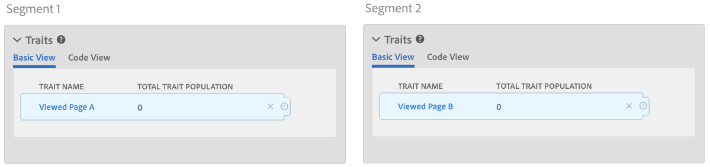
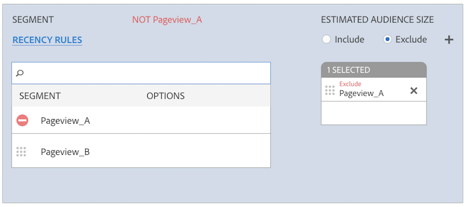

# Regole di unione profili e processi di annullamento della segmentazione dei dispositivi {#profile-merge-rules-and-device-un-segmentation-processes}

L&#39;unsegmentazione descrive i processi che consentono di squalificare e rimuovere profili dispositivo dai segmenti. La capacità di rimuovere un profilo dispositivo da un segmento dipende dall&#39;opzione del dispositivo utilizzata per creare un [!UICONTROL Profile Merge Rule].

## Opzioni dispositivo disponibili {#device-options}

Come promemoria, la [!UICONTROL Device Options] sezione è disponibile nella [!UICONTROL Profile Merge Rules Setup] sezione quando si crea o si modifica un [!UICONTROL Profile Merge Rule].

## Opzione Profilo dispositivo corrente e Annullamento della segmentazione del dispositivo {#current-device-profile-options}

**[!UICONTROL Current Device Profile]** è l&#39;opzione di profilo dispositivo predefinita per un [!UICONTROL Profile Merge Rule]. [!DNL Audience Manager] can remove a device profile from a segment when your [!UICONTROL Profile Merge Rule] use the **[!UICONTROL Current Device Profile]** option. In queste condizioni, l&#39;unsegmentazione avviene quando:

* Il profilo del dispositivo è stato inattivo per 120 giorni. Un processo settimanale di pulizia dei dati rimuove dai segmenti i profili dispositivo inattivi.
* Il dispositivo non si qualifica più per un segmento, perché gli aggiornamenti o le modifiche al profilo dispositivo la disqualificano. Questo avviene quando si cambiano i criteri di qualifica del segmento, oppure si applica un [!DNL AND NOT] operatore a una regola di segmento, oppure si specificano [condizioni di aggiornamento e frequenza](../../features/segments/recency-and-frequency.md) che utilizzano le impostazioni minore di/uguale a. I casi d&#39;uso sono descritti nella [documentazione sull&#39;eliminazione](../../features/profile-merge-rules/instant-cross-device-suppression.md) interdevice.

<!-- 

  Audience Manager can remove a device profile from a segment when your  Profile Merge Rule uses the <b> Current Device Profile</b> option. Under these conditions, unsegmentation happens when: 
 

 
 <ul id="ul_596501272A224228BD330DD56E01D973"> 
  <li id="li_E4FA1A5C722748CD82AE3A49FCBE86F6">The device profile has been inactive for 120-days. A weekly data cleanup process removes inactive device profiles from your segments. </li> 
  <li id="li_DB0CCD28425048D5B35309B8C2C384F9">The device no longer qualifies for a segment because updates or changes to the device profile disqualify it. This happens when segment qualification criteria change, or you apply an AND NOT operator to a segment rule, or specify <a href="../../features/segments/recency-and-frequency.md"> recency and frequency</a> conditions that use the less than/equal to settings. </li> 
 </ul> 
 

  

 -->

## Nessuna opzione dispositivo e Annullamento della segmentazione dispositivo {#no-device-option}

[!DNL Audience Manager] can remove a cross-device ID from a segment when your [!UICONTROL Profile Merge Rule] use the **[!UICONTROL No Device Profile]** + **[!UICONTROL Current Authenticated]** option. In queste condizioni, l&#39;unsegmentazione avviene quando l&#39;ID cross-device non si qualifica più per un segmento, perché gli aggiornamenti o le modifiche al profilo cross-device la disqualificano. Questo avviene quando si cambiano i criteri di qualifica del segmento, oppure si applica un [!UICONTROL AND NOT] operatore a una regola di segmento, oppure si specificano [condizioni di aggiornamento e frequenza](../../features/segments/recency-and-frequency.md) che utilizzano le impostazioni minore di/uguale a. I casi d&#39;uso sono descritti nella [documentazione sull&#39;eliminazione](../../features/profile-merge-rules/instant-cross-device-suppression.md) interdevice.

## Opzioni grafico dispositivo e Unsegmentazione dispositivo {#device-graph-options-unsegmentation}

[!DNL Audience Manager] può rimuovere più profili dispositivo da un segmento quando usa [!UICONTROL Profile Merge Rule] un&#39;opzione grafico dispositivo. L&#39;unsegmentazione avviene quando il profilo unito del dispositivo dal grafico del dispositivo non è più idoneo per il segmento, perché gli aggiornamenti o le modifiche a questo profilo unito non sono più riconoscibili dal segmento. Questo avviene quando si cambiano i criteri di qualifica del segmento, oppure si applica un [!UICONTROL AND NOT] operatore a una regola di segmento, oppure si specificano [condizioni di aggiornamento e frequenza](../../features/segments/recency-and-frequency.md) che utilizzano le impostazioni minore di/uguale a. I casi d&#39;uso sono descritti nella [documentazione sull&#39;eliminazione](../../features/profile-merge-rules/instant-cross-device-suppression.md) interdevice.

>[!NOTE]
>
>**Il limite di quattro dispositivi per la valutazione e l&#39;abilitazione dei segmenti** [!DNL Audience Manager] unisce fino a quattro dispositivi durante la valutazione dei segmenti con un [!UICONTROL Profile Merge Rule] grafico del dispositivo. [!DNL Audience Manager] valuta il dispositivo *corrente e tre dispositivi aggiuntivi che sono stati visti in tempo reale*. Se viene emesso il segnale di annullamento del segmento, il dispositivo corrente e tre dispositivi aggiuntivi visualizzati in tempo reale verranno rimossi dal segmento nella destinazione. Ad esempio, in un cluster di sei dispositivi, fino a quattro dispositivi vengono uniti, valutati e qualificati per un segmento. Analogamente, fino a quattro dispositivi vengono uniti, valutati e non segmentati.

<!-- 

Currently,  Audience Manager <i>cannot </i> remove a device profile from a segment when your  Profile Merge Rule uses a device graph option. This applies to rules created with these  Device Options settings: 
 

 
 <ul id="ul_0923834C984F464E9AB12FF5A8773214"> 
  <li id="li_731F67B7A07342988B13D7F91ECA5A9E">Profile Link Device Graph. </li> 
  <li id="li_D1EFC6F124124E64A0732DD060F788BE">The  Adobe device graph. </li> 
  <li id="li_CFD4189D4488432D92732532D23B30C7">Other third-party device graph options available that are available to you. </li> 
 </ul> 
 

 Unlike the previous case above, using the AND NOT operator or less than/equal to settings won't remove all of the devices from a segment profile. However, you can unsegment device profiles if you create simple segment rules and apply unsegment logic in the destination that receives your data. The following sections walks you through different unsegmentation use cases. 

 -->

<!-- 

This workaround shows you how to unsegment with Boolean  AND NOT logic when your  Profile Merge Rule uses a device graph option. This procedure uses separate, simple segments mapped to the same destination. In this case, you apply AND NOT logic on the destination rather than creating rules in Segment Builder. To set up unsegment rules for this use case: 
 

 
 <ol id="ol_677F0F9E6CB640079D9021DE66819916"> 
  <li id="li_95F898FDFB2D4F5395201FEA2E60A3AF">Create separate, single-trait segments as shown in the following example. 
 
 </li> 
  <li id="li_3A9F6D8B3CBB4F65B9A06EEC3B265158">Map the segments to the same destination. In this case, we're sending these to  Media Optimizer. </li> 
  <li id="li_092BB5887D0D4EE4B09F4B1C6703D454">Set AND NOT logic on the destination ( Media Optimizer) rather than in  Audience Manager. 
 
 </li> 
 </ol> 
 

 If you're not using  Media Optimizer, apply AND NOT logic on whatever destination receives these segments. 

 -->

<!-- 

This workaround shows you how to unsegment with the < = (less than/equal to) recency and frequency settings when your  Profile Merge Rule uses a device graph option. To set up unsegment rules for this use case: 
 

 
 <ol id="ol_DCBEE004B9FE40A881E4EC17FAEA50C2"> 
  <li id="li_DB8C1B6D5C5546E68769902A4F367966">Create a segment that contains a single trait and apply a > = (greater than/equal to) recency and frequency rule to the trait. 
 
 </li> 
  <li id="li_0DC50960D83B4B27A40F0BC76B944E0B">Map the segment to a destination. In this case, we're sending the segment to  Media Optimizer. </li> 
  <li id="li_FC23194A9FE54296914393F8067A6672">Set NOT logic on the destination ( Media Optimizer) rather than in  Audience Manager. Use NOT logic to exclude all devices that qualify for this segment from your campaign. 
 
 </li> 
 </ol> 
 

 If you're not using  Media Optimizer, apply NOT logic on whatever destination receives these segments. 

 -->

>[!MORE_ LIKE_ THIS]
>
>* [Domande frequenti su Profile Merge Rules e Device Graph](../../faq/faq-profile-merge.md)
>* [Soppressione immediata su diversi dispositivi](../../features/profile-merge-rules/instant-cross-device-suppression.md)
>* [Considerazioni importanti sulle regole di unione profili con grafici dispositivo](../../features/profile-merge-rules/considerations-pmr-device-graph.md)

