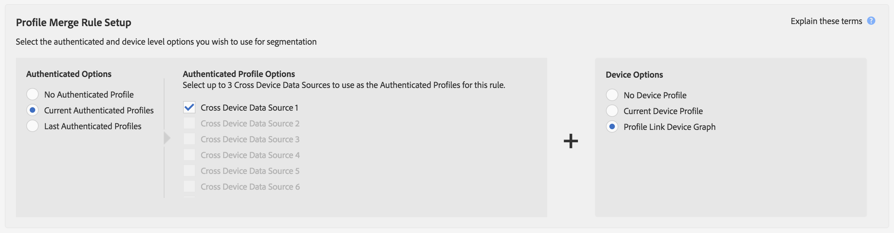

# Casi di utilizzo del grafico dei collegamenti profilo {#profile-link-device-graph-use-cases}

Raccomandazioni e casi d’uso per il retargeting dei segmenti e la qualificazione dei segmenti personalizzati con il grafico del [!UICONTROL Profile Link] dispositivo.

## Consigli {#recommendations}

Considerate il grafico del [!UICONTROL Profile Link] dispositivo per le campagne che:

* Avere un livello elevato di autenticazione nelle loro proprietà digitali. Utilizzate un'opzione [per grafico dispositivi](../../features/profile-merge-rules/merge-rule-definitions.md#device-options) esterni se disponete di una piccola quantità di utenti autenticati.
* Richiedi un targeting accurato delle audience note. Il modulo [!UICONTROL Profile Link device graph] viene creato utilizzando dati autenticati di prime parti.
* Esegue il targeting in tempo reale dei tipi di pubblico noti per i rispettivi stati di autenticazione e non autenticazione.

## Ripristino della configurazione della regola di unione di maiuscole e minuscole {#retargeting-use-cases}

Riavviate i tipi di pubblico che in precedenza erano stati autenticati sul sito e/o in-app su più dispositivi. I segmenti possono essere composti dai seguenti profili:

* Ultimo profilo dispositivo autenticato noto.
* Attività anonima per ciascun profilo dispositivo.

>[!NOTE]
>
>Per creare il segmento è possibile utilizzare le informazioni sulle caratteristiche di entrambi i tipi di profilo.

### Esempio di retargeting

Diamo un'occhiata a come funziona con una società di carte di credito di esempio. In questo esempio vengono utilizzate le informazioni sulle caratteristiche raccolte dalle attività anonime visualizzate solo in 3 profili dispositivo.

<table id="table_8C5ABA47A0634EBA9B1AA1B5C2AABF07"> 
 <thead> 
  <tr> 
   <th colname="col1" class="entry"> Caso d'uso </th> 
   <th colname="col2" class="entry"> Descrizione </th> 
  </tr> 
 </thead>
 <tbody> 
  <tr> 
   <td colname="col1"> 
 <b>Condizioni</b> 
 </td> 
   <td colname="col2"> 
Questo caso d’uso presuppone le seguenti condizioni: 
 
 
     <ul id="ul_72373D0F304044AE84E4CC055E3E8154"> 
      <li id="li_375DA786ED4D4F18A74C8FE42ABF8448">Un utente ha 3 dispositivi ed è stato l'ultima persona ad autenticarsi sul sito/app della società della carta di credito su tutti e 3 i dispositivi. </li> 
      <li id="li_77FDBFAED21B4DE19AB2B6C112E0C64B">Sul primo dispositivo, un utente in uno stato non autenticato visualizza un'offerta per una carta di credito premium. </li> 
      <li id="li_D3BE1B30BCCA49EA931AA9D97DD5F86D">Sul secondo dispositivo, un utente in uno stato non autenticato visualizza la pagina dei benefici della carta di credito premium. </li> 
      <li id="li_39D894624FC44806B6DB2C77F459B39E">Sul terzo dispositivo, un utente in uno stato non autenticato visualizza la pagina delle tariffe e delle tariffe della carta di credito premium. </li> 
     </ul> 
 </td> 
  </tr> 
  <tr> 
   <td colname="col1"> 
 <b>Risultati</b> 
 </td> 
   <td colname="col2"> 
Date queste condizioni,  Audience Manager: 
 
 
     <ul id="ul_1B6174F5C3AF4C32831D4217C5113789"> 
      <li id="li_98FE54696B604C3C8D93CC1C1FBB48D9">Unisce l'attività anonima non autenticata raccolta da tutti e 3 i dispositivi utilizzando l'ultimo profilo autenticato sul dispositivo corrente. </li> 
      <li id="li_A73C7DCE36BA42B6BAD26D8A075416C1">Valuta l'utente anonimo per la qualifica del segmento in base a: 
       <ul id="ul_EF66EAFD12CA44F5ACCB66319606D937"> 
        <li id="li_541762056ECF4BC1ABF1F5116B5FED6C">Una combinazione di attività anonima su tutti e 3 i dispositivi. </li> 
        <li id="li_C386CB62E5234E10AFEDE900ADC0E261">Ultimo profilo autenticato sul dispositivo corrente. </li> 
       </ul> </li> 
      <li id="li_5C9BDC8FF886494589F005C9658A923C">Invia il segmento a qualsiasi destinazione in tempo reale per il retargeting su tutti e 3 i dispositivi. </li>
     </ul> 
 </td> 
  </tr> 
 </tbody> 
</table>

### Esempio di regola di unione profilo di retargeting

Per impostare il retargeting con [!UICONTROL Profile Link], il vostro [!UICONTROL Authenticated Options] e [!UICONTROL Device Options] dovrebbe essere simile alla configurazione della regola mostrata di seguito. Le [!UICONTROL Authenticated Profile] opzioni saranno diverse da questo esempio perché queste impostazioni utilizzano i nomi delle origini dati cross-device.

## Configurazione della regola di unione dei profili e del caso di utilizzo della personalizzazione {#personalization-use-case}

Personalizza l'esperienza per l'audience autenticata sul sito e/o in-app in base all'attività su più dispositivi. I segmenti possono essere composti dai seguenti profili:

* Profilo dispositivo autenticato.
* Profili di dispositivi anonimi.

>[!NOTE]
>
>Per qualificarsi per un segmento, un utente deve essere autenticato.

### Esempio di personalizzazione

Diamo un'occhiata a come funziona con una società di carte di credito di esempio.

<table id="table_D2F4D5D27EB54224BB2CC1D843DDEDA3"> 
 <thead> 
  <tr> 
   <th colname="col1" class="entry"> Caso d'uso </th> 
   <th colname="col2" class="entry"> Descrizione </th> 
  </tr> 
 </thead>
 <tbody> 
  <tr> 
   <td colname="col1"> 
 <b>Condizioni</b> 
 </td> 
   <td colname="col2"> 
Il nostro caso di utilizzo presuppone le seguenti condizioni: 
 
 
     <ul id="ul_C4D2108E7B1C4D3C89411A9CCCDA6DAC"> 
      <li id="li_2F10EB17466B4B91A94DF707C3CB6BE5">Un utente ha 3 dispositivi ed è stato l'ultima persona ad autenticarsi sul sito/app della società della carta di credito su tutti e 3 i dispositivi. </li> 
      <li id="li_1559C4DA51254BCF95291133F32A4057">Sul primo dispositivo, un utente in uno stato non autenticato visualizza un'offerta per una carta di credito premium. </li> 
      <li id="li_734465E5619C474291C42921160CEC6B">Sul secondo dispositivo, un utente in uno stato non autenticato visualizza la pagina dei benefici della carta di credito premium. </li> 
      <li id="li_B96ABC0205384B59A1901708505B8BF8">Sul terzo dispositivo, un utente in uno stato non autenticato visualizza la pagina delle tariffe e delle tariffe della carta di credito premium. </li> 
      <li id="li_1A7BDBD546BD4B8EACF4292D885127F2">Su uno di questi dispositivi, il cliente esegue l'autenticazione (effettuando l'accesso) per verificarne il saldo. </li> 
     </ul> 
 </td> 
  </tr> 
  <tr> 
   <td colname="col1"> 
 <b>Risultati</b> 
 </td> 
   <td colname="col2"> 
Date queste condizioni,  Audience Manager: 
 
 
     <ul id="ul_37DBF5FEABC5463D85C74AD9150EA177"> 
      <li id="li_B60FFA5CF3F64FB69997AA05595900D7">Unisce l'attività anonima e non autenticata raccolta da tutti e 3 i dispositivi utilizzando il profilo autenticato corrente. Il profilo autenticato fornisce un identificatore comune per ciascun dispositivo. </li> 
      <li id="li_AB9FD87DD804474BA33805C364B7B92D">Valuta l'utente autenticato per la qualifica del segmento in base a: 
       <ul id="ul_EAF99E72159D4E329052B71344D9C69B"> 
        <li id="li_0B5E52BA6D8B493980291EA7B0AE235A">Una combinazione di attività anonima su tutti e 3 i dispositivi. </li> 
        <li id="li_07588DEFBEF64F97850CB12CD62D0213">Il profilo autenticato corrente. </li> 
       </ul> </li> 
      <li id="li_E7CFCEAD7610496189F4486000D7860A">Invia il segmento a qualsiasi destinazione in tempo reale per creare un'esperienza di navigazione personalizzata per l'utente durante l'autenticazione sul dispositivo corrente. 
Nota:  Ciò qualifica tutti e 3 i dispositivi per il segmento, indipendentemente dallo stato di autenticazione. Questo risultato può causare problemi di privacy se si tratta di dispositivi condivisi. 
 </li>
     </ul> 
 </td>
  </tr>
 </tbody> 
</table>

### Esempio di regola di unione profilo di personalizzazione

Per impostare la personalizzazione con [!UICONTROL Profile Link], il tuo [!UICONTROL Authenticated Options] e [!UICONTROL Device Options] dovresti avere l'aspetto della configurazione delle regole come mostrato di seguito. Le [!UICONTROL Authenticated Profile] opzioni saranno diverse da questo esempio perché queste impostazioni utilizzano i nomi delle origini dati cross-device.

Per ulteriori informazioni sul funzionamento di questi grafici del dispositivo, scaricate il PDF, [Audience Manager e i grafici](https://marketing.adobe.com/resources/help/en_US/aam/downloads/AAM_Device_Graphs.pdf)del dispositivo esterno.

>[!MORE_LIKE_this]
>
>* [Casi d'uso dei grafici dei dispositivi esterni](../../features/profile-merge-rules/external-graph-use-cases.md)
>* [Casi di utilizzo generali per le regole di unione dei profili](../../features/profile-merge-rules/merge-rule-targeting-options.md)
>* [Domande frequenti sulle regole di unione dei profili](../../faq/faq-profile-merge.md)

