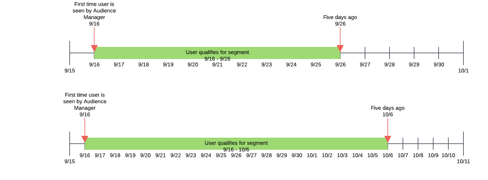

# Attualità e frequenza {#recency-and-frequency}

In [!UICONTROL Segment Builder]recency e frequenza potete segmentare i visitatori in base alle azioni che si verificano o si ripetono in un determinato intervallo giornaliero.

 Audience Manager definisce [!DNL recency] e [!DNL frequency] :

* **[!UICONTROL Recency]:**Recente visualizzazione o qualifica di un utente per uno o più[!UICONTROL traits].
* **[!UICONTROL Frequency]:**Frequenza con cui un utente ha visualizzato o qualificato uno o più utenti[!UICONTROL traits].

[!UICONTROL Recency] e [!UICONTROL Frequency] le impostazioni consentono di segmentare i visitatori in base al loro livello di interesse reale (o percepito) in un sito, una sezione o un particolare contenuto creativo. Ad esempio, gli utenti idonei per un segmento con requisiti di recency/frequenza elevati possono essere più interessati a un sito o a un prodotto rispetto agli utenti che visitano meno spesso o meno frequentemente.

## Posizione delle [!UICONTROL Recency and Frequency] impostazioni {#location}

In [!UICONTROL Segment Builder], [!UICONTROL Recency] e [!UICONTROL Frequency] le impostazioni si trovano nella [!UICONTROL Basic View] sezione del [!UICONTROL Traits] pannello. Fate clic sull&#39;icona dell&#39;orologio per visualizzare questi controlli.

## Limitazioni e regole {#limitations-rules}

Controlla e comprendi questi limiti e queste regole quando vuoi applicare recency e frequenza alle caratteristiche dei tuoi segmenti.

### [!UICONTROL Recency] {#recency}

<table id="table_026064124C694D75B7A960457D50170B"> 
 <thead> 
  <tr> 
   <th colname="col1" class="entry"> Limite o regola </th> 
   <th colname="col2" class="entry"> Descrizione </th> 
  </tr> 
 </thead>
 <tbody> 
  <tr> 
   <td colname="col1"> 
 <b>Valore minimo</b> 
 </td> 
   <td colname="col2"> 
Il valore Recency deve essere maggiore di 0. 
 </td> 
  </tr>
  <tr> 
   <td colname="col1"> 
 <b>Tipi di caratteristiche</b> 
 </td> 
   <td colname="col2"> 
Potete applicare controlli di aggiornamento solo alle caratteristiche basate su regole e alle cartelle. 
 </td> 
  </tr> 
  <tr> 
   <td colname="col1"> 
 <b>Caratteristiche di terze parti</b> 
 </td> 
   <td colname="col2"> 
Non è possibile impostare regole di aggiornamento per singoli tratti o gruppi di caratteristiche di terze parti contenenti caratteristiche di terze parti. Recency e frequenza si applicano solo alle proprie caratteristiche. 
 </td> 
  </tr> 
 </tbody> 
</table>

### [!UICONTROL Frequency] {#frequency}

<table id="table_EBD621D26C8B4D03933E8C0753C892A7"> 
 <thead> 
  <tr> 
   <th colname="col1" class="entry"> Limite o regola </th> 
   <th colname="col2" class="entry"> Descrizione </th> 
  </tr> 
 </thead>
 <tbody> 
  <tr> 
   <td colname="col1"> 
 <b>Caratteristiche di terze parti</b> 
 </td> 
   <td colname="col2"> 
Non è possibile impostare regole di frequenza sulle caratteristiche individuali di terze parti o sui gruppi di caratteristiche che contengono caratteristiche di terze parti. Recency e frequenza si applicano solo alle proprie caratteristiche. 
 </td> 
  </tr> 
  <tr> 
   <td colname="col1"> 
 <b>Tipi di caratteristiche</b> 
 </td> 
   <td colname="col2"> 
Potete applicare i controlli di frequenza solo alle caratteristiche basate su regole e alle cartelle. 
 </td> 
  </tr> 
  <tr> 
   <td colname="col1"> 
 <b>Requisiti di aggiornamento</b> 
 </td> 
   <td colname="col2"> 
Puoi configurare i requisiti di frequenza <i>senza</i> configurare i requisiti di aggiornamento. È sufficiente impostare un valore di frequenza e lasciare vuoto il campo Recency. 
 </td> 
  </tr> 
  <tr> 
   <td colname="col1"> 
<b>Regole di unione profili</b> 
 </td> 
   <td colname="col2"> 
See <a href="../../faq/faq-profile-merge.md#trait-freq-device-rules"> Trait Frequency, External Device Graphs, and Profile Merge Rules</a>. 
 </td> 
  </tr> 
 </tbody> 
</table>

## Esempi recenti {#recency-examples}

Di seguito sono riportati due esempi del funzionamento dell’aggiornamento, a seconda della selezione effettuata nell’interfaccia utente:

### Utilizzo di un operatore minore o uguale a (&lt;=)

In questo esempio, viene selezionato l&#39;operatore &lt;=, come mostrato nella schermata. Questo qualifica l’utente per [!UICONTROL segment] se questi ha diritto a uno dei tre [!UICONTROL traits] almeno tre volte negli ultimi cinque giorni. La timeline seguente mostra la [!UICONTROL segment] [!UICONTROL segment] qualifica al momento della creazione, il 1° ottobre e dieci giorni dopo.

### Utilizzo di un operatore maggiore o uguale a (=>)

In questo esempio, si seleziona l&#39;operatore =>, come mostrato nella schermata. Questo qualifica l&#39;utente [!UICONTROL segment] se questi ha diritto a una delle tre [!UICONTROL traits] almeno tre volte tra la prima qualifica sulla piattaforma Audience Manager  e l&#39;interruzione di tempo di cinque giorni fa. La timeline seguente mostra la [!UICONTROL segment] [!UICONTROL segment] qualifica al momento della creazione, il 1° ottobre e dieci giorni dopo.

## Esempi di maschiatura delle frequenze {#frequency-capping}

Le espressioni di capping delle frequenze includono tutti gli utenti il cui numero di [!UICONTROL trait] realizzazioni è inferiore al valore desiderato. Di seguito sono riportati alcuni esempi Right e Wrong:

* Sbagliato - L&#39;espressione `frequency([1000T]) <= 5` include tutti gli utenti che hanno realizzato l&#39; [!UICONTROL trait] ID &quot;1000&quot; al massimo cinque volte, ma include anche gli utenti che non hanno realizzato l&#39; [!UICONTROL trait]. Pertanto,  Audience Manager non convalida questa espressione per motivi di prestazioni, in quanto qualificherebbe troppi utenti per il [!UICONTROL segment].

* Right - Se desiderate includere tutti gli utenti che hanno realizzato l&#39; [!UICONTROL trait] con l&#39;ID &quot;1000&quot; al massimo cinque volte, aggiungete un&#39;altra condizione all&#39;espressione, per essere certi che gli utenti abbiano acquisito le qualifiche per [!UICONTROL trait] almeno una volta:  `frequency([1000T]) >= 1  AND  frequency([1000T]) <= 5`

* Right - Quando è necessario che i requisiti di recency/frequenza siano inferiori a un numero specifico di volte o di giorni, unisciti [!UICONTROL trait] a un altro con un `AND` operatore. Utilizzando l&#39;esempio nel primo punto elenco, questa espressione diventa valida se unita a un&#39;altra, [!UICONTROL trait] come illustrato di seguito: `frequency([1000T]) <= 5 AND isSiteVisitorTrait`.

* Right - Per i casi di utilizzo con limite di frequenza pubblicitaria, potete creare una [!UICONTROL segment] regola simile a questa: `(frequency([1000T] <= 2D) >= 5)`. Questa espressione include tutti gli utenti che hanno realizzato il [!UICONTROL trait] con l&#39;ID &quot;1000&quot; negli ultimi 2 giorni almeno cinque volte. Impostate il limite di frequenza inviando questo messaggio [!UICONTROL segment] al server di annunci con un `NOT` set sul [!UICONTROL segment] server di annunci. Questo approccio consente di ottenere prestazioni migliori [!DNL Audience Manager] pur continuando a servire lo stesso scopo per i limiti di frequenza.

>[!MORELIKETHIS]
>
>* [Controlli Generatore di segmenti: Sezione Caratteristiche](../../features/segments/segment-builder.md#segment-builder-controls-traits)
>* [Sintassi di codice utilizzata nell’editor di espressioni di segmenti](../../features/segments/segment-code-syntax.md)

