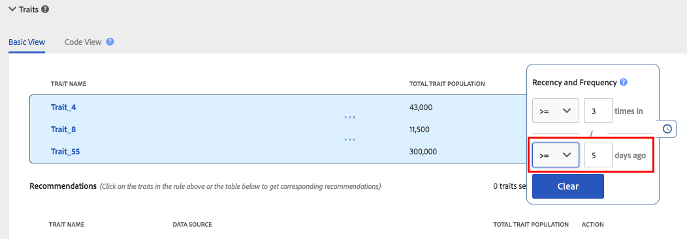

# Attualità e frequenza {#recency-and-frequency}

In [!UICONTROL Segment Builder], recency e frequenza consentono di segmentare i visitatori in base alle azioni che si verificano o si ripetono in un determinato intervallo giornaliero.

Audience Manager definisce [!DNL recency] e [!DNL frequency] come segue:

* **[!UICONTROL Recency]:** Recentemente un utente ha visualizzato o qualificato per uno o più [!UICONTROL traits].
* **[!UICONTROL Frequency]:** Frequenza di visualizzazione o qualificazione di un utente per uno o più [!UICONTROL traits].

Le impostazioni [!UICONTROL Recency] e [!UICONTROL Frequency] consentono di segmentare i visitatori in base al loro livello reale (o percepito) di interesse in un sito, una sezione o una particolare creatività. Ad esempio, gli utenti che si qualificano per un segmento con requisiti di frequenza/attualità elevati possono essere più interessati a un sito o a un prodotto rispetto agli utenti che visitano meno spesso o meno frequentemente.

## Percorso delle impostazioni [!UICONTROL Recency and Frequency] {#location}

In [!UICONTROL Segment Builder], le impostazioni [!UICONTROL Recency] e [!UICONTROL Frequency] si trovano nella sezione [!UICONTROL Basic View] del pannello [!UICONTROL Traits]. Fare clic sull&#39;icona dell&#39;orologio per esporre questi controlli.

## Limitazioni e regole {#limitations-rules}

Rivedi e comprendi questi limiti e regole quando desideri applicare recency e frequenza alle caratteristiche nei tuoi segmenti.

### [!UICONTROL Recency] {#recency}

<table id="table_026064124C694D75B7A960457D50170B"> 
 <thead> 
  <tr> 
   <th colname="col1" class="entry"> Limite o regola </th> 
   <th colname="col2" class="entry"> Descrizione </th> 
  </tr> 
 </thead>
 <tbody> 
  <tr> 
   <td colname="col1"> 
 <b>Valore minimo</b> 
 </td> 
   <td colname="col2"> 
Il valore di recency deve essere maggiore di 0. 
 </td> 
  </tr>
  <tr> 
   <td colname="col1"> 
 <b>Tipi di caratteristiche</b> 
 </td> 
   <td colname="col2"> 
Puoi applicare i controlli di attualità solo alle caratteristiche basate su regole e cartelle. 
 </td> 
  </tr> 
  <tr> 
   <td colname="col1"> 
 <b>Caratteristiche di terze parti</b> 
 </td> 
   <td colname="col2"> 
Non è possibile impostare regole di attualità su singole caratteristiche di terze parti o su gruppi di caratteristiche contenenti caratteristiche di terze parti. L’attualità e la frequenza si applicano solo alle caratteristiche dell’utente. 
 </td> 
  </tr> 
 </tbody> 
</table>

### [!UICONTROL Frequency] {#frequency}

<table id="table_EBD621D26C8B4D03933E8C0753C892A7"> 
 <thead> 
  <tr> 
   <th colname="col1" class="entry"> Limite o regola </th> 
   <th colname="col2" class="entry"> Descrizione </th> 
  </tr> 
 </thead>
 <tbody> 
  <tr> 
   <td colname="col1"> 
 <b>Caratteristiche di terze parti</b> 
 </td> 
   <td colname="col2"> 
Non puoi impostare regole di frequenza per caratteristiche di terze parti singole o gruppi di caratteristiche che contengono caratteristiche di terze parti. L’attualità e la frequenza si applicano solo alle caratteristiche dell’utente. 
 </td> 
  </tr> 
  <tr> 
   <td colname="col1"> 
 <b>Tipi di caratteristiche</b> 
 </td> 
   <td colname="col2"> 
Puoi applicare i controlli di frequenza solo alle caratteristiche basate su regole e cartelle. 
 </td> 
  </tr> 
  <tr> 
   <td colname="col1"> 
 <b>Requisiti di recency</b> 
 </td> 
   <td colname="col2"> 
È possibile configurare i requisiti di frequenza <i>senza</i> configurare i requisiti di aggiornamento. È sufficiente impostare un valore di frequenza e lasciare vuoto il campo di aggiornamento. 
 </td> 
  </tr> 
  <tr> 
   <td colname="col1"> 
<b>Regole di unione profili</b> 
 </td> 
   <td colname="col2"> 
Consulta <a href="../../faq/faq-profile-merge.md#trait-freq-device-rules"> Trait Frequency, External Device Graphs e Profile Merge Rules</a>. 
 </td> 
  </tr> 
 </tbody> 
</table>

## Esempi di attualità {#recency-examples}

Di seguito sono riportati due esempi di funzionamento di recency, a seconda della selezione effettuata nell’interfaccia utente:

### Utilizzo di un operatore minore o uguale a (&lt;=)

In questo esempio, seleziona l’operatore &lt;=, come mostrato nella schermata. Questo qualifica l&#39;utente per [!UICONTROL segment] se è idoneo per uno dei tre [!UICONTROL traits] almeno tre volte negli ultimi cinque giorni. La sequenza temporale seguente mostra la qualifica di [!UICONTROL segment] al momento della creazione di [!UICONTROL segment], il 1° ottobre e dieci giorni dopo.

### Utilizzo di un operatore maggiore o uguale a (=>)

In questo esempio, seleziona l’operatore =>, come mostrato nella schermata. Questo qualifica l&#39;utente per [!UICONTROL segment] se è idoneo per uno dei tre [!UICONTROL traits] almeno tre volte tra la prima qualifica sulla piattaforma Audience Manager e il cut-off di cinque giorni fa. La sequenza temporale seguente mostra la qualifica di [!UICONTROL segment] al momento della creazione di [!UICONTROL segment], il 1° ottobre e dieci giorni dopo.

## Esempi di limite di frequenza {#frequency-capping}

Le espressioni di quota limite includono tutti gli utenti il cui numero di realizzazioni [!UICONTROL trait] è inferiore al valore desiderato. Di seguito sono riportati alcuni esempi di utilizzo corretto e non corretto:

* Sbagliato: l&#39;espressione `frequency([1000T]) <= 5` include tutti gli utenti che hanno realizzato [!UICONTROL trait] con l&#39;ID &quot;1000&quot; un massimo di cinque volte, ma include anche gli utenti che non hanno realizzato [!UICONTROL trait]. Pertanto, Audience Manager non convalida questa espressione per motivi di prestazioni, in quanto qualificherebbe troppi utenti per [!UICONTROL segment].

* A destra: se si desidera includere tutti gli utenti che hanno realizzato [!UICONTROL trait] con l&#39;ID &quot;1000&quot; per un massimo di cinque volte, aggiungere un&#39;altra condizione all&#39;espressione per assicurarsi che gli utenti siano qualificati per [!UICONTROL trait] almeno una volta: `frequency([1000T]) >= 1  AND  frequency([1000T]) <= 5`

* A destra: quando i requisiti di recency/frequenza devono essere inferiori a un numero specifico di volte o giorni, unisci quel [!UICONTROL trait] a un altro con un operatore `AND`. Utilizzando l&#39;esempio nel primo punto elenco, questa espressione diventa valida quando si è uniti con un altro [!UICONTROL trait] come mostrato di seguito: `frequency([1000T]) <= 5 AND isSiteVisitorTrait`.

* A destra: per i casi di utilizzo dei limiti di frequenza per la pubblicità, puoi creare una regola [!UICONTROL segment] simile alla seguente: `(frequency([1000T] <= 2D) >= 5)`. Questa espressione include tutti gli utenti che hanno realizzato [!UICONTROL trait] con l&#39;ID &quot;1000&quot; negli ultimi 2 giorni almeno cinque volte. Impostare il limite di frequenza inviando [!UICONTROL segment] al server di annunci con `NOT` impostato su [!UICONTROL segment] nel server di annunci. Questo approccio consente di ottenere prestazioni migliori in [!DNL Audience Manager], mantenendo lo stesso scopo per il limite di frequenza.

>[!MORELIKETHIS]
>
>* [Controlli Generatore Di Segmenti: Sezione Caratteristiche](../../features/segments/segment-builder.md#segment-builder-controls-traits)
>* [Sintassi di codice utilizzata nell’editor di espressioni di segmenti](../../features/segments/segment-code-syntax.md)
