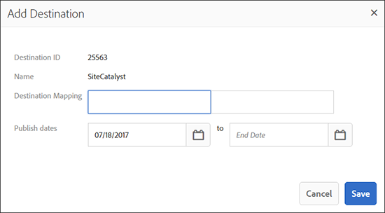

# Generatore di segmenti {#segment-builder}

Describes the required and optional steps that create a segment in [!UICONTROL Segment Builder].

## Crea un segmento {#create-segment}

### Sezione Generatore di segmenti

<!-- t_create_segment.xml -->

[!UICONTROL Segment Builder] consiste di 3 sezioni separate: [!UICONTROL Basic Information], [!UICONTROL Traits]e [!UICONTROL Destinations Mapping]. To create a segment, complete the required fields in the [!UICONTROL Basic Information] and [!UICONTROL Traits] sections. [!UICONTROL Destinations Mapping] sono facoltative. Per ulteriore assistenza, consultate le istruzioni riportate di seguito.

1. In the [Basic Information](../../features/segments/segment-builder.md#segment-builder-controls-basics) section:
   * Denominate il segmento. La lunghezza massima del nome di un segmento è 255 caratteri.
   * Imposta lo stato del segmento (attivo, è predefinito).
   * Scegliete un'origine dati.
   * Seleziona una regola di unione profilo da usare per la qualifica del segmento.
   * Assegna il segmento a una cartella di archiviazione.
1. In the [Traits](../../features/segments/segment-builder.md#segment-builder-controls-traits) section:
   * Search for the trait you want to add to a segment and click **[!UICONTROL Add Trait]**. Aggiungete un'altra caratteristica per creare un gruppo di caratteristiche.
   * Bring up the Advanced Search modal by clicking **[!UICONTROL Browse All Traits]**. Cerca caratteristiche per nome, ID, descrizione o origine dati. Fate clic su una cartella durante la ricerca per limitare i risultati a quella cartella e alle relative sottocartelle. Potete anche filtrare le caratteristiche per tipo di caratteristica.
   * Get live [trait recommendations](trait-recommendations.md) as you build your segment.
   * Fate clic e trascinate le caratteristiche per creare gruppi separati.
   * Hover between groups to set relationships with Boolean [!UICONTROL AND], [!UICONTROL OR], [!UICONTROL AND NOT] values.
   * Hover over the clock icon to add [recency and frequency](../../features/segments/recency-and-frequency.md) rules to the trait.
   * Visualizza i dati della popolazione del segmento quando aggiungi o rimuovi caratteristiche. Click **[!UICONTROL Calculate Estimates]** to see (or refresh) the estimated population numbers. Read more about [segment population data](../../features/segments/segment-builder-data.md#segment-populations) in the Segment Builder.
   * Click **[!UICONTROL Save]** when done.
1. *(Facoltativo)* Mappate un segmento su una destinazione nella [sezione Mappatura](../../features/segments/segment-builder.md#segment-builder-controls-destinations) destinazione:
   * Search for the destination and click **[!UICONTROL Add Destination]**. Nota, la destinazione deve già esistere prima di aggiungerla a un segmento.
   * Click **[!UICONTROL Save]** when done.

## Segment Builder Controls: Basic Information Section {#segment-builder-controls-basics}

In [!UICONTROL Segment Builder], [!UICONTROL the Basic Information] settings let you create new, or edit existing traits. Per creare un nuovo segmento, fornisci un nome, un'origine dati e seleziona una cartella di archiviazione. Tutti gli altri campi sono facoltativi. Move on to the [!UICONTROL Traits] section when done.

<!-- r_segment_basic_info_section.xml -->

<table id="table_39DA4BC9470448B48F6654F2774EE0D5"> 
 <thead> 
  <tr> 
   <th colname="col1" class="entry"> Campo </th> 
   <th colname="col2" class="entry"> Descrizione </th> 
  </tr> 
 </thead>
 <tbody> 
  <tr> 
   <td colname="col1"> <b>Nome</b> </td> 
   <td colname="col2"> 
Assegna al segmento un nome breve e logico che descrive la funzione o lo scopo. Evitare abbreviazioni e caratteri speciali. La lunghezza massima del nome di un segmento è 255 caratteri. 
 </td> 
  </tr> 
  <tr> 
   <td colname="col1"> <b>Descrizione</b> </td> 
   <td colname="col2"> 
Campo per ulteriori informazioni descrittive sul segmento. 
 </td> 
  </tr> 
  <tr> 
   <td colname="col1"> <b>Codice integrazione</b> </td> 
   <td colname="col2"> 
Campo per un ID definito dall'utente o altre informazioni specifiche della società. 
 </td> 
  </tr> 
  <tr> 
   <td colname="col1"> <b>Origine dati</b> </td> 
   <td colname="col2"> 
Associa il segmento a un provider di dati specifico. 
 </td> 
  </tr> 
  <tr> 
   <td colname="col1"><b>Regola unione profilo</b> </td> 
   <td colname="col2"> 
Seleziona la Regola unione profilo da usare per la qualifica del segmento. 
 </td> 
  </tr> 
  <tr> 
   <td colname="col1"> <b>Stato</b> </td> 
   <td colname="col2"> 
Attiva o disattiva il segmento (attivo per impostazione predefinita). 
 </td> 
  </tr> 
  <tr> 
   <td colname="col1"> <b>Archiviazione cartella</b> </td> 
   <td colname="col2"> 
Determina la cartella di memorizzazione a cui appartiene il segmento. 
 </td> 
  </tr> 
 </tbody> 
</table>

## Segment Builder Controls: Traits Section {#segment-builder-controls-traits}

In [!UICONTROL Segment Builder], the [!UICONTROL Traits] section lets you manage traits in a segment, create trait groups, and set qualification criteria. To add a trait to a segment, type the trait name in the search field and click [!UICONTROL Add Trait]. Save the trait (if finished) or move on to [!UICONTROL Destinations Mapping].

<!-- r_segment_traits_section.xml -->

**Prerequisiti:** Compila i campi richiesti nella [!UICONTROL Basic Information] sezione.

| Campo | Descrizione |
|--- |--- |
| Visualizzazione di base | Questa sezione fornisce controlli visivi che consentono di: <ul><li>Crea nuovi segmenti e gestisci i segmenti esistenti.</li><li>Rimuovi caratteristiche da un segmento.</li><li>Aggiungete fino a 50 caratteristiche al segmento.</li><li>Trascinate le caratteristiche per creare nuovi gruppi.</li><li>Visualizza caratteristiche e gruppi di caratteristiche in un segmento.</li><li>Impostate criteri di qualifica con espressioni booleane, operatori di confronto e impostazioni recency/frequenza.</li></ul> |
| Vista Codice | Apre un ambiente di sviluppo che consente di creare e gestire caratteristiche, gruppi e requisiti di qualifica con codice anziché l'interfaccia visiva. La vista Codice è utile se i segmenti sono: <ul><li>Contiene più di 50 caratteristiche in un singolo segmento. Nota: I segmenti sono limitati a 5000 caratteristiche (massimo).</li><li>Contiene molti gruppi di caratteristiche.</li><li>Requisiti di qualificazione complessi.</li></ul> |
| Cerca | Consente di trovare caratteristiche da aggiungere a un segmento. |
| Consigli | Ottenete consigli live per caratteristiche simili da aggiungere alla regola del segmento. Read more in [Trait Recommendations](trait-recommendations.md). |
| Dati Dimensione segmento reale e stimati | See [Trait and Segment Population Data in Segment Builder](segment-builder-data.md). |

## Remove Traits from a Segment {#remove-traits}

La gestione delle caratteristiche nei segmenti è una fase importante per mantenere i segmenti validi. Per rimuovere tratti da un segmento, effettuate le seguenti operazioni.

Per rimuovere tratti da un segmento:

1. Go to **Audience Data &gt; Segments**. Scorri l'elenco o usa la funzione di ricerca per trovare il segmento con cui vuoi lavorare.
2. Fai clic sul nome del segmento per aprire la schermata dei dettagli del segmento.
3. Click **Edit** to open Segment Builder and then click **Traits** to open the traits panel.
4. Passate il puntatore del mouse sulla caratteristica da eliminare, quindi fate clic sulla X. Questa azione rimuove immediatamente la caratteristica dal segmento.

## Segment Builder Controls: Destinations Mappings Section {#segment-builder-controls-destinations}

In [!UICONTROL Segment Builder], the optional [!UICONTROL Destinations Mapping] section lets you send segment data to a third-party [!DNL cookie], [!DNL URL], or server-to-server destination. To add a destination, search (or browse) for a destination, provide destination specific information, and click **[!UICONTROL Add Destination]**.

<!-- r_segment_destinations_map.xml -->

### Prerequisiti

Complete the required fields in the [!UICONTROL Basic Information] and [!UICONTROL Traits] sections. Inoltre, la destinazione deve già esistere.

### Strumenti di ricerca delle mappature di destinazione

**[!UICONTROL Destination Mappings]** Il pannello contiene strumenti di ricerca come descritto nella tabella seguente.

| Tipo di ricerca | Descrizione |
|---|---|
| **Ricerca per nome destinazione** | Consente di cercare una destinazione specifica per nome. Per eseguire la ricerca, iniziate a digitare. Il campo viene compilato automaticamente in base ai termini di ricerca. Click **[!UICONTROL Add Destination]** when done. |
| **Sfoglia tutte le destinazioni** | Browse a list of *all* destinations available to you. Seleziona e aggiungi le destinazioni al tuo segmento dall'elenco a comparsa. |

## Fields in the Destination Mappings Pop-up Windows {#fields-in-dest-mappings}

In [!UICONTROL Segment Builder], the [!UICONTROL Add Destination] dialog appears after you select a destination. Questa finestra visualizza informazioni statiche sulla destinazione e sui campi che variano a seconda del tipo di destinazione. Fornite le informazioni richieste nei campi vuoti per impostare una mappatura di destinazione.

>[!NOTE]
>
>Le date di pubblicazione sono facoltative. Se vuota, la destinazione diventa attiva e non scade mai.

<!-- r_add_mappings_pop.xml -->

### Campi di destinazione cookie

In the [!UICONTROL Destination Mapping] fields, specify the key-value pairs used to send data to the destination. Immettere la chiave nel primo campo e i valori della seconda. La destinazione del cookie potrebbe essere simile a quella riportata di seguito:

### Campi destinazione URL

In the [!UICONTROL URL] and [!UICONTROL Secure URL] fields, specify the complete standard or secure address used to send data to the destination.

### Campi di destinazione server-to-server

In the [!UICONTROL Destination Value] field specify the value (part of a key-value pair) used to send data to the destination.

>[!MORE_ LIKE_ THIS]
>
>* [Creare una destinazione cookie](../../features/destinations/manage-destinations.md#create-cookie-destination)
>* [Creare una destinazione URL](../../features/destinations/manage-destinations.md#configure-url-destination)

