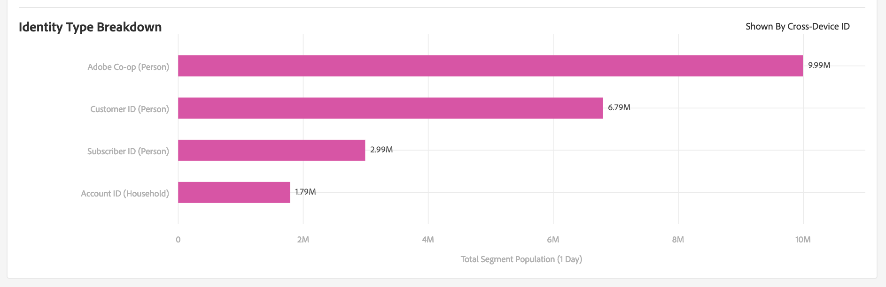

# Pagina Dettagli segmento {#segment-summary-view}

La pagina dei dettagli per un singolo segmento fornisce una panoramica dei dettagli del segmento, come il nome del segmento, l’ID, le metriche delle prestazioni, le regole che definiscono il segmento e le mappature di destinazione. Per visualizzare questi dettagli, andate a **[!UICONTROL Audience Data]** > **[!UICONTROL Segments]** e fate clic sul nome del segmento con cui desiderate lavorare.

## Strumenti di gestione dei segmenti {#segment-management-tools}

Nella parte superiore della pagina dei dettagli del segmento sono inclusi gli strumenti che puoi utilizzare per gestire i tuoi segmenti:

1. **[!UICONTROL Add New]**: Utilizzare questa opzione per attivare [!UICONTROL Segment Builder] e creare nuovi segmenti.
2. **[!UICONTROL Edit]**: Utilizzare questa opzione per modificare la configurazione del segmento corrente.
3. **[!UICONTROL Duplicate]**: Utilizzare questa opzione per creare una copia del segmento corrente.
4. **[!UICONTROL Delete]**: Utilizzate questa opzione per rimuovere il segmento corrente dall'account Audience Manager .
5. **[!UICONTROL Marketplace Recommendations]**: Utilizzate questa opzione per trovare segmenti simili a quelli che state visualizzando, dai feed di [!UICONTROL Audience Marketplace] dati a cui non siete iscritti. Consulta [Audience Marketplace for Data Buyers](../audience-marketplace/marketplace-data-buyers/marketplace-data-buyers.md) per scoprire come navigare nel mercato e trovare segmenti simili.

## Informazioni segmento {#basics}

Sotto gli strumenti di gestione dei segmenti potete trovare le seguenti informazioni sui segmenti:

1. **[!UICONTROL Basic Information]:**Mostra i dettagli obbligatori e facoltativi specificati al momento della creazione del segmento. Consulta[Segment Builder (Generatore](segment-builder.md)di segmenti) per una panoramica dettagliata del significato di questi campi.
2. **[!UICONTROL Segment Graph]:**Visualizza i dati sulle prestazioni graficamente e per intervalli fissi di 1, 7, 14, 30, 60 e 90 giorni. Spieghiamo i numeri della popolazione in un articoloseparato.

   

3. **[!UICONTROL Identity Type Breakdown ]:**Il rapporto mostra il numero di persone o famiglie idonee per un segmento contando il numero di ID cross-device e/o di ID di Device Graph esterni collegati ai dispositivi idonei per il segmento (mostrato dal[!UICONTROL Total Segment Population]). Gli ID cross-device e gli ID di Device Graph esterni mostrati in questo rapporto vengono utilizzati per unire i profili con la regola di unione dei profili utilizzata dal segmento. Questo rapporto viene visualizzato solo se hai selezionato un'origine dati multi-dispositivo o un Device Graph esterno nella regola di unione del profilo utilizzata dal segmento.

   

   >[!NOTE]
   >
   >Audience Manager visualizza il [!UICONTROL Identity Type Breakdown] rapporto solo se disponete di ID cross-device qualificati per il segmento.

   Guardate il video sottostante per una panoramica di [!UICONTROL Identity Type Breakdown].
   >[!VIDEO](https://video.tv.adobe.com/v/27977/)

4. **[!UICONTROL Segment Rules]:**Elenca le caratteristiche nel segmento insieme alle regole di qualifica.
5. **[!UICONTROL Destination Mappings]:**Elenca le mappature di destinazione per il segmento.
6. **[!UICONTROL Management Tools]:**Controlli che consentono di creare, modificare, duplicare ed eliminare segmenti.
