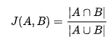

# Raccomandazioni sulle caratteristiche

Ricevi raccomandazioni sulle caratteristiche dal vivo man mano che crei i tuoi segmenti, dalle caratteristiche di prima parte e dai feed di [!UICONTROL Audience Marketplace] dati.

## Dimostrazione video

Per iniziare, guarda il [!UICONTROL Trait Recommendations] video qui sotto, quindi leggi per saperne di più. La dimostrazione video mostra come lavorare con le raccomandazioni derivate da caratteristiche di prime parti, nonché con le raccomandazioni sulle caratteristiche dei feed di [!UICONTROL Audience Marketplace] dati a cui *si è già abbonati*.

>[!VIDEO](https://video.tv.adobe.com/v/26228/)

Il video successivo illustra il flusso di lavoro per [!UICONTROL Marketplace Recommendations], mostrandovi come aggiungere caratteristiche ai segmenti, in base alle raccomandazioni dei feed di dati in [!UICONTROL Audience Marketplace]. Queste raccomandazioni si basano sui feed di dati a cui non *siete iscritti*.

>[!VIDEO](https://video.tv.adobe.com/v/29363/)

## Panoramica

[!UICONTROL Trait Recommendations], basato su [!DNL Adobe Sensei], introduce la scienza dei dati nei flussi di lavoro quotidiani  Audience Manager.
With [!UICONTROL Trait Recommendations], when you build or edit a segment in [Segment Builder](segment-builder.md), you get recommendations on additional traits you can include, that are similar to the traits in the segment rule.

 Audience Manager mostra le raccomandazioni relative alle caratteristiche sia dalle caratteristiche di prime parti, nella **[!UICONTROL Recommendations]** sezione e **[!UICONTROL Audience Marketplace]** nella **[!UICONTROL Recommendations from Marketplace]** sezione.

Aggiungi le caratteristiche consigliate al segmento per aumentare il pubblico di destinazione.

**In sintesi:**

*  Audience Manager mostra caratteristiche di prime parti nella [!UICONTROL Recommendations] sezione. Le raccomandazioni di Marketplace dai feed pubblici e privati per i quali non sei iscritto sono visibili nella [!UICONTROL Recommendations from Marketplace] sezione. Fate clic sul nome del feed per andare a [!UICONTROL Audience Marketplace] e iscrivervi.
*  Audience Manager mostra un massimo di cinquanta caratteristiche simili a quella della regola del segmento.
* Potete filtrare le origini dati da cui non desiderate visualizzare alcuna raccomandazione.
* Nel calcolo delle similarità,  Audience Manager considera gli [UUID](../../reference/ids-in-aam.md) idonei per la caratteristica negli ultimi 30 giorni.
* Se viene visualizzato il messaggio di errore &quot;Nessuna caratteristica simile trovata. Caratteristiche potrebbero essere troppo nuove.&quot;, ciò significa che o non c&#39;è stata alcuna attività per quel tratto negli ultimi 30 giorni, o  Audience Manager non ha ancora aggiornato le raccomandazioni per quel tratto. Riprova tra 24 ore.

## Casi d&#39;uso

Con [!UICONTROL Trait Recommendations], puoi migliorare i flussi di lavoro, a seconda di come utilizzi  Audience Manager:

* Come esperto di marketing, puoi trovare rapidamente audience interessate a prodotti complementari con l&#39;aiuto di caratteristiche simili, in modo da aumentare la tua portata.
* Se utilizzi  Audience Manager come editore, [!UICONTROL Trait Recommendations]puoi comprendere il comportamento del pubblico e creare segmenti migliori per le vendite di annunci pubblicitari o l&#39;acquisizione di utenti.
* In qualità di [!UICONTROL Audience Marketplace] data buyer, voglio scoprire dati rilevanti di terze parti senza consultare un gran numero di feed.
* Come fornitore di [!UICONTROL Audience Marketplace] dati, voglio raccomandare dati rilevanti agli acquirenti in modo da poter beneficiare di abbonamenti ottimali e rilevanti.

## Differenze tra le raccomandazioni caratteristiche e i modelli algoritmici

### Modelli algoritmici

[!UICONTROL Algorithmic Models] trova non solo le caratteristiche più influenti, ma anche i punteggi degli utenti in base a tali caratteristiche e assegna a ogni utente una valutazione individuale. In seguito puoi creare caratteristiche algoritmiche per eseguire il targeting degli utenti. With accuracy and reach controls in the [!UICONTROL Trait Builder], you can specify which users amongst all those who have the influential traits you want to target.

[!UICONTROL Algorithmic Models] consente di selezionare gli utenti a diversi livelli di precisione e di verificare in [!UICONTROL Audience Lab] quale gruppo di utenti converte meglio. Consulta il caso d’uso dettagliato in [Compare Models in Audience Lab](../../features/audience-lab/audience-lab-use-cases.md#compare-models).

In [!UICONTROL Algorithmic Models], the model runs every 8 days and refreshes the users qualified for algorithmic traits.

### Raccomandazioni sulle caratteristiche

[!UICONTROL Trait Recommendations] è un modo rapido per ottenere informazioni su altre caratteristiche simili a quelle utilizzate in un segmento.

È consigliabile utilizzare [!UICONTROL Trait Recommendations] quando:

* Hai bisogno di informazioni rapide durante la creazione di un segmento;
* Utilizzi segmenti per campagne brevi o quando desideri eliminare rapidamente il pubblico che effettua la conversione;
* Stai cercando di massimizzare la portata.

## Flusso di lavoro

Durante la creazione o la modifica di un segmento in Generatore [di](segment-builder.md)segmenti, puoi esplorare caratteristiche simili alle caratteristiche nella regola del segmento. Il flusso di lavoro [Segment Builder](segment-builder.md) è molto simile per i segmenti nuovi ed esistenti:

### Nuovi segmenti

1. Vai a Dati **audience > Segmenti** e fai clic su **Aggiungi nuovo**.
1. Nella casella a discesa **Caratteristiche** , aggiungi almeno una caratteristica alla regola del segmento.
1. Potete visualizzare le caratteristiche consigliate di prima parte e le raccomandazioni sulle [!UICONTROL Audience Marketplace] caratteristiche dai feed a cui siete iscritti, nella **[!UICONTROL Recommendations]** sezione. La **[!UICONTROL Recommendations from Marketplace]** sezione mostra le raccomandazioni di caratteristiche dai feed a cui non si è iscritti. Tutte queste raccomandazioni sono simili alle caratteristiche aggiunte alla regola del segmento. Scorrete verso il basso per visualizzare tutte le caratteristiche consigliate.
1. (Facoltativo) Per escludere caratteristiche di prime parti consigliate da determinate origini dati, fare clic sul simbolo **X** relativo alle origini dati da escludere.

   >[!NOTE]
   >
   >Le origini dati escluse sono visualizzate appena sopra l&#39;elenco delle caratteristiche consigliate. Fare clic su **X** nella casella grigia per rimuovere le esclusioni e visualizzare di nuovo i risultati dalle rispettive origini dati.
1. Per aggiungere caratteristiche consigliate alla regola del segmento, fate clic sul simbolo **+** .

>[!IMPORTANT]
>
>Quando aggiungi [!UICONTROL Marketplace] caratteristiche a un segmento, queste vengono utilizzate solo per la stima del segmento, fino a quando non ti iscrivi al feed di dati corrispondente. Le caratteristiche derivanti dai feed di dati per i quali non si è iscritti vengono contrassegnate con un&#39;icona del carrello nell&#39;elenco delle caratteristiche. Fate clic sul nome della caratteristica per andare alla pagina del feed di dati e iscrivervi.
>
>
>
>Puoi salvare un segmento con caratteristiche di terze parti solo dopo aver effettuato la sottoscrizione ai feed di dati corrispondenti.

### Segmenti esistenti

1. Vai a **[!UICONTROL Audience Data]>[!UICONTROL Segments]**, seleziona il segmento da modificare e fai clic su.
1. Scorri verso il basso fino alla casella a [!UICONTROL Traits] discesa.
1. Potete visualizzare le caratteristiche consigliate, che sono simili alle caratteristiche già presenti nella regola del segmento. Scorrete verso il basso per visualizzare tutte le caratteristiche consigliate.
1. (Facoltativo) Per escludere le caratteristiche consigliate da determinate origini dati, fare clic sul simbolo **X** relativo alle origini dati da escludere.

   >[!NOTE]
   >
   >Le origini dati escluse sono visualizzate appena sopra l&#39;elenco delle caratteristiche consigliate. Fare clic su **X** nella casella grigia per rimuovere le esclusioni e visualizzare di nuovo i risultati dalle rispettive origini dati.
1. Per aggiungere caratteristiche consigliate alla regola del segmento, fate clic sul simbolo **+** .

Quando create o modificate un segmento e aggiungete una caratteristica alla regola del segmento, viene visualizzato un massimo di cinquanta caratteristiche consigliate, simili a quelle aggiunte. Se la regola del segmento contiene più caratteristiche,  Audience Manager utilizza un metodo round robin per mostrare la corrispondenza migliore per ogni caratteristica, la seconda migliore per ogni caratteristica, e così via, per le più grandi cinquanta caratteristiche per popolazione, nella regola del segmento.

Ad esempio, se nella regola del segmento sono presenti tre caratteristiche, come illustrato di seguito, le caratteristiche consigliate sono:

1. Migliore corrispondenza con la caratteristica 3 (la caratteristica con la popolazione più numerosa);
1. Migliore corrispondenza per la caratteristica 1;
1. Migliore corrispondenza per la caratteristica 2;
1. seconda corrispondenza migliore per la caratteristica 3;
1. Seconda combinazione per la caratteristica 1, e così via fino a ottenere 50 caratteristiche.

Per ottenere le raccomandazioni per una caratteristica specifica, potete fare clic sulle caratteristiche nella regola del segmento (1) o nella vista delle caratteristiche raccomandate (2).

Facendo clic su una caratteristica di prima parte si apre una finestra a comparsa, come illustrato nell&#39;immagine seguente. Se le caratteristiche consigliate non fanno parte del segmento, potete aggiungerle al segmento premendo **+**.

>[!TIP]
>
>Le origini dati escluse dalla pagina principale vengono considerate durante la generazione di raccomandazioni all&#39;interno della finestra a comparsa delle informazioni sulle caratteristiche. Inoltre, escludendo le origini dati in questa visualizzazione, le esclusioni si applicano alla pagina principale.

>[!NOTE]
>
>Le caratteristiche consigliate possono essere tratti di prime parti o tratti di terze parti dai feed di dati a cui si è iscritti [!UICONTROL Audience Marketplace].

## Come funziona

Per produrre le raccomandazioni sulle caratteristiche,  Audience Manager calcola la similarità  Jaccard tra la caratteristica di destinazione e ogni altra caratteristica a cui l&#39;account ha accesso, compresi i dati di terze parti.  Audience Manager visualizza quindi fino a cinquanta caratteristiche con la somiglianza più elevata.

## Punteggio per similarità caratteristica {#trait-similarity-score}

 Audience Manager calcola la [!UICONTROL Trait Similarity Score] tra due caratteristiche calcolando l&#39;intersezione e l&#39;unione in termini di numero di [!UICONTROL UUID]s e quindi dividendo i due. Per due caratteristiche A e B, il calcolo si presenta come segue:

Vedi anche i due esempi seguenti.

### Esempio 1 - Punteggio per similarità con caratteristica bassa

Considerate le due caratteristiche A e B, diciamo che ciascuna caratteristica ha una popolazione di 1000000 [!UICONTROL UUID]s, 25000 [!UICONTROL UUID]s delle quali soddisfa entrambe le caratteristiche.
Utilizzando la formula precedente, si ottiene quanto segue: 25.000 / 1.975.000 = 0.012. Questo è basso, [!UICONTROL Trait Similarity Score]le due caratteristiche sono molto diverse.

### Esempio 2 - Punteggio per similarità caratteristica

Se le stesse caratteristiche A e B presentavano 400.000 [!UICONTROL UUID]s idonee per entrambe le caratteristiche, l&#39; [!UICONTROL Trait Similarity Score] operazione è molto più elevata:
400.000 / 1.600.000 = 0,25

### Come interpretare il punteggio per similarità caratteristica

Utilizzate la tabella riportata di seguito come guida approssimativa per la caratteristica similarità. Questa guida si basa sui punteggi di similarità rilevati nella maggior parte delle caratteristiche.

| [!UICONTROL Trait Similarity Score] | Significatività |
---------|----------|
| 0.1 e versioni successive | Elevata somiglianza tra le caratteristiche |
| 0.03 - 0.1 | Parità media tra caratteristiche |
| 0.01 - 0.03 | Bassa similarità tra le caratteristiche |
| 0 - 0.01 | Somiglianza molto bassa tra le caratteristiche |

## Controllo dell&#39;accesso basato sul ruolo (RBAC)

Per le aziende che utilizzano [!UICONTROL Role-Based Access Controls] ([!UICONTROL RBAC]), è necessario disporre dell&#39;autorizzazione per creare e modificare i segmenti al fine di visualizzare le caratteristiche consigliate. Le raccomandazioni sulle caratteristiche visualizzate sono solo quelle provenienti da origini dati a cui hai accesso tramite [!UICONTROL RBAC].

>[!IMPORTANT]
>
>Per aggiungere [!UICONTROL Marketplace Recommendations] un segmento, gli utenti devono prima sottoscrivere i feed di dati corrispondenti. Solo gli utenti con privilegi di amministratore possono iscriversi ai feed [!UICONTROL Audience Marketplace] di dati.

Ulteriori informazioni sui [!UICONTROL RBAC] controlli sono disponibili [qui](../administration/administration-overview.md).

## Limitazioni

* Al momento,  Audience Manager non mostra le caratteristiche delle cartelle come caratteristiche consigliate. Ulteriori informazioni sulle caratteristiche delle cartelle [qui](../traits/manage-folder-traits.md).
* Quando visualizzate le raccomandazioni sulle caratteristiche,  Audience Manager non tiene conto [!DNL Boolean] degli operatori ([!DNL AND], [!DNL OR], [!DNL NOT]) nelle regole dei segmenti.
