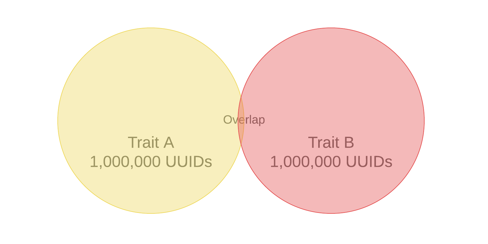

# Consigli sulle caratteristiche

Ottenete suggerimenti sulle caratteristiche live durante la creazione dei segmenti.

## Dimostrazione video

Per iniziare guardate il video Trait Recommendations, quindi continuate a leggere per ulteriori informazioni.

>[!VIDEO](https://video.tv.adobe.com/v/26228/?captions=ita)

## Panoramica

[!UICONTROL Trait Recommendations], gestito da [!DNL Adobe Sensei], porta la scienza dati nei flussi di lavoro giornalieri di Audience Manager.
With [!UICONTROL Trait Recommendations], when you build or edit a segment in [Segment Builder](segment-builder.md), you get recommendations on additional traits you can include, that are similar to the traits in the segment rule. Aggiungi le caratteristiche consigliate al segmento per aumentare il pubblico di destinazione.

**In un esempio:**

* Audience Manager mostra tratti di prime parti e caratteristiche di terze parti dai feed dati con iscrizione come caratteristiche consigliate.
* Audience Manager mostra un massimo di cinquanta caratteristiche simili a quelle della regola del segmento.
* Potete filtrare le origini dati da cui non desiderate visualizzare le raccomandazioni.
* Quando calcolate similarità, Audience Manager considera [UUID](../../reference/ids-in-aam.md) che sono idonei per la caratteristica negli ultimi 30 giorni.
* Se compare il messaggio di errore «Nessuna caratteristica similare trovata. Le caratteristiche possono essere troppo nuove. ", ciò significa che non c'è nessuna attività per quella caratteristica negli ultimi 30 giorni, oppure Audience Manager non ha ancora aggiornato le raccomandazioni per tale caratteristica. Riprovate dopo 24 ore.

## Casi d'uso

Con [!UICONTROL Trait Recommendations], puoi migliorare i flussi di lavoro a seconda di come usi Audience Manager:

* In qualità di esperto di marketing, puoi trovare rapidamente i tipi di pubblico interessati a prodotti complementari con l'aiuto di caratteristiche simili, per migliorare la portata.
* Se usi Audience Manager come editore, potrai [!UICONTROL Trait Recommendations]comprendere il comportamento dell'audience e creare segmenti migliori per le vendite pubblicitarie o l'acquisizione degli utenti.

## Differenze tra raccomandazioni caratteristiche e modelli algoritmici

### Modelli algoritmici

[!UICONTROL Algorithmic Models] trova non solo le caratteristiche più influenti, ma anche gli utenti di valutazione basati su tali caratteristiche e assegna a ogni utente un punteggio individuale. Potete quindi creare caratteristiche algoritmiche per eseguire il targeting dei vostri utenti. Con i controlli relativi alla precisione e alla portata in [!UICONTROL Trait Builder], potete specificare quali utenti hanno a disposizione le caratteristiche influenti che desiderate destinare.

[!UICONTROL Algorithmic Models] consente di selezionare gli utenti con livelli di accuratezza diversi e di eseguire il test in base [!UICONTROL Audience Lab] al quale il gruppo di utenti viene convertito meglio. Guarda il caso d'uso dettagliato in [Confronta modelli in Audience Lab](../../features/audience-lab/audience-lab-use-cases.md#compare-models).

In [!UICONTROL Algorithmic Models], il modello viene eseguito ogni 8 giorni e aggiorna gli utenti idonei per le caratteristiche algoritmiche.

### Consigli sulle caratteristiche

[!UICONTROL Trait Recommendations] è un modo rapido per ottenere informazioni su altre caratteristiche simili a quelle utilizzate in un segmento.

È opportuno utilizzare [!UICONTROL Trait Recommendations] quando:

* Durante la creazione di un segmento hai bisogno di informazioni rapide;
* State utilizzando i segmenti per campagne brevi o per rimuovere rapidamente i destinatari che effettuano conversioni;
* Stai cercando di massimizzare la portata.

## Flusso di lavoro

Quando crei o modifica un segmento in [Segment Builder](segment-builder.md)(Generatore segmenti), puoi esplorare caratteristiche simili alle caratteristiche nella regola del segmento. Il flusso di lavoro del Generatore di segmenti è molto simile ai segmenti nuovi e esistenti:

### Nuovi segmenti

1. In **Audience Data &gt; Segmenti**, seleziona **Aggiungi nuovo**.
2. Nel menu a discesa **Caratteristiche** , aggiungi almeno una caratteristica alla regola del segmento.
3. Ora potete vedere caratteristiche consigliate simili alle caratteristiche aggiunte alla regola del segmento. Scorrete verso il basso per visualizzare tutte le caratteristiche raccomandate.
4. (Facoltativo) Per escludere tratti consigliati da determinate origini dati, fai clic sul **simbolo X** per le origini dati da escludere.
   > [!NOTE]
   > 
   >Le origini dati escluse sono visualizzate appena sopra l'elenco delle caratteristiche consigliate. Premete **X** nella casella grigia per rimuovere le esclusioni e vedere di nuovo i risultati dalle rispettive origini dati.
5. Per aggiungere caratteristiche consigliate alla regola del segmento, fate clic sul **simbolo +** .

### Segmenti esistenti

1. Passate a **[!UICONTROL Audience Data]&gt;[!UICONTROL Segments]**, selezionate il segmento da modificare e premete ).
1. Scorrete verso il basso fino al [!UICONTROL Traits] menu a discesa.
1. Potete vedere caratteristiche consigliate, simili alle caratteristiche già presenti nella regola del segmento. Scorrete verso il basso per visualizzare tutte le caratteristiche raccomandate.
1. (Facoltativo) Per escludere tratti consigliati da determinate origini dati, fai clic sul **simbolo X** per le origini dati da escludere.
   > [!NOTE]
   > 
   >Le origini dati escluse sono visualizzate appena sopra l'elenco delle caratteristiche consigliate. Premete **X** nella casella grigia per rimuovere le esclusioni e vedere di nuovo i risultati dalle rispettive origini dati.
1. Per aggiungere caratteristiche consigliate alla regola del segmento, fate clic sul **simbolo +** .

Quando create o modificate un segmento e aggiungete una caratteristica alla regola del segmento, potete vedere un massimo di cinquanta caratteristiche consigliate, simile a quella che avete aggiunto. Se la regola del segmento contiene più caratteristiche, Audience Manager usa un metodo round robin per mostrare la corrispondenza migliore per ogni caratteristica, quindi la seconda corrispondenza con ogni caratteristica, e così via, per le più grandi cinquanta caratteristiche della popolazione nella regola del segmento.

Ad esempio, se nella regola del segmento sono presenti tre caratteristiche, come illustrato di seguito, le caratteristiche consigliate sono:

1. Corrispondenza ottimale per caratteristica 3 (caratteristica con la popolazione più grande);
2. Corrispondenza ottimale per la caratteristica 1;
3. Corrispondenza ottimale per la caratteristica 2;
4. Corrispondenza secondo la caratteristica 3;
5. Corrispondenza di seconda qualità per la caratteristica 1 e così via fino a ottenere quattro caratteristiche.

Per ottenere raccomandazioni per una caratteristica specifica, potete fare clic sulle caratteristiche nella regola del segmento (1) o nella relativa vista (2).

Fai clic su una caratteristica per aprire una finestra a comparsa, come mostrato nell'immagine di seguito. Se le caratteristiche consigliate non fanno parte del segmento, puoi aggiungerle al segmento premendo **+**.

> [!TIP]
>
>Le origini dati escluse dalla pagina principale vengono considerate durante la generazione delle raccomandazioni nella finestra a comparsa delle informazioni relative alle caratteristiche. Inoltre, se escludi le origini dati in questa visualizzazione, queste vengono applicate alla pagina principale.

> [!NOTE]
>
> Le caratteristiche consigliate possono essere tratti di prime parti o caratteristiche di terze parti dai feed a cui sei iscritto.

## Come funziona

Per generare raccomandazioni sulle caratteristiche, Audience Manager calcola la similarità [di Jaccard](https://en.wikipedia.org/wiki/Jaccard_index) tra la caratteristica di destinazione e tutte le altre caratteristiche a cui l'account ha accesso, compresi i dati di terze parti. Audience Manager quindi visualizza fino a cinquanta caratteristiche con la similarità più elevata.

## Valutazione per similarità

Audience Manager calcola le [!UICONTROL Trait Similarity Score] due caratteristiche calcolando l'intersezione e l'unione in termini di numero [!UICONTROL UUID]di s e quindi dividile. Per due caratteristiche A e B, il calcolo si presenta come segue:

Consultate, inoltre, i due esempi seguenti.

### Esempio 1 - Punteggio per similarità con caratteristiche ridotte

Considerate due caratteristiche A e B, diciamo che ciascuna caratteristica ha una popolazione di 1,000,000 [!UICONTROL UUID], 25,000 [!UICONTROL UUID]di cui si qualifica per entrambe le caratteristiche.
Utilizzando la formula qui sopra, si ottiene: 25,000/1,975,000 = 0.012. Questa caratteristica è bassa [!UICONTROL Trait Similarity Score], le due caratteristiche sono molto diverse.

### Esempio 2 - Valutazione per similarità

Se le stesse caratteristiche A e B avevano 400,000 [!UICONTRL UUID]che si qualificano per entrambe le caratteristiche, il [!UICONTROL Trait Similarity Score] valore è molto superiore:
400,000/1,600,000 = 0.25

### Come interpretare il punteggio per similarità caratteristiche

Utilizzate la tabella seguente come guida approssimativa per la somiglianza. Questa guida si basa sui punteggi similarità osservati nella maggior parte delle caratteristiche.

| [!UICONTROL Trait Similarity Score] | Rilevanza |
---------|----------|
| 0.1 e versioni successive | Somiglianza alta tra le caratteristiche |
| 0.03 - 0.1 | Similarità media tra caratteristiche |
| 0.01 - 0.03 | Somiglianza bassa tra le caratteristiche |
| 0 - 0.01 | Somiglianza molto bassa tra le caratteristiche |

## Controllo dell'accesso basato su ruolo (RBAC)

Per le aziende che usano [!UICONTROL Role-Based Access Controls] ([!UICONTROL RBAC]), devi disporre dell'autorizzazione per creare e modificare segmenti per visualizzare caratteristiche consigliate. Inoltre, le caratteristiche consigliate visualizzate sono solo quelle delle origini dati a cui hai accesso [!UICONTROL RBAC]. Ulteriori informazioni sui [!UICONTROL RBAC] controlli disponibili qui.

## Limitazioni

* Attualmente, Audience Manager non mostra caratteristiche delle cartelle come consigliate. Ulteriori informazioni sulle caratteristiche [della cartella](../traits/manage-folder-traits.md).
* Quando visualizzate le Raccomandazioni caratteristiche, Audience Manager non prende [!DNL Boolean] gli operatori ([!DNL AND][!DNL OR], [!DNL NOT]) nelle regole del segmento.