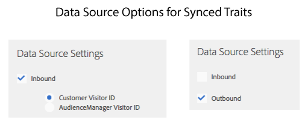

# Caratteristiche di pubblici attivi e caratteristiche sincronizzate con Data Source {#active-audience-traits-and-data-source-synced-traits}

Caratteristiche speciali utilizzate da [!UICONTROL Addressable Audiences]. [!UICONTROL Active Audience] e [!UICONTROL Data Source Synced Traits] si trovano in [!UICONTROL Audience Data > Traits > Audience Traits].

>[!NOTE]
>
>Per accedere a è necessario disporre di autorizzazioni di amministratore.

## Caratteristiche pubblico attivo {#active-audience-traits}

Una caratteristica [!UICONTROL Active Audience] contiene tutti i dispositivi gestiti nell&#39;account [!DNL Audience Manager]. È possibile utilizzare un [!UICONTROL Active Audience Trait] come altre caratteristiche quando si creano o si modificano segmenti. Inoltre, [Tipi di pubblico utilizzabili](../../features/addressable-audiences.md) richiede questa caratteristica per generare dati di sovrapposizione. Per impostazione predefinita, tutti gli account hanno una caratteristica [!UICONTROL Active Audience]. Questa caratteristica non può essere eliminata.

## Caratteristiche sincronizzate di Data Source {#data-source-synced-traits}

[!UICONTROL Data Source Synced Traits] vengono visualizzati nella cartella [!UICONTROL Audience Traits] quando [crei o modifichi un&#39;origine dati](../../features/manage-datasources.md#create-data-source) e applichi una delle seguenti impostazioni:

[!UICONTROL Data Source Synced Traits] tiene traccia di tutti gli utenti associati a un&#39;origine dati. È possibile utilizzare [!UICONTROL Data Source Synched Trait] come altre caratteristiche quando si creano o si modificano segmenti. Quando crei un [!UICONTROL Data Source Synced Trait], il nome della caratteristica corrisponde al nome utilizzato dall&#39;origine dati. Modifica l’origine dati per modificare il nome della caratteristica. Queste caratteristiche non possono essere eliminate.

>[!TIP]
>
>[!UICONTROL Data Source Synced Traits] sono utili per la risoluzione dei problemi. Fai clic sul nome di una caratteristica per controllare le metriche nella pagina di riepilogo delle caratteristiche. Se la caratteristica selezionata restituisce dati, ciò indica che il processo di sincronizzazione ID è configurato correttamente e i dati vengono inviati a [!DNL Audience Manager].

>[!MORELIKETHIS]
>
>* [Pubblico di riferimento](../../features/addressable-audiences.md)
