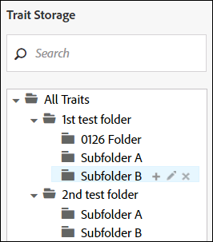
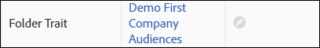

# Gestisci caratteristiche cartella {#manage-folder-traits}

Creare, modificare ed eliminare le caratteristiche della cartella.

## Creare una caratteristica cartella {#create-folder-trait}

A [!UICONTROL folder trait] viene creato automaticamente quando si crea una nuova cartella nella tassonomia.

<!-- create-folder-trait.xml -->

1. Vai a **[!UICONTROL Audience Data > Traits]** per passare al **Caratteristiche** dashboard.
1. In [!UICONTROL Trait Storage] finestra, passa il puntatore del mouse su:

   * Testo &quot;Tutte le caratteristiche&quot; per aggiungere una nuova cartella a livello principale.
   * Una cartella padre esistente per aggiungere una nuova cartella subordinata.

   

1. Fai clic sull&#39;icona + per creare la cartella. Puoi creare un massimo di 2000 cartelle nella tassonomia. Per ulteriori informazioni, consulta la documentazione sui [limiti di utilizzo](../../features/administration/usage-limits.md).
1. Assegna un nome alla cartella e fai clic su **Salva**. Ad esempio, una cartella denominata Elettronica avrà una caratteristica cartella denominata &quot;Caratteristiche cartella elettronica&quot;. Puoi visualizzare e selezionare la nuova caratteristica della cartella nel dashboard delle caratteristiche.
1. La nuova caratteristica della cartella viene assegnata automaticamente al [!DNL Audience Manager] origine dati generata. I tuoi utenti con le [!UICONTROL Role-Based Access Control] ([!DNL RBAC]) le autorizzazioni possono modificare l’origine dati nel flusso di lavoro modifica caratteristiche cartella . Vedi [Modificare una caratteristica di una cartella](../../features/traits/manage-folder-traits.md#edit-folder-trait).

## Modificare una caratteristica di una cartella {#edit-folder-trait}

Descrive come modificare un [!UICONTROL folder trait].

<!-- edit-folder-trait.xml -->

1. In [!UICONTROL Traits] dashboard, passa il puntatore del mouse **[!UICONTROL Actions]** colonna per la caratteristica della cartella da modificare.
1. Fai clic sulla matita per modificare la caratteristica.

   

1. La **[!UICONTROL Edit]** flusso di lavoro consente di modificare l’origine dati per le caratteristiche della cartella. Seleziona l’origine dati desiderata e fai clic su **[!UICONTROL Save]**. Le origini dati sono ordinate numericamente, per [!DNL DPID], nella casella a discesa .

   Se l&#39;azienda utilizza [!UICONTROL Role-Based Access Rights (RBAC)], per soddisfare le esigenze degli utenti [autorizzazioni di accesso](../../features/traits/about-folder-traits.md#role-based-access-controls) alle origini dati delle caratteristiche.

>[!NOTE]
>
>Non è possibile rinominare direttamente una caratteristica della cartella. [Rinomina la cartella di archiviazione associata](../../features/traits/trait-storage.md#rename-delete-trait-storage-folder) per modificare il nome della caratteristica della cartella.

## Eliminare una caratteristica cartella {#delete-folder-trait}

Eliminare una caratteristica cartella eliminando la cartella di archiviazione a cui appartiene la caratteristica.

<!-- delete-folder-trait.xml -->

1. **Dati sul pubblico > Caratteristiche** per passare al **Caratteristiche** dashboard.
1. In [!UICONTROL Trait Storage] per eliminare una cartella, passa il cursore sopra di essa e fai clic sull&#39;icona X.

   

>[!NOTE]
>
>Non è possibile eliminare una caratteristica della cartella se viene utilizzata in un’espressione di segmento. Passa a [vista sulle caratteristiche](../../features/traits/trait-details-page.md) per vedere quali segmenti utilizzano la caratteristica della cartella. Quindi, fai clic sul nome del segmento per aprire il [visualizzazione riepilogo dei segmenti](../../features/segments/segment-summary-view.md), che consente di rimuovere caratteristiche dalle espressioni del segmento.
