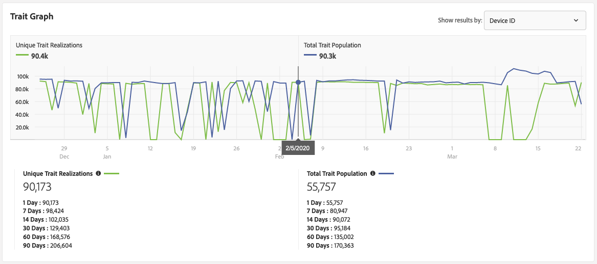

# Riferimenti per la qualifica di caratteristiche e segmenti {#trait-qualification-reference}

La qualifica di caratteristica, o realizzazione di caratteristiche, viene trattata in modo diverso in  Audience Manager, a seconda del tipo di caratteristica. Per informazioni dettagliate sulla qualifica del tipo di caratteristica, vedere [Qualificazione caratteristica per tipo di caratteristica](#trait-type).

Per ulteriori informazioni sulla qualifica del segmento, vedere [Popolazione segmento in tempo reale e Popolazione segmento totale](#real-time-segment).

## Qualificazione caratteristica per tipo di caratteristica {#trait-type}

| Tipo di caratteristica | Criteri di qualifica |
|---|---|
| Caratteristiche basate su regole | La qualifica di caratteristica avviene in tempo reale, in quanto gli utenti hanno diritto a una caratteristica nel browser. Gli utenti inizieranno a qualificarsi per una caratteristica basata su regola circa 4 ore dopo che [avrai creato la caratteristica](create-onboarded-rule-based-traits.md#create-rules-based-or-onboarded-traits) nell&#39;interfaccia utente. Le caratteristiche basate su regole consentono di utilizzare i controlli [recency e frequenza](../segments/recency-and-frequency.md) per il limite di frequenza degli annunci e altri casi di utilizzo. |
| Caratteristiche di bordo | La qualifica di caratteristica avviene dopo l&#39;elaborazione di un file in ingresso, ovvero il file in ingresso viene [importato in  Audience Manager](../../faq/faq-inbound-data-ingestion.md), ovvero quando si verifica la qualifica di caratteristica. Prima di caricare un file in entrata per l’elaborazione, è necessario attendere circa 4 ore dopo aver creato una caratteristica caricata. Per le caratteristiche registrate, il numero massimo di qualifiche per un profilo utente è 1. |
| Caratteristiche algoritmiche | Per le caratteristiche algoritmiche, il numero massimo di qualifiche per un profilo utente è 1. |
| Caratteristiche delle cartelle | Una caratteristica della cartella riassume le caratteristiche delle caratteristiche che contiene. Leggi [Caratteristiche cartella: Informazioni su](about-folder-traits.md) per ulteriori informazioni. |
| Caratteristiche di pubblici attivi e caratteristiche sincronizzate con la sorgente dei dati | Una caratteristica [!UICONTROL Active Audience] contiene tutti i dispositivi in gestione nell&#39;account  Audience Manager. [!UICONTROL Data Source Synced Traits] tenere traccia di tutti gli utenti associati a un&#39;origine dati. Ulteriori informazioni su [Caratteristiche del pubblico attivo e caratteristiche sincronizzate dell&#39;origine dati](client-activity-synced-audience-traits.md). |

## Realizzazioni di caratteristiche univoche e popolazione totale di caratteristiche {#unique-trait-realizations}

A seconda del tipo di risultati che si desidera visualizzare nel grafico (filtrato da [!UICONTROL Device ID] o [!UICONTROL Cross-Device ID]), le metriche hanno significati diversi:

Durante il filtraggio dei risultati per [!UICONTROL Device ID]:

* [!UICONTROL Unique Trait Realizations] è il numero di visitatori anonimi del dispositivo che hanno aggiunto la caratteristica al proprio profilo entro intervalli di tempo diversi.
* [!UICONTROL Total Trait Population] è il numero di visitatori anonimi del dispositivo che hanno questa caratteristica sul loro profilo.

Durante il filtraggio dei risultati per [!UICONTROL Cross-Device ID]:

* [!UICONTROL Unique Trait Realizations] è il numero di visitatori autenticati che hanno aggiunto la caratteristica al proprio profilo, entro intervalli di tempo diversi.
* [!UICONTROL Total Trait Population] è il numero di visitatori autenticati che hanno questa caratteristica sul loro profilo.

Pensate ai numeri in questo modo. Nell&#39;immagine precedente, dalla [Visualizzazione Dettagli caratteristica](../../features/traits/trait-details-page.md), 90.173 rappresenta il numero di dispositivi attivi che hanno visitato le vostre proprietà ieri. La [!UICONTROL Total Trait Population] di 55.757 rappresenta la quantità di utenti attualmente qualificati per questa caratteristica. La cifra [!UICONTROL Total Trait Population] è destinata a mostrare la quantità totale di utenti che possono essere utilizzati per segmentazione/targeting. In genere, gli utenti restano parte di una caratteristica per 120 giorni.

Poiché eseguiamo due diversi processi di calcolo per calcolare le due popolazioni, la [!UICONTROL Total Trait Population] rimane sempre indietro di 24 ore rispetto alla [!UICONTROL Unique Trait Realizations]. Nel grafico qui sopra, potete vedere circa 90.400 [!UICONTROL Unique Trait Realizations] e un [!UICONTROL Total Trait Population] di circa 90.300 per il 5 febbraio. I 90.400 profili vengono aggiunti al [!UICONTROL Total Trait Population] il giorno successivo.

Per portare ulteriormente a casa il punto, se avete sperimentato un picco di 10.000 visitatori in questo momento, si presenterebbero in [!UICONTROL Unique Trait Realizations] di domani, ma solo 24 ore dopo nel [!UICONTROL Total Trait Population].

Qualsiasi modifica nelle realizzazioni delle caratteristiche riflette le popolazioni dei segmenti.

## Popolazione di segmenti in tempo reale e popolazione totale di segmenti {#real-time-segment}

Il [!UICONTROL Real-time Segment Population] conteggia il numero di dispositivi idonei per il segmento selezionato e che hanno raggiunto le proprietà, entro l&#39;intervallo di tempo selezionato.

Il [!UICONTROL Total Segment Population] conta il numero di dispositivi idonei per il segmento selezionato nell&#39;intervallo di tempo selezionato. Il report [!UICONTROL 1 Day] rappresenta il conteggio di popolazione del segmento più aggiornato.

Pensate ai numeri in questo modo. Nell&#39;immagine qui sopra, dalla [Segment Details](../../features/segments/segment-summary-view.md) view, 9.993 rappresenta il numero di dispositivi attivi, che ieri hanno visitato le vostre proprietà e che sono qualificati per il segmento. Il numero [!UICONTROL Total Segment Population] di 699.532 rappresenta il numero totale di dispositivi attualmente idonei per questo segmento. La cifra [!UICONTROL Total Segment Population] è destinata a mostrare il numero totale di dispositivi che possono essere utilizzati per segmentazione/targeting.

Poiché eseguiamo due diversi processi di calcolo per calcolare le due popolazioni, la [!UICONTROL Total Segment Population] rimane sempre indietro di 24 ore rispetto alla [!UICONTROL Real-time Segment Population]. Nel grafico qui sopra, potete vedere un 8.116 [!UICONTROL Real-time Segment Population] e un [!UICONTROL Total Segment Population] di 742.000 per il 2 febbraio. I profili 8.116 vengono aggiunti al [!UICONTROL Total Segment Population] il giorno successivo.

Per portare ulteriormente a casa il punto, se avete sperimentato un picco di 10.000 visitatori in questo momento, si presenterebbero in [!UICONTROL Real-time Segment Population] di domani, ma solo 24 ore dopo nel [!UICONTROL Total Segment Population].

## Limite di qualifica caratteristica {#trait-qualification-limit}

Per ciascun profilo utente viene applicato un limite di 150.000 qualifiche di caratteristica, che si tratti di un profilo autenticato ([DPUUID](../../reference/ids-in-aam.md)) o di un ID dispositivo ([UUID](../../reference/ids-in-aam.md)). Sebbene i DPUUID siano univoci per un&#39;istanza specifica di [!DNL Audience Manager], gli UUID vengono condivisi tra le [!DNL Audience Manager] piattaforme. Per [!UICONTROL UUID]s, imponiamo una politica di equità quando si memorizzano le qualifiche di caratteristiche. Un algoritmo garantisce che una quota uguale del profilo [!UICONTROL UUID] sia disponibile per ogni istanza di [!DNL Audience Manager].

