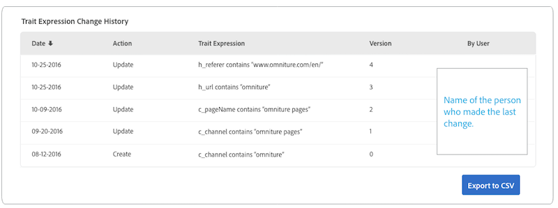

# [!UICONTROL Trait] Pagina dei dettagli  {#trait-details-page}

La pagina dei dettagli di un singolo [!UICONTROL trait] fornisce una panoramica dei dettagli [!UICONTROL trait], ad esempio il nome [!UICONTROL trait], l&#39;ID, le metriche delle prestazioni, le espressioni che definiscono il [!UICONTROL trait], i segmenti a cui appartiene e il registro di controllo [!UICONTROL trait]. Per visualizzare questi dettagli, vai su **[!UICONTROL Audience Data]** > **[!UICONTROL Traits]** e fai clic sul nome del [!UICONTROL trait] con cui desideri lavorare.

## [!UICONTROL Trait] Strumenti di gestione  {#trait-management-tools}

Nella parte superiore della pagina dei dettagli [!UICONTROL trait] sono presenti gli strumenti che puoi utilizzare per gestire il tuo [!UICONTROL traits]:

1. **[!UICONTROL Add New]**: Utilizza questa opzione per creare nuovi  [!UICONTROL rule-based],  [!UICONTROL algorithmic] o  [!UICONTROL onboarded traits].
2. **[!UICONTROL Edit]**: Utilizza questa opzione per modificare la configurazione dell&#39;attuale  [!UICONTROL trait].
3. **[!UICONTROL Delete]**: Utilizza questa opzione per rimuovere la corrente  [!UICONTROL trait] dal tuo account Audience Manager.
4. **[!UICONTROL Marketplace Recommendations]**: Usa questa opzione trova simile  [!UICONTROL traits] a quella che stai visualizzando, dalle tariffe  [!UICONTROL Audience Marketplace] dati a cui non sei iscritto. Per informazioni su come navigare [!UICONTROL Marketplace] e trovare caratteristiche simili, consulta l’ [Audience Marketplace per gli acquirenti di dati](../audience-marketplace/marketplace-data-buyers/marketplace-data-buyers.md) .

## [!UICONTROL Trait] Informazioni {#basics}

La sezione [!UICONTROL Trait Information] mostra i dettagli sui campi obbligatori e facoltativi completati durante la creazione di [!UICONTROL trait]. Questo include elementi come il tipo [!UICONTROL trait], l&#39; [!UICONTROL trait] ID, la descrizione, [!UICONTROL data source] e altri metadati. Questi dettagli variano a seconda del tipo [!UICONTROL trait] ([!UICONTROL folder], [!UICONTROL onboarded] o [!UICONTROL rule-based]).

## [!UICONTROL Trait Graph] {#trait-graph}

Il [!UICONTROL Trait Graph] fornisce metriche delle prestazioni a colpo d&#39;occhio per il [!UICONTROL trait] selezionato. Tieni il cursore su una linea di tendenza per visualizzare i dati aggiuntivi per la [!UICONTROL trait] selezionata.

[!UICONTROL Unique Trait Realizations] rappresentano un conteggio di utenti univoci che l’hanno aggiunto  [!UICONTROL trait] al loro profilo nel periodo di tempo specificato. Il [!UICONTROL Total Trait Population] indica il numero di utenti univoci attualmente qualificati per questo [!UICONTROL trait].

Per [!UICONTROL rule-based traits], la qualificazione [!UICONTROL trait] avviene in tempo reale, in quanto gli utenti si qualificano per un [!UICONTROL trait] nel proprio browser.

Per [!UICONTROL onboarded traits], la qualificazione [!UICONTROL trait] si verifica dopo l’elaborazione di un file in entrata, ovvero il file in entrata è [inserito in Audience Manager](../../faq/faq-inbound-data-ingestion.md) e cioè quando si verifica la qualifica [!UICONTROL trait].

Il [!UICONTROL Trait Graph] mostra le seguenti informazioni:

* **[!UICONTROL Show results by]**
   * **[!UICONTROL Cross-Device ID]**: seleziona questa opzione per visualizzare i risultati per  [!UICONTROL traits] i quali vengono raccolti i dati per i profili autenticati. Quando selezioni questa opzione, visualizzi solo i dati nel rapporto [!UICONTROL Cross-Device ID] e nessun dato sarà presente nel rapporto [!UICONTROL Device ID].
   * **[!UICONTROL Device ID]**: seleziona questa opzione per visualizzare i risultati per  [!UICONTROL traits] i quali vengono raccolti i dati per i profili dispositivo. Quando selezioni questa opzione, visualizzi solo i dati nel rapporto [!UICONTROL Device ID] e nessun dato sarà presente nel rapporto [!UICONTROL Cross-Device ID].

      

* **[!UICONTROL Unique Trait Realizations]**: Un conteggio di utenti univoci che ha aggiunto questo  [!UICONTROL trait] al loro profilo nel periodo di tempo specificato.
* **[!UICONTROL Total Trait Population]**: Il numero di utenti univoci attualmente qualificati per questo  [!UICONTROL trait].

* **[!UICONTROL Identity Type Breakdown]**: Le prime tre voci mostrano i primi tre  [!UICONTROL cross-device data sources] con il numero di popolazione più alto che si sono qualificati per  [!UICONTROL trait], in ordine decrescente. La quarta voce mostra la somma di tutti gli altri [!DNL DPUUIDs] ([!DNL CRM IDs]) qualificati per il [!UICONTROL trait], tra i [!UICONTROL cross-device data sources] che non si trovano nei primi tre. Questo rapporto viene visualizzato solo se si seleziona [!UICONTROL Cross-device ID] nel menu a discesa [!UICONTROL Show Results By] in alto a destra nella pagina. L’opzione a discesa predefinita è [!UICONTROL Device ID], dove il rapporto non viene visualizzato.

   

   >[!NOTE]
   >
   >Il rapporto [!UICONTROL Identity Type Breakdown] viene visualizzato solo in Audience Manager se si dispone di [!UICONTROL cross-device] ID qualificati per [!UICONTROL trait].

   >[!VIDEO](https://video.tv.adobe.com/v/27977/)

## [!UICONTROL Trait] Espressione  {#trait-expression}

La sezione [!UICONTROL Trait Expression] mostra i criteri che gli utenti devono soddisfare per qualificarsi come [!UICONTROL trait]. Queste regole vengono impostate quando [crei o modifichi una caratteristica](../../features/traits/about-trait-builder.md).

## [!UICONTROL Trait]Segmenti {#trait-segments}

La sezione [!UICONTROL Segments with this Trait] elenca tutti i segmenti a cui appartiene la [!UICONTROL trait] selezionata. Puoi fare clic sul nome di un segmento per visualizzare i dettagli relativi a quel segmento.

## [!UICONTROL Trait] Registro di controllo/cronologia  {#trait-audit-history}

Per [!UICONTROL rule-based] e [!UICONTROL onboarded traits], l’ [!UICONTROL Trait Expression Change History] mostra le ultime 10 modifiche apportate alle regole di espressione [!UICONTROL trait] e gli autori. Se il [!UICONTROL trait] contiene più di 10 modifiche, fai clic su **[!UICONTROL Export to CSV]** per scaricare l’intero registro di controllo. Il registro di controllo non è disponibile per [!UICONTROL folder] o [!UICONTROL algorithmic traits].

>[!NOTE]
>
>[!UICONTROL Not Available] nella  [!UICONTROL By User] colonna significa che l’account per tale utente è stato eliminato.

