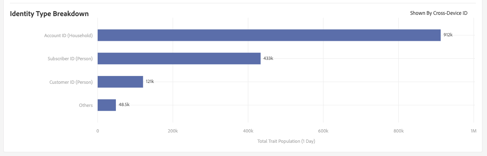

# [!UICONTROL Trait] Pagina Dettagli  {#trait-details-page}

La pagina dei dettagli relativa a un singolo [!UICONTROL trait] fornisce una panoramica dei dettagli [!UICONTROL trait], come il nome [!UICONTROL trait], l&#39;ID, le metriche delle prestazioni, le espressioni che definiscono il [!UICONTROL trait], i segmenti a cui appartiene e il registro di controllo [!UICONTROL trait]. Per visualizzare questi dettagli, andare su **[!UICONTROL Audience Data]** > **[!UICONTROL Traits]** e fare clic sul nome della [!UICONTROL trait] con cui si desidera lavorare.

## [!UICONTROL Trait] Strumenti di gestione  {#trait-management-tools}

Nella parte superiore della pagina dei dettagli [!UICONTROL trait] sono presenti gli strumenti che è possibile utilizzare per gestire la [!UICONTROL traits]:

1. **[!UICONTROL Add New]**: Utilizzate questa opzione per creare nuovo  [!UICONTROL rule-based],  [!UICONTROL algorithmic] o  [!UICONTROL onboarded traits].
2. **[!UICONTROL Edit]**: Utilizzare questa opzione per modificare la configurazione della corrente  [!UICONTROL trait].
3. **[!UICONTROL Delete]**: Utilizzate questa opzione per rimuovere la corrente  [!UICONTROL trait] dal vostro account di Audience Manager .
4. **[!UICONTROL Marketplace Recommendations]**: Utilizzate questa opzione per trovare un oggetto simile  [!UICONTROL traits] a quello visualizzato, dalle tariffe  [!UICONTROL Audience Marketplace] dati a cui non siete iscritti. Vedere [ Audience Marketplace per gli acquirenti di dati](../audience-marketplace/marketplace-data-buyers/marketplace-data-buyers.md) per informazioni su come navigare all&#39;interno del [!UICONTROL Marketplace] e trovare caratteristiche simili.

## [!UICONTROL Trait] Informazioni {#basics}

La sezione [!UICONTROL Trait Information] mostra i dettagli sui campi obbligatori e facoltativi completati durante la creazione della [!UICONTROL trait]. Questo include elementi come il tipo [!UICONTROL trait], l&#39;ID [!UICONTROL trait], la descrizione, [!UICONTROL data source] e altri metadati. Questi dettagli variano a seconda del tipo [!UICONTROL trait] ([!UICONTROL folder], [!UICONTROL onboarded] o [!UICONTROL rule-based]).

## [!UICONTROL Trait Graph] {#trait-graph}

[!UICONTROL Trait Graph] fornisce metriche delle prestazioni a colpo d&#39;occhio per la [!UICONTROL trait] selezionata. Tenere il cursore su una linea di tendenza per visualizzare i dati aggiuntivi per la [!UICONTROL trait] selezionata.

[!UICONTROL Unique Trait Realizations] rappresentano un numero di utenti univoci che lo hanno aggiunto  [!UICONTROL trait] al proprio profilo nel periodo di tempo specificato. Il [!UICONTROL Total Trait Population] indica il numero di utenti univoci attualmente qualificati per questo [!UICONTROL trait].

Per [!UICONTROL rule-based traits], la qualifica [!UICONTROL trait] viene eseguita in tempo reale, in quanto gli utenti hanno diritto a un [!UICONTROL trait] nel proprio browser.

Per [!UICONTROL onboarded traits], la qualifica di [!UICONTROL trait] avviene dopo l&#39;elaborazione di un file in ingresso, ovvero il file in ingresso è [inserito in  Audience Manager](../../faq/faq-inbound-data-ingestion.md), ovvero quando si verifica la qualifica di [!UICONTROL trait].

La [!UICONTROL Trait Graph] mostra le informazioni seguenti:

* **[!UICONTROL Show results by]**
   * **[!UICONTROL Cross-Device ID]**: selezionate questa opzione per visualizzare i risultati per  [!UICONTROL traits] la raccolta di dati per i profili autenticati. Quando si seleziona questa opzione, vengono visualizzati solo i dati nel report [!UICONTROL Cross-Device ID] e nessun dato sarà presente nel report [!UICONTROL Device ID].
   * **[!UICONTROL Device ID]**: selezionate questa opzione per visualizzare i risultati per  [!UICONTROL traits] la raccolta di dati per i profili dispositivo. Quando si seleziona questa opzione, vengono visualizzati solo i dati nel report [!UICONTROL Device ID] e nessun dato sarà presente nel report [!UICONTROL Cross-Device ID].

      

* **[!UICONTROL Unique Trait Realizations]**: Numero di utenti univoci che hanno aggiunto questo  [!UICONTROL trait] al proprio profilo nel periodo di tempo specificato.
* **[!UICONTROL Total Trait Population]**: Il numero di utenti univoci attualmente qualificati per questo  [!UICONTROL trait].

* **[!UICONTROL Identity Type Breakdown]**: Le prime tre voci mostrano i primi tre  [!UICONTROL cross-device data sources] con il numero di popolazione più elevato che hanno aderito al progetto, in ordine  [!UICONTROL trait]decrescente. La quarta voce mostra la somma di tutte le altre [!DNL DPUUIDs] ([!DNL CRM IDs]) qualificate per la [!UICONTROL trait], dalla [!UICONTROL cross-device data sources] che non si trovano nelle prime tre. Questo rapporto viene visualizzato solo se selezionate [!UICONTROL Cross-device ID] nel menu a discesa [!UICONTROL Show Results By] in alto a destra della pagina. L&#39;opzione predefinita è [!UICONTROL Device ID], dove il rapporto non viene visualizzato.

   

   >[!NOTE]
   >
   > Audience Manager visualizza il rapporto [!UICONTROL Identity Type Breakdown] solo se si dispone di [!UICONTROL cross-device] ID qualificati per la [!UICONTROL trait].

   >[!VIDEO](https://video.tv.adobe.com/v/27977/)

## [!UICONTROL Trait] Espressione  {#trait-expression}

La sezione [!UICONTROL Trait Expression] mostra i criteri che gli utenti devono soddisfare per qualificarsi per la [!UICONTROL trait]. Queste regole vengono impostate quando [create o modificate una caratteristica](../../features/traits/about-trait-builder.md).

## [!UICONTROL Trait]Segmenti {#trait-segments}

Nella sezione [!UICONTROL Segments with this Trait] sono elencati tutti i segmenti a cui appartiene la [!UICONTROL trait] selezionata. Potete fare clic sul nome di un segmento per visualizzare i dettagli su di esso.

## [!UICONTROL Trait] Registro di controllo/cronologia  {#trait-audit-history}

Per [!UICONTROL rule-based] e [!UICONTROL onboarded traits], la [!UICONTROL Trait Expression Change History] mostra le ultime 10 modifiche apportate alle regole di espressione [!UICONTROL trait] e chi le ha apportate. Se il [!UICONTROL trait] contiene più di 10 modifiche, fare clic su **[!UICONTROL Export to CSV]** per scaricare l&#39;intero registro di controllo. Il registro di controllo non è disponibile per [!UICONTROL folder] o [!UICONTROL algorithmic traits].

>[!NOTE]
>
>[!UICONTROL Not Available] nella  [!UICONTROL By User] colonna indica che l’account dell’utente è stato eliminato.

