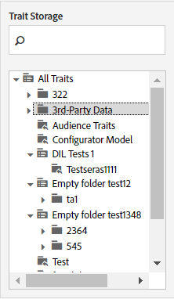

# Archiviazione delle caratteristiche {#trait-storage}

Le cartelle di archiviazione delle caratteristiche memorizzano e consentono di organizzare le caratteristiche.

<!-- c_tb_storage.xml -->

## Scopo delle cartelle di archiviazione delle caratteristiche

In [!UICONTROL Trait Builder] le cartelle di archiviazione delle caratteristiche sono directory che contengono e organizzano le caratteristiche in gruppi logici creati dall&#39;utente. Accedere alle cartelle di archiviazione dal dashboard [!UICONTROL Traits] o durante la creazione di una nuova caratteristica. Non è possibile creare una nuova caratteristica senza assegnarla a una cartella di archiviazione.

## Creare una cartella di archiviazione delle caratteristiche {#create-trait-storage-folder}

Questa procedura descrive come creare una cartella di archiviazione per le caratteristiche.

<!-- t_tb_create_storage.xml -->

È possibile creare una nuova cartella di archiviazione nella sezione [!UICONTROL Basic Information] durante la configurazione di una nuova caratteristica. È inoltre possibile creare le cartelle nella sezione [!UICONTROL Trait Storage] del dashboard elenco [!UICONTROL Traits] principale.

Per creare una nuova cartella di archiviazione:

1. Nella finestra [!UICONTROL Trait Storage], passa il puntatore del mouse su:
   * **[!UICONTROL All Traits]** per aggiungere una nuova cartella principale.
   * Cartella padre esistente per aggiungere una nuova cartella subordinata.
1. Fai clic sull&#39;icona + per creare la cartella.
1. Denomina la cartella e fai clic su **[!UICONTROL Save]**.

## Rinominare o eliminare una cartella di memorizzazione delle caratteristiche {#rename-delete-trait-storage-folder}

In questa procedura viene descritto come rinominare o eliminare una cartella di archiviazione.

<!-- t_tb_rename_delete_storage.xml -->

È possibile rinominare o eliminare le cartelle di archiviazione dalla sezione [!UICONTROL Trait Storage] del dashboard elenco [!UICONTROL Traits] principale.

* Per rinominare una cartella, passa il puntatore del mouse su di essa e fai clic sull’icona della matita.
* Per eliminare una cartella, passa il puntatore su di essa e fai clic sull&#39;icona **X**.
