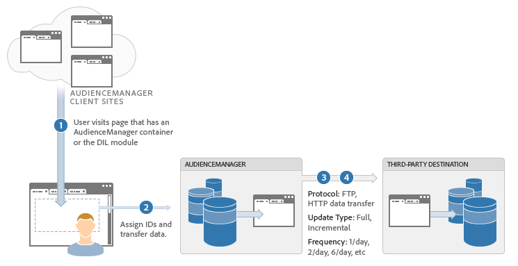

# Metodi di integrazione dei dati {#data-integration-methods}

Panoramica di alto livello su come Audience Manager scambia informazioni con altri provider e sistemi di dati.

## Supported Data Integration Methods: Real-Time and Server-to-Server {#supported-methods}

La scelta del metodo di integrazione giusta dipende da una combinazione di requisiti aziendali e delle capacità tecniche del partner dati. Audience Manager scambia le informazioni sui visitatori con altri provider di dati tramite uno dei seguenti metodi:

* **Real-Time:** Trasferisce i dati immediatamente quando un utente visita il sito. This method is also known as a *`synchronous`* integration.
* **Batch (Server-to-Server):** Trasferisce i dati tra i server in una pianificazione impostata dopo che un visitatore è uscito dalla pagina. This method is also known as an *`out-of-band`* or *`asynchronous`* integration.

## Prerequisites: Create a Trait Taxonomy {#prereqs}

Before the integration process begins, remember to [create traits](../features/traits/create-onboarded-rule-based-traits.md) and a [folder structure](../features/traits/trait-storage.md#create-trait-storage-folder) in the [!DNL Audience Manager] UI. La tassonomia conterrà tutte le caratteristiche organizzate in una gerarchia logica.

## Integration Use Cases {#integration-use-cases}

Riepilogo dei casi di utilizzo dei metodi di integrazione dei dati di Audience Manager con i vantaggi e gli svantaggi di ciascuno.

### Integrazioni server-to-server in tempo reale

<!-- c_int_types_use_cases.xml -->

Un'integrazione dati server-to-server in tempo reale sincronizza rapidamente i dati degli utenti tra i server Audience Manager e un altro sistema di targeting. Nella maggior parte dei casi, lo scambio di dati avviene entro secondi o minuti, a seconda della frequenza di aggiornamento del sistema di targeting. Tuttavia, il sistema con targeting determina questo intervallo di aggiornamento, non Audience Manager. Inoltre, la frequenza di aggiornamento può variare a seconda dei sistemi. Un'integrazione server-to-server in tempo reale è il tipo di integrazione preferito per gli scambi di dati. Audience Manager usa questo metodo ogni volta che i partner di targeting possono supportarlo.

<table id="simpletable_5307DEC378E5486CB92A354287F33AD8"> 
 <tr class="strow">
  <td class="stentry"> 
Vantaggi: 
</td>
  <td class="stentry"> 
   <ul id="ul_F251AFF8A2FA49D0849E36D7FAE87DE7"> 
    <li id="li_1737EBB1AD8844BD87E736BB4D8080EF">Consente di qualificare gli utenti per segmenti senza visualizzarli nuovamente sulla pagina, in un lettore video e così via. </li>
    <li id="li_1C1F346CB7BD40508AA5A6918C6B8514"> Riduce il numero di chiamate HTTP dalla pagina. Un minor numero di chiamate consente di mantenere l'esperienza dell'utente. </li>
    <li id="li_046BF4568B104F53A0E5372568C957CD">Aiuta con targeting sensibile alle ore in modo da poter intervenire rapidamente su un utente qualificato. </li>
    <li id="li_70F7AB19AC5D4A9AB80216A2B05163B8">Utile quando si passa a una DSP per il targeting offsite. </li>
   </ul></td>
 </tr>
 <tr class="strow">
  <td class="stentry"> Svantaggi:</td>
  <td class="stentry"> Meno utili per il targeting onsite quando è necessario eseguire il targeting dell'utente sulla stessa pagina, o sulla pagina successiva, in base alla qualificazione di un utente per quel segmento.</td>
 </tr>
</table>

### Integrazioni batch da server a server

Un'integrazione batch-to-server effettua il bundle dei dati e la invia ad altri sistemi a intervalli di set, anziché in tempo reale. Intervalli di trasferimento dati iniziano da 24 ore. Alcuni fornitori di dati supportano solo questo tipo di integrazione. Tuttavia, abbiamo visto una tendenza generale rispetto alle integrazioni batch verso metodologie di integrazione in tempo reale.

<table id="simpletable_6878241639114DE68E61A251486C6317"> 
 <tr class="strow">
  <td class="stentry"> 
Vantaggi: 
</td>
  <td class="stentry"> 
   <ul id="ul_1E9B48B06E764D3AB6F2D702EB4922DC"> 
    <li id="li_1CF0E018660347B3A5AF79160F74FBDB">Consente di qualificare gli utenti per segmenti senza visualizzarli nuovamente sulla pagina, in un lettore video e così via. </li> 
    <li id="li_B6A9DF9C0D8B44A48F032F2FDB5B3956">Utile per targeting che non è sensibile al tempo. </li>
   </ul></td>
 </tr>
 <tr class="strow">
  <td class="stentry"> Svantaggi:</td>
  <td class="stentry"> L'intervallo di sincronizzazione può ritardare il targeting rispetto ai dati più aggiornati.</td>
 </tr>
</table>

### Chiamate in tempo reale

In tempo reale, le chiamate allo scambio di dati con Audience Manager vengono scambiate immediatamente quando un utente visita il tuo sito o si sposta sulla pagina. Con questo metodo, i sistemi di targeting ottengono i dati di qualificazione del segmento più aggiornati e possono prendere in considerazione tali informazioni durante una decisione di tipo contenuto o consegna annunci. Inoltre, questo processo funziona con i server pubblicitari editore in cui vengono aggiornati i segmenti qualificati a un cookie di prime parti che viene letto come coppie chiave-valore. Currently, Audience Manager uses real-time calls to integrate with [!DNL Target] and other content management systems.

<table> 
 <tr>
  <td> 
Vantaggi: 
</td>
  <td> 
 Consente di impostare come destinazione la pagina successiva, l'area contenuto o l'impression ad impression in base alla qualifica del segmento più recente. 
</td> 
 </tr> 
 <tr>
  <td> 
Svantaggi: 
</td>
  <td> 
Aggiunge una chiamata ad Audience Manager dalla pagina.
</td>
 </tr> 
</table>

### Sincronizzazioni pixel nei sistemi di destinazione

La sincronizzazione pixel mappa i segmenti sui pixel della pagina. Il pixel attiva e trasmette i dati quando un utente è idoneo per un particolare segmento. La sincronizzazione pixel è un meccanismo di trasferimento dati rudimentale e inaffidabile. I fornitori e i sistemi di dati principali vengono raramente utilizzati.

<table id="simpletable_39E4CD139CCF4417842AA28CDFFB6EB1"> 
 <tr class="strow">
  <td class="stentry"> 
Vantaggi: 
</td>
  <td class="stentry"> 
 Trasferimenti di dati in tempo reale. 
</td> 
 </tr> 
 <tr class="strow">
  <td class="stentry"> 
Svantaggi: 
</td>
  <td class="stentry"> 
   <ul id="ul_5217EDC82434401493C2C96823C068E9"> 
    <li id="li_26EB0458CA1844908C005A47F55E50AC">Può aggiungere numerose chiamate lato client dalla pagina. </li>
    <li id="li_CD91F3DC92F2429293787D61506E5E04">Non affidabile per la trasmissione dei dati. La perdita da 5% a 20% è normale. </li>
   </ul></td>
 </tr> 
</table>

## How to Choose a Data Delivery Method {#data-delivery-choices}

Descrive motivi tecnici e commerciali per l'invio di dati tramite metodi sincroni (in tempo reale) o asincroni (server-to-server).

<!-- c_int_delivery_choices.xml -->

### Selezione di un tipo di consegna dati

* **Considerazioni tecniche:** La distribuzione dei dati dipende dalle capacità tecniche del partner dati. Audience Manager può inviare/ricevere dati in tempo reale dal browser o tramite aggiornamenti batch tramite processi di comunicazione server-to-server.
* **Considerazioni sulla business:** I motivi aziendali per selezionare un metodo di consegna o un altro dipendono dalle capacità tecniche del partner di destinazione e dalla modalità di utilizzo di tali dati. In genere, i trasferimenti di dati sincroni sono utili quando è necessario intervenire immediatamente sui dati degli utenti. I trasferimenti di dati asincroni possono essere utili quando l'azione immediata non è obbligatoria e quando è necessario creare profili utente più dettagliati per un uso successivo.

## Real-Time Data Transfer Process {#real-time-data-transfer-process}

Panoramica generale su come Audience Manager esegue uno scambio di dati sincrono con un fornitore di terze parti.

### Trasferimento dati in tempo reale

<!-- c_int_overview_sync.xml -->

I trasferimenti di dati in tempo reale inviano e ricevono ID segmento quando un utente visita o utilizza il tuo sito. In genere, i trasferimenti di dati sincroni sono utili per qualificare o segmentare gli utenti immediatamente, man mano che navigano nell'inventario.

### Passaggi per l'integrazione dati in tempo reale

Il processo di integrazione dei dati in tempo reale funziona come segue:

1. Un utente visita il sito di un cliente che contiene il codice Audience Manager.
1. Audience Manager loads an Iframe and makes a call to the [!UICONTROL Data Collection Server] ([!UICONTROL DCS]).
1. The [!UICONTROL DCS] calls the third-party server (in real time) to check if the vendor has any segment information about the user.
1. La terza parte restituisce informazioni sui segmenti su quell'utente ad Audience Manager.
1. Informazioni sul segmento di ingombro Audience Manager per renderle disponibili per il targeting.

## Batch Data Transfer Process {#batch-data-transfer-process}

Panoramica generale su come Audience Manager scambia i dati in modo sincrono (in tempo reale) con un fornitore di terze parti.

### Integrazione dei dati in batch

<!-- c_int_overview_async.xml -->

Il processo di integrazione dei dati in batch (server-to-server) segue la maggior parte dei passaggi descritti nel processo di trasferimento dati in tempo reale. Invece di restituire immediatamente gli ID del segmento, le informazioni dell'utente vengono salvate nei nostri server e sincronizzate con un provider di dati terze parti a intervalli regolari. Il processo di trasferimento dati asincrono è utile quando:

* I trasferimenti di dati immediati non sono obbligatori.
* Raccogliere dati per creare un pool elevato di utenti segmentati.
* You want to reduce data discrepancies and `HTTP` calls from the browser.

### Passaggi per l'integrazione dei dati in batch

1. Un utente visita un sito cliente.
1. Audience Manager e il provider di dati di terze parti assegnano al visitatore un ID univoco (in genere con un cookie).
1. Audience Manager chiama il provider di dati di terze parti per far corrispondere gli ID visitatore.
1. Una richiesta pianificata, solitamente su un intervallo giornaliero, scambia i dati dei segmenti dei visitatori tra Audience Manager e il fornitore di dati di terze parti.

For information describing the time frames when Audience Manager processes inbound and outbound Server-to-Server ([!UICONTROL S2S]) file transfers, see [Reporting and File Transfer Time-Frame Guidelines](../reference/reporting-file-transfer-timeframe.md).
