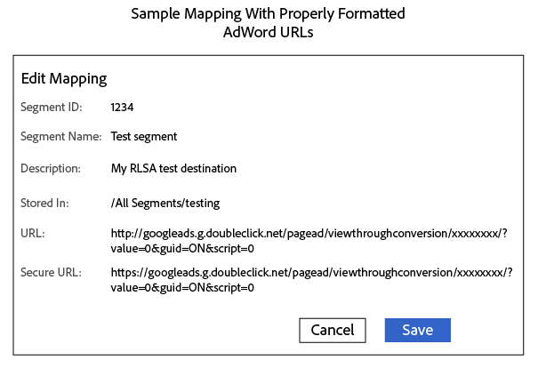

# Inviare segmenti a un elenco per il remarketing di Google Ads {#send-segments-to-a-google-adwords-remarketing-list}

Questa procedura richiede un elenco di remarketing [!DNL Google Ads], un codice pixel e un Audience Manager [!DNL URL] [!DNL destination]. È anche noto come elenco di remarketing per l&#39;integrazione degli annunci di ricerca ([!DNL RLSA]). Si applica solo alla ricerca a pagamento.

>[!IMPORTANT]
>Si noti che non si tratta di un&#39;integrazione di produzione dei due sistemi.

Per impostare un elenco di remarketing [!DNL Google Ads] come [!DNL Audience Manager] [!DNL URL destination]:

1. Nel tuo account [!DNL Google Ads], [crea un elenco di remarketing del sito Web](https://support.google.com/tagmanager/answer/6106960?hl=en) e annota il tuo ID conversione.
1. Utilizza l’URL seguente come modello per l’URL di base e l’URL sicuro. Sostituisci la sezione xxxxxxxx con il tuo ID conversione.

   ```
    //googleads.g.doubleclick.net/pagead/viewthroughconversion/xxxxxxxx/?value=0&guid=ON&script=0&data=%ALIAS%
   ```

1. In Audience Manager, [Crea un [!DNL URL destination]](../../features/destinations/create-url-destination.md) o modifica un [!DNL destination] esistente. Utilizzare le impostazioni seguenti durante la creazione di [!DNL destination]:
   * Tipo: URL
   * Serializza: abilitato
   * Delimitatore: punto e virgola ( &semi; )

1. Nella sezione [!UICONTROL Segment Mappings] di [!DNL URL] [!DNL destination], aggiungi il codice del passaggio 2 ai campi [!DNL URL] e [!DNL Secure URL]. Aggiungi al codice il prefisso `http:` e `https:` rispettivamente nei campi [!DNL URL] e [!DNL Secure URL].

   >[!IMPORTANT]
   >
   >Sostituisci e commerciali codificate `&` con e commerciali non codificate `&`

   Codice [!DNL URL] non sicuro:

   ```
    http://googleads.g.doubleclick.net/pagead/viewthroughconversion/xxxxxxxx/?
    value=0&guid=ON&script=0&data=%ALIAS%
   ```

   Codice [!DNL URL] protetto:

   ```
    https://googleads.g.doubleclick.net/pagead/viewthroughconversion/xxxxxxxx/?
    value=0&guid=ON&script=0&data=%ALIAS%
   ```

1. Fare clic su **[!UICONTROL Save]**.

   >[!NOTE]
   >
   >Se lavori con più segmenti, ottieni un nuovo pixel per ciascun segmento da mappare a un [!DNL Google Ads] [!DNL destination]. In questo modo i dati vengono applicati all’elenco di remarketing appropriato.

1. Quando esegui il mapping di un nuovo segmento a [!DNL destination] in Audience Manager, definisci il mapping come `aam=segmentID` e sostituisci `segmentID` con l&#39;ID del segmento.
1. Quando definisci un bucket in [!DNL Google Ads], crea una regola che corrisponda al mapping definito al passaggio 6.

Una mappatura completata potrebbe essere simile alla seguente:



>[!MORELIKETHIS]
>
>* [[!DNL Destinations]](../../features/destinations/destinations.md)
>* [Crea un [!DNL URL Destination]](../../features/destinations/create-url-destination.md)
>* [Informazioni sugli elenchi di remarketing di AdWords](https://support.google.com/adwords/answer/2472738)
>* [Funzionamento del remarketing AdWords](https://support.google.com/adwords/answer/2454000)
