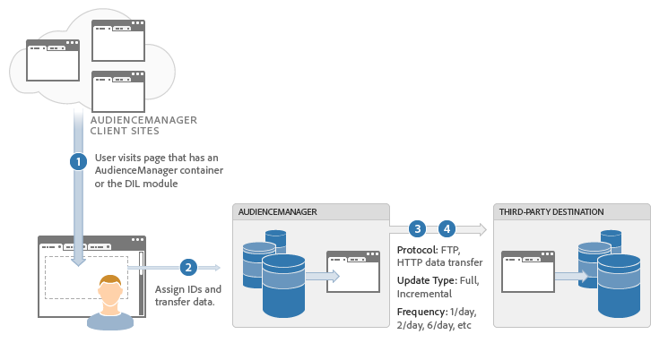

# Descrizione del processo di trasferimento di dati in batch {#batch-data-transfer-process-described}

Panoramica generale sul modo in cui [!DNL Audience Manager] esegue uno scambio di dati batch asincrono con un fornitore di terze parti.

## Integrazione dei dati in batch

<!-- c_async.xml -->

Il processo di integrazione dei dati in batch salva le informazioni sui visitatori sui nostri server e sincronizza tale materiale con i dati inviati da un provider a intervalli regolari. Il processo di trasferimento dati asincrono è utile quando:

* Non sono necessari trasferimenti immediati di dati.
* Raccolta di dati per creare un ampio pool di utenti segmentati.
* Vuoi ridurre le discrepanze di dati e `HTTP` chiamate dal browser.

## Passaggi dell’integrazione dei dati

1. Un utente visita una sede del cliente.
1. [!DNL Audience Manager] e il provider di dati di terze parti assegnano al visitatore un ID univoco (in genere con un cookie).
1. [!DNL Audience Manager] chiama il provider di dati di terze parti per far corrispondere gli ID visitatore.
1. Una richiesta pianificata, in genere su base giornaliera, scambia i dati del segmento visitatore tra [!DNL Audience Manager] e il provider di dati di terze parti.
1. Ogni volta che viene elaborato un file [!UICONTROL Server-to-Server] in entrata, viene inviata una conferma tramite e-mail alle soluzioni partner e, se configurate, al partner. Per ulteriori informazioni, vedere [Messaggio di esempio ai partner dopo l&#39;elaborazione in entrata](../../../integration/sending-audience-data/batch-data-transfer-explained/inbound-receipt-message.md).
