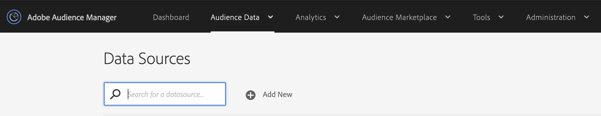
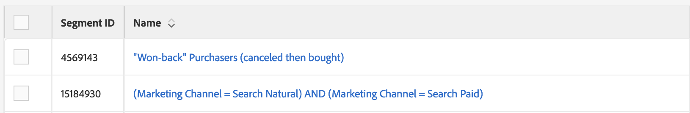
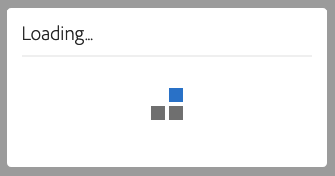

# Accessibilità in Audience Manager {#accessibility}

## Panoramica {#overview}

L’accessibilità si riferisce a una serie di funzioni che rendono un prodotto software utilizzabile, con il minimo sforzo possibile da parte di utenti con varie disabilità, come quella visiva, uditiva, cognitiva, motoria o di altro tipo.

Adobe è leader di settore nell’accessibilità e supporta la creazione di esperienze web eccezionali incoraggiando gli sviluppatori a produrre contenuti avanzati e coinvolgenti, accessibili a tutti gli utenti. Per ulteriori dettagli sull&#39;impegno di Adobe per l&#39;accessibilità, vedere [Accessibilità Adobe](https://www.adobe.com/accessibility.html).

Le funzioni di accessibilità più comuni presenti nei prodotti software sono: navigazione da tastiera, struttura semantica, contrasto sufficiente tra elementi in primo piano ed elementi in background, supporto per tecnologie assistive, etichette chiare per gli elementi e così via.

Per semplificare l&#39;utilizzo di [!DNL Audience Manager] per tutti, è stato sviluppato il supporto di più funzioni di accessibilità.

## Navigazione tramite tastiera {#keyboard-navigation}

[!DNL Audience Manager] supporta l&#39;accesso completo alla tastiera:

* La chiave `Tab` e le frecce si spostano tra i singoli elementi dell&#39;interfaccia utente.

  

* Le chiavi `Return` (`Enter`) e `Space` attivano l&#39;elemento selezionato.

## Ordinamento tabella accessibile {#table-sorting}

Le intestazioni di tabella possono essere selezionate quando si naviga tramite il tasto `Tab`. È possibile modificare l&#39;ordinamento premendo `Space`.

## Supporto per le tecnologie per l&#39;accessibilità {#assistive-technologies}

Tramite l&#39;utilizzo del codice semantico e di [ARIA](https://www.w3.org/WAI/standards-guidelines/aria/), gli elementi interattivi all&#39;interno dell&#39;interfaccia utente di [!DNL Audience Manager] includono etichette corrispondenti, nomi accessibili e ruoli che identificano sia lo scopo che lo stato corrente.

In questo modo le tecnologie per l’accessibilità, come gli assistenti vocali, possono leggere le etichette e altre informazioni per consentire agli utenti di interagire facilmente con i controlli dell’applicazione.

Tutti gli elementi interattivi all’interno dell’interfaccia utente di Audience Manager includono le etichette corrispondenti. In questo modo le tecnologie per l’accessibilità, come gli assistenti vocali, possono leggere le etichette per gli utenti.

## Colori e contrasto {#colors-contrast}

L&#39;interfaccia utente di [!DNL Audience Manager] si impegna a fornire un contrasto sufficiente nell&#39;applicazione per garantire un&#39;esperienza di visualizzazione accessibile agli utenti ipovedenti o con deficienze cromatiche.

Ad esempio, le schermate di caricamento includono una rotazione di caricamento all’interno di una casella modale bianca, il tutto sulla parte superiore di una sovrapposizione grigio scuro.

## Letture ulteriori {#further-reading}

[!DNL Audience Manager] si impegna a fornire un livello sempre maggiore di accessibilità, rendendo il prodotto facile da utilizzare per tutti.

Ti invitiamo a utilizzare il [Modulo di feedback sull&#39;accessibilità di Adobe](https://www.adobe.com/accessibility/feedback.html) per inviarci suggerimenti di miglioramento e segnalare i problemi di accessibilità incontrati. Saremo lieti di tenere conto del tuo feedback e migliorare [!DNL Audience Manager].
