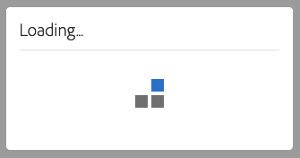

# Accessibilità in Audience Manager {#accessibility}

## Panoramica {#overview}

L’accessibilità si riferisce a una serie di funzioni che rendono un prodotto software utilizzabile, con il minimo sforzo possibile da parte di utenti con varie disabilità, come quella visiva, uditiva, cognitiva, motoria o di altro tipo.

Adobe è leader di settore nell’accessibilità e supporta la creazione di esperienze web eccezionali incoraggiando gli sviluppatori a produrre contenuti avanzati e coinvolgenti, accessibili a tutti gli utenti. Per ulteriori dettagli sull’impegno di Adobe per l’accessibilità, consulta [Accessibilità Adobe](https://www.adobe.com/accessibility.html).

Le funzioni di accessibilità più comuni presenti nei prodotti software sono: navigazione da tastiera, struttura semantica, contrasto sufficiente tra elementi in primo piano ed elementi in background, supporto per tecnologie assistive, etichette chiare per gli elementi e così via.

Da effettuare [!DNL Audience Manager] più semplice da utilizzare per tutti, abbiamo sviluppato il supporto per più funzioni di accessibilità.

## Navigazione tramite tastiera {#keyboard-navigation}

[!DNL Audience Manager] supporta l&#39;accessibilità completa della tastiera:

* Il `Tab` e le frecce si spostano tra i singoli elementi dell’interfaccia utente.

   

* Il `Return` (`Enter`) e `Space` i tasti attivano l&#39;elemento selezionato.

## Ordinamento tabella accessibile {#table-sorting}

Le intestazioni della tabella sono selezionabili quando si naviga tramite `Tab` e modificare l&#39;ordinamento premendo `Space`.

## Supporto per le tecnologie per l&#39;accessibilità {#assistive-technologies}

Attraverso l&#39;uso di codice semantico e [ARIA](https://www.w3.org/WAI/standards-guidelines/aria/), elementi interattivi all&#39;interno di [!DNL Audience Manager] L’interfaccia utente di include le etichette corrispondenti, i nomi accessibili e i ruoli che identificano sia il loro scopo che il loro stato corrente.

In questo modo le tecnologie per l’accessibilità, come gli assistenti vocali, possono leggere le etichette e altre informazioni per consentire agli utenti di interagire facilmente con i controlli dell’applicazione.

Tutti gli elementi interattivi all’interno dell’interfaccia utente di Audience Manager includono le etichette corrispondenti. In questo modo le tecnologie per l’accessibilità, come gli assistenti vocali, possono leggere le etichette per gli utenti.

## Colori e contrasto {#colors-contrast}

Il [!DNL Audience Manager] l’interfaccia utente si impegna a fornire un contrasto sufficiente nell’applicazione per garantire un’esperienza di visualizzazione accessibile agli utenti ipovedenti o con deficienze cromatiche.

Ad esempio, le schermate di caricamento includono una rotazione di caricamento all’interno di una casella modale bianca, il tutto sulla parte superiore di una sovrapposizione grigio scuro.

## Letture ulteriori {#further-reading}

[!DNL Audience Manager] si impegna a fornire un livello di accessibilità sempre maggiore, rendendo il prodotto facile da usare per tutti.

Si consiglia di utilizzare il [Modulo di feedback sull’accessibilità di Adobe](https://www.adobe.com/accessibility/feedback.html) per inviarci suggerimenti di miglioramento e problemi di accessibilità incontrati. Saremo più che lieti di prendere in considerazione il tuo feedback e migliorare [!DNL Audience Manager].
