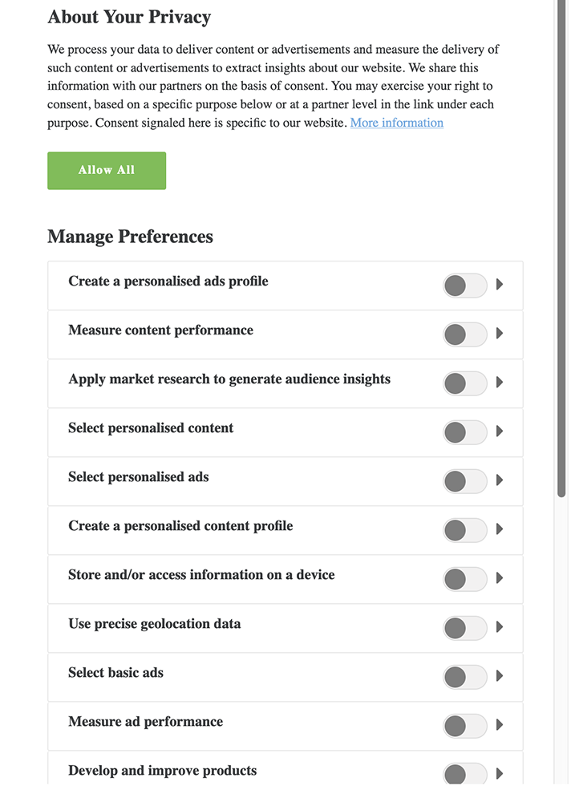

# [!DNL Audience Manager Plug-in for IAB TCF] {#aam-iab-plugin}

## Panoramica

Un aspetto importante degli obblighi in materia di privacy che potresti avere nei confronti dei tuoi utenti è l&#39;acquisizione e la trasmissione delle scelte degli utenti su come i loro dati personali possono essere utilizzati (cioè, &quot;scopi&quot;) e da chi (cioè, &quot;aziende&quot;).

Adobe consente di gestire e comunicare le scelte degli utenti in materia di riservatezza, tramite la [Funzionalità di consenso](https://docs.adobe.com/content/help/en/id-service/using/implementation/opt-in-service/optin-overview.html) e il supporto del [Transparency and Consent Framework (TCF) di IAB](https://iabtechlab.com/standards/gdpr-transparency-and-consent-framework/).

In questo articolo vengono descritti i casi di utilizzo di Audience Manager che supportano IAB TCF e come implementare tale supporto in Audience Manager.

>[!IMPORTANT]
>
> Audience Manager è registrato in [IAB TCF](https://iabeurope.eu/tcf-for-vendors/) con l&#39;ID fornitore 565.

Il  plug-in Audience Manager per IAB TCF utilizza la funzionalità [](https://docs.adobe.com/content/help/en/id-service/using/implementation/opt-in-service/iab.html)Opt-in, che a sua volta fa parte della libreria [Adobe Experience Platform Identity Service (ECID)](https://docs.adobe.com/content/help/en/id-service/using/home.html) .

## Ambito di applicazione e limitazioni {#scope-and-limitations}

In qualità di Editore o Inserzionista che lavora con  Audience Manager, è possibile trasmettere le scelte degli utenti a  Audience Manager in base a IAB TCF.

>[!IMPORTANT]
>
>I regolamenti IAB TCF si applicano solo ai visitatori situati nello Spazio economico europeo.

 Audience Manager ti aiuta a rispettare le scelte sulla privacy degli utenti e ti offre anche un modo semplice per comunicare queste scelte a tutti i partner con cui lavori.

Al momento  Audience Manager non supporta:

* Flussi di lavoro per dispositivi mobili;
* Appendere il consenso per segmentare le esportazioni.

## Aggiornamento a [!DNL IAB TCF v2.0] {#upgrading}

I clienti che aggiornano [!DNL Audience Manager Plug-in for IAB TCF] l&#39;implementazione da [!DNL IAB TCF] v1.1 a [!DNL IAB TCF] v2.0 o che abilitano [!DNL IAB TCF] v2.0 per la prima volta, devono seguire tutte le stesse linee guida sui prerequisiti e l&#39;implementazione come descritto di seguito.

## Prerequisiti {#prerequisites}

>[!IMPORTANT]
>
> Audience Manager supporta IAB TCF v2.0.
>
>Il supporto per IAB TCF v1.1 terminerà il 15 agosto 2020.
>
> I clienti che desiderano continuare a utilizzare il plug-in  Audience Manager per IAB TCF per la gestione del consenso devono effettuare l&#39;aggiornamento alla versione più recente di [ECID](https://github.com/Adobe-Marketing-Cloud/id-service/releases) per un supporto continuo.
>
> Dopo l&#39;aggiornamento alla versione [ECID](https://github.com/Adobe-Marketing-Cloud/id-service/releases) più recente, le stringhe di consenso IAB TCF v1.1 non saranno più supportate. Accertatevi quindi di aggiornare il CMP prima di eseguire l&#39;aggiornamento alla versione ECID più recente.

Per utilizzare il plug-in Audience Manager  per IAB TCF con  Audience Manager, è necessario soddisfare i seguenti prerequisiti:

1. È necessario utilizzare  Adobe Experience Platform Identity Service (ECID) versione 5 o successiva. [Scarica](https://github.com/Adobe-Marketing-Cloud/id-service/releases) la versione più recente di ECID.
2. Devi utilizzare  Audience Manager [!DNL Data Integration Library] (DIL) versione 9.0 o successiva, scaricabile da [qui](https://github.com/Adobe-Marketing-Cloud/dil/releases). Leggi [DIL nella documentazione](../..//dil/dil-overview.md)Audience Manager . È consigliabile utilizzare [Adobe Launch](https://docs.adobe.com/content/help/en/launch/using/extensions-ref/adobe-extension/adobe-audience-manager-extension.html) per l&#39;implementazione DIL più semplice per  Audience Manager.
3. In alternativa, se utilizzate [!DNL Server-Side Forwarding] (SSF) per importare dati in  Audience Manager, dovete eseguire l&#39;aggiornamento alla versione più recente di AppMeasurement. Scarica AppMeasurement utilizzando [Analytics Code Manager](https://docs.adobe.com/content/help/en/analytics/admin/admin-tools/code-manager-admin.html).
4. È necessario utilizzare un Platform di gestione del consenso (CMP), commerciale o personale, integrato con IAB TCF v2.0 e registrato con lo IAB TCF. Consultate l’elenco dei [CMP registrati nel framework](https://iabeurope.eu/cmp-list/)IAB.

>[!WARNING]
>
>Se utilizzi un Platform di gestione del consenso (CMP) che non supporta IAB TCF v.2.0,  Audience Manager invierà automaticamente il `gdpr=0` parametro nelle sincronizzazioni ID, anche se i visitatori si trovano nell’Unione Europea. Per determinare se la convalida GDPR è attiva, si consiglia di confermare con il Platform di gestione del consenso (CMP) che supportano IAB TCF v2.0.

## Raccomandazioni e modalità di implementazione {#recommendations}

Per abilitare il supporto IAB TCF in  Audience Manager, leggi la nostra documentazione su [come configurare IAB con il consenso](https://docs.adobe.com/content/help/en/id-service/using/implementation/opt-in-service/iab.html).

Il modo più semplice per farlo è utilizzare [Launch](https://docs.adobe.com/content/help/en/launch/using/overview.html) Adobe Experience Platform per aggiungere [!DNL ECID Opt-in] proprietà. Read the documentation for the [ECID Opt-in extension](https://docs.adobe.com/content/help/en/launch/using/extensions-ref/adobe-extension/id-service-extension/overview.html) to learn how to set up the Launch extension.

## Flusso di lavoro di scelta dell’utente quando si utilizza il framework IAB {#user-choice-workflow}

Quando si visita una proprietà Web, gli utenti possono scegliere in che modo i loro dati devono essere utilizzati dall&#39;editore e dai fornitori di terze parti con cui lavora l&#39;editore.

Gli utenti forniscono le loro scelte sotto forma di *consenso* e di *legittimo interesse* ai fini dell&#39;IAB a venditori *di* terze parti registrati nell&#39;elenco dei fornitori globali.

L’immagine seguente rappresenta un esempio di una finestra di dialogo CMP, visualizzata per la prima volta da un visitatore di un sito Web. Tieni presente che questa finestra di dialogo può essere molto diversa, in base all&#39;implementazione del cliente.



I dettagli sulle varie finalità e autorizzazioni incluse in IAB TCF v2.0 sono trattati nelle politiche [quadro per la trasparenza e il consenso di](https://iabeurope.eu/iab-europe-transparency-consent-framework-policies/#A_Purposes)IAB Europe.

Gli utenti possono concedere il loro consenso o il loro interesse legittimo (se disponibile) per una combinazione di scopi e venditori. Ad esempio, gli utenti possono concedere il loro consenso per l&#39;archiviazione delle informazioni su un dispositivo, lo sviluppo e il miglioramento dei prodotti e concedere il loro consenso a tutti i fornitori di terze parti visualizzati dal CMP.

Oppure, in un altro esempio, possono concedere il loro consenso o il loro interesse legittimo per tutti gli scopi, ma solo concedere il consenso o il legittimo interesse ad alcuni dei venditori esposti dal CMP.

Una volta che l&#39;utente seleziona le proprie scelte sulla privacy, le scelte dell&#39;utente vengono registrate nella stringa TC IAB. La stringa IAB TC memorizza la combinazione di scopi e fornitori approvati, insieme ad altre informazioni sui metadati (consultate la pagina [](https://github.com/InteractiveAdvertisingBureau/GDPR-Transparency-and-Consent-Framework/blob/master/TCFv2/IAB%20Tech%20Lab%20-%20Consent%20string%20and%20vendor%20list%20formats%20v2.md#about-the-transparency--consent-string-tc-string) IAB per ulteriori informazioni).

Ogni fornitore registrato nell&#39;IAB TCF valuta la stringa IAB TC e prende decisioni in base alle scelte di privacy degli utenti. Tenere presente che le scelte relative alla privacy degli utenti sono valide per tutti i fornitori registrati presso IAB TCF.

## Finalità richieste da  Audience Manager {#aam-standard-purposes}

 Audience Manager valuta le scelte degli utenti memorizzate nella stringa IAB TC per i seguenti scopi, definiti nelle policy [quadro](https://iabeurope.eu/iab-europe-transparency-consent-framework-policies/#A_Purposes)IAB Europe Transparency &amp; Consent. Inoltre, è possibile trovare gli scopi nell&#39;elenco [dei fornitori](https://vendorlist.consensu.org/vendorlist.json)globali.

* **Finalità 1**: Archiviare e/o accedere alle informazioni su un dispositivo;
* **Finalità 10**: Sviluppare e migliorare i prodotti;
* **Scopo speciale 1**: Protezione, prevenzione di frodi e debug.

>[!IMPORTANT]
>
> Audience Manager necessita del consenso per l&#39;obiettivo 1 e lo scopo 10, più il consenso del fornitore, al fine di distribuire i cookie e avviare o onorare le sincronizzazioni ID.
>
>In base alle normative [](https://iabeurope.eu/iab-europe-transparency-consent-framework-policies/#Special_Purpose_1__Ensure_security_prevent_fraud_and_debug_)IAB, lo scopo speciale 1 (garantire la sicurezza, prevenire frodi e debug) è sempre consentito e gli utenti non possono opporsi ad esso.

##  comportamento di Audience Manager dipende dal fatto che l&#39;utente conceda o meno il consenso {#aam-behavior-consent}

 Audience Manager funziona in modo diverso a seconda che la stringa IAB TC includa o meno il consenso degli utenti per i due scopi (memorizzare e/o accedere alle informazioni su un dispositivo, e sviluppare e migliorare i prodotti).

Controlliamo inoltre il consenso degli utenti per tutte le destinazioni con cui lavorate in  Audience Manager, purché tali destinazioni siano registrate con IAB TCF.

| Quando l&#39;utente *fornisce il consenso*,  Audience Manager: | Quando l&#39;utente *rifiuta* il consenso,  Audience Manager: |
|---|---|
| <ul><li>Esegue tutti i casi di utilizzo di Audience Manager  richiesti.</li><li>Invia il consenso a terzi nelle sincronizzazioni ID (passando `gdpr = 1` e la stringa di consenso come `gdpr_consent` nelle chiamate di sincronizzazione ID).</li><li>Valuta e rispetta il consenso passato dai pixel del server di annunci.</li><li>Rispetta le sincronizzazioni ID avviate dai partner.</li></ul> | <ul><li>Non memorizza alcun nuovo dato utente nell&#39;istanza. Questo include ID partner, segnali, caratteristiche o dati pixel.</li><li>Non avvia sincronizzazioni ID di terze parti.</li><li>Non rispetta le sincronizzazioni ID avviate dal partner.</li><li>Rifiuta all&#39;utente di effettuare ulteriori raccolte di dati.</li></ul> |

## Caso di utilizzo di Publisher {#publisher-use-case}

Implementando il plug-in Audience Manager  per IAB TCF, non è necessario mantenere il codice personalizzato per la gestione del consenso sulle proprietà Web tramite un meccanismo diverso con Adobe o altri fornitori di terze parti. Il caso d’uso è descritto nell’immagine e nei passaggi seguenti. Iniziate da sinistra dell’immagine:

1. Un utente visita una delle proprietà Web dell’utente. Se si utilizzano le versioni più recenti delle librerie ECID e DIL (vedere [Prerequisiti](/help/using/overview/data-security-and-privacy/aam-iab-plugin.md#prerequisites)), viene attivato il flusso di consenso.
2.  Audience Manager controlla se il flusso IAB è applicabile (`isIabContext=true`). Consultate [Recommendations (Raccomandazioni e come implementarle](aam-iab-plugin.md#recommendations)).
3.  Audience Manager verifica se il GDPR è applicabile (`gdpr = 1`) e se è presente un CMP registrato con IAB TCF nella proprietà Web. Ad esempio, questo vale per gli utenti che visitano dall&#39;Unione europea. È responsabilità dell&#39;editore impostare il flag GDPR.
4. Se GDPR è applicabile,  Audience Manager controlla la stringa IAB TC, trasmessa nel `gdpr_consent` parametro, per il consenso richiesto.  Audience Manager richiede il consenso per l&#39;archiviazione e/o l&#39;accesso alle informazioni su un dispositivo ([IAB TCF purpose 1](https://iabeurope.eu/iab-europe-transparency-consent-framework-policies/#A_Purposes)), lo sviluppo e il miglioramento dei prodotti ([IAB TCF purpose 10](https://iabeurope.eu/iab-europe-transparency-consent-framework-policies/#A_Purposes)), più  consenso del fornitore Audience Manager per memorizzare, elaborare o attivare i dati.
5. Se la stringa IAB TC è presente e contiene il consenso richiesto,  Audience Manager trasmette la stringa IAB TC ai nostri server [di raccolta](../../reference/system-components/components-data-collection.md) dati (DCS).
6.  Audience Manager risponde impostando un cookie [demdex](https://docs.adobe.com/content/help/en/core-services/interface/ec-cookies/cookies-am.html) sul browser e avvia e rispetta le sincronizzazioni ID di terze parti.
7. In alternativa, se la stringa TC IAB passata al punto 4 non contiene tutte le autorizzazioni necessarie,  Audience Manager non raccoglie, elabora o attiva dati utente e non rispetta né avvia sincronizzazioni ID. Inoltre, esclude l’utente dalle destinazioni con cui lavori.

>[!IMPORTANT]
>
>Se state lavorando con  partner di destinazione Audience Manager che richiedono parametri IAB TCF, ma non disponete di un CMP che supporti IAB TCF sul vostro sito Web,  Audience Manager invia `gdpr=0` le sincronizzazioni ID. Ciò significa che il GDPR non si applica a tali utenti.
>
> In caso contrario, è necessario abilitare la funzionalità IAB TCF in  Audience Manager per inviare le stringhe IAB TC appropriate ai partner di destinazione.


## Caso di utilizzo dell&#39;inserzionista {#advertiser-use-case}

 Audience Manager valuta e rispetta il consenso passato nelle chiamate [in](../../integration/sending-audience-data/real-time-data-integration/pixel-based-data-transfer.md)pixel, in conformità con lo IAB TCF.

I pixel possono essere inseriti  clienti Audience Manager sulle pagine del loro partner o inseriti nei server di annunci da includere nella risposta dell&#39;annuncio. Nel primo caso, il partner deve recuperare in modo programmatico il parametro di consenso e aggiungerlo al pixel prima di iniziare. Nel secondo caso, più comune e descritto dettagliatamente di seguito, i server di annunci aggiungono i parametri di consenso ricevuti dai server di annunci dell&#39;Platform (SSP) o dell&#39;editore a tutti i pixel.

 Audience Manager utilizza due parametri per trasmettere il consenso degli utenti nelle chiamate pixel:

* `gdpr` può essere 0 (non si applica il GDPR) o 1 (si applica il GDPR);
* `gdpr_consent` è la stringa di consenso GDPR con codifica URL-safe base64 (vedere [la specifica](https://github.com/InteractiveAdvertisingBureau/GDPR-Transparency-and-Consent-Framework/blob/master/TCFv2/IAB%20Tech%20Lab%20-%20Consent%20string%20and%20vendor%20list%20formats%20v2.md#about-the-transparency--consent-string-tc-string)). Una chiamata di esempio per un pixel di impression, con i due parametri potrebbe essere simile a quella riportata di seguito:

```
http://yourcompany.demdex.net/event?d_event=imp&gdpr=1&gdpr_consent=consentstring&d_src=datasource_id&d_site=siteID&d_creative=creative_id&d_adgroup=adgroup_id&d_placement=placement_id
```

Il caso d’uso è descritto nell’immagine e nei passaggi seguenti. Iniziate da sinistra dell’immagine:

1. L&#39;utente riceve un&#39;impressione tramite un server di annunci. Questo si traduce in una chiamata [in](../../integration/media-data-integration/impression-data-pixels.md) pixel ai nostri Data Collection Servers (DCS).
2.  Audience Manager controlla se è valido il flag GDPR. In caso contrario,  Audience Manager memorizza i dati passati nelle `gdpr` variabili e `gdpr_consent` nelle chiamate in pixel.
3. Se la stringa TC IAB è presente e contiene le autorizzazioni richieste,  Audience Manager memorizza i dati passati nelle `gdpr` variabili e `gdpr_consent` nelle chiamate in pixel.
4. Se la stringa TC IAB è mancante o mancano le autorizzazioni necessarie,  Audience Manager rilascia i dati passati nelle `gdpr` variabili e `gdpr_consent` nelle chiamate in pixel.


## Partner di attivazione che supportano IAB TCF {#aam-activation-partners}

Il plug-in Audience Manager  per IAB TCF consente di inoltrare la stringa IAB TC ai partner di attivazione rispettando le scelte di privacy degli utenti. Per informazioni su quali partner di attivazione supportano IAB TCF, consulta il nostro [elenco di destinazioni](/help/using/features/destinations/device-based-destinations-list.md)basate sui dispositivi.

## Aggiunta del consenso agli URL inviati alle destinazioni URL

L&#39;integrazione Audience Manager  con IAB TCF v2.0 supporta l&#39;aggiunta del consenso alle informazioni inviate alle destinazioni [](../../features/destinations/create-url-destination.md) URL integrate con IAB TCF v2.0. Tuttavia, questo processo non viene eseguito automaticamente da  Audience Manager, per evitare di interrompere formati URL specifici.

I clienti che desiderano aggiungere il consenso ai dati a cui [!DNL URL destinations] vengono inviati devono aggiungere manualmente il `${GDPR}` e `${GDPR_CONSENT_XXXX}` le macro al proprio formato URL, sostituendo `XXXX` con l&#39;ID partner di destinazione.

Esempio: `http://yourdomain.com?gdpr=${GDPR}&gdpr_consent=${GDPR_CONSENT_1234}`.

Per ulteriori informazioni sulle macro di destinazione supportate, vedere Macro di [destinazione definite](../../features/destinations/destination-macros.md) .

## Gestione del consenso tra dispositivi

Il plug-in Audience Manager  per IAB TCF esclude automaticamente gli ID presenti su una richiesta, quando i visitatori del sito non forniscono le autorizzazioni appropriate. Se la richiesta contiene un ID [cross-device (CRM ID)](../../reference/ids-in-aam.md),  Audience Manager esclude l&#39;ID, insieme all&#39;ultimo dispositivo collegato a tale ID [cross-device (CRM ID)](../../reference/ids-in-aam.md).

## Test dell’implementazione IAB {#test-iab-implementation}

Per verificare di aver implementato correttamente il plug-in  Audience Manager per IAB TCF, leggere Caso [d’uso 4 in Convalida del servizio](https://docs.adobe.com/content/help/en/id-service/using/implementation/opt-in-service/testing-optin-and-iab-plugin.html#section-64331998954d4892960dcecd744a6d88)di consenso.

## IAB e rinunce in  Audience Manager. Ordine di precedenza. {#iab-and-optout}

Un&#39;altra opzione di privacy a disposizione degli utenti è la possibilità di rinunciare a tutte le attività di raccolta dei dati. Adobe fornisce agli utenti i mezzi per farlo all’interno della pagina [delle scelte](https://www.adobe.com/privacy/opt-out.html#customeruse) sulla privacy.

 Audience Manager affronta le richieste di rifiuto in un articolo [separato della documentazione](data-privacy-requests.md#opt-out-requests).

>[!IMPORTANT]
>
>Gli utenti che rifiutano la raccolta dei dati dopo che rifiutano il consenso non possono essere riammessi.

>[!NOTE]
>
>**Ordine di precedenza** - Se l&#39;utente rinuncia alla raccolta dei dati utilizzando uno strumento di rinuncia globale, come descritto nel collegamento precedente, questo ha la precedenza sulle verifiche opt-in e IAB.

## Risorse aggiuntive {#additional-resources}

* [consenso al servizio identità Adobe Experience Platform](https://docs.adobe.com/content/help/en/id-service/using/implementation/opt-in-service/optin-overview.html)
* [IAB Europe GDPR Trasparenza e Quadro di Consenso](https://iabtechlab.com/standards/gdpr-transparency-and-consent-framework/)
* [IAB Europe GDPR Trasparenza e Consenso Quadro Tecnico](https://github.com/InteractiveAdvertisingBureau/GDPR-Transparency-and-Consent-Framework/blob/master/Consent%20string%20and%20vendor%20list%20formats%20v1.1%20Final.md)
* [plugin IAB TCF - dimostrazione video](https://helpx.adobe.com/audience-manager/kt/using/iab-tcf-support-audience-manager-technical-video-implement.html)