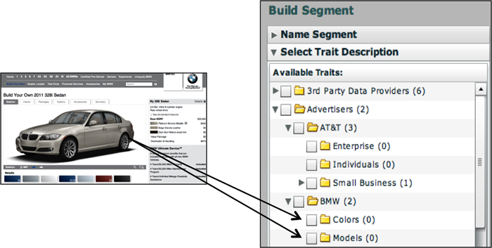

# Types of Data Collected{#types-of-data-collected}

Audience Manager consente di raccogliere e gestire dati di prime, seconda e terze parti.

Sbloccare le risorse delle informazioni sui clienti memorizzate in più silos è una delle principali problematiche di dati affrontate oggi dalle aziende. Dai database CRM, dai sistemi di registrazione a server di annunci, e così via, le aziende richiedono strumenti utili per centralizzare i dati utili e gestire le informazioni cliente/pubblico come una singola risorsa dati strategica. Audience Manager ti aiuta a sbloccare informazioni isolate sui clienti e a gestire la raccolta dati da più fonti. I dati raccolti possono essere gestiti in base ai valori time-to-live (TTL) dell'elemento dati, il che aiuta l'editore a controllare la scadenza dei dati in tutte le origini. Audience Manager è progettato per aiutarti a gestire i seguenti tipi di dati:

| Tipo di dati | Dove provengono i dati |
|---|---|
| **Prime parti** | Clienti. I dati vengono raccolti online (dalle interazioni del consumatore sui siti Web) o offline. |
| **Seconda parte** | Partner strategici e inserzionisti. |
| **Third-party** | Fornitori di dati e/o scambi. I dati possono includere informazioni quali intento, demografia, social/vita, psicografia e molto altro. |

## First-Party Data Collection {#first-party-data}

La raccolta di dati di prime parti è una funzionalità principale di Audience Manager. Questa proprietà di base soddisfa le esigenze dei nostri clienti (editori o pubblicitari) che desiderano utilizzare dati proprietari come pietra miliare dei loro programmi di marketing o per targeting e modellazione rispetto ad altre sorgenti dati.

<!-- 

c_1st_party_data.xml

 -->

Audience Manager collabora con i clienti per comprendere la loro strategia dati, quindi mappa nuovamente la strategia in un piano di raccolta dati personalizzato. Il team Soluzioni Partner collabora con te per valutare siti, segnali dati grezzi e altre interazioni degli utenti sui tuoi siti Web. Con queste informazioni, ti aiuteremo a creare una strategia di raccolta dati personalizzata che acquisisca i segnali dati a livello di utente da varie pagine dell'inventario. I dati acquisiti vengono memorizzati e mappati a una tassonomia predefinita, che può essere aggiornata in qualsiasi momento, in base alla modifica dell'azienda.

L'esempio seguente illustra il modo in cui potenziali elementi dati possono essere acquisiti da una pagina di acquisto di esempio.

Una volta raccolti, i dati non elaborati vengono mappati alle caratteristiche definite dal cliente nella piattaforma Audience Manager. Sia la tassonomia che le mappature dati possono essere regolate in qualsiasi momento senza apportare modifiche al codice di raccolta dati.

## Second-Party Data Collection {#second-party-data}

I dati di seconda parte provengono da un partner aziendale strategico (non sono dati editore). Queste informazioni vengono raccolte e gestite come dati di prime parti.

<!-- 

c_2nd_party_data.xml

 -->

In uno scenario di terze parti, gli inserzionisti inviano le proprie risorse dati agli editori in modo che possano combinare tali informazioni con i dati dell'editore e quindi eseguire un programma pubblicitario più mirato. Inoltre, gli editori possono estendere il pool di pubblico collaborando con i loro inserzionisti. Nella maggior parte dei casi, questi accordi implicano relazioni contrattuali limitate all'inserimento del tag contenitore Audience Manager sul sito partner per semplificare la raccolta di dati e la condivisione.

Un esempio di raccolta di dati di seconda parte e di remarketing potrebbe coinvolgere un produttore automobilistico nella raccolta di dati nelle pagine di configurazione dell'auto e quindi condividere queste informazioni con i partner chiave. In questo caso, il produttore dell'automobile potrebbe distribuire annunci diversi in un sito partner Audience Manager per consumatori che configurano diversi tipi di opzioni veicolo (ad es. colore, modello, ecc.).

## Third-Party Data Collection {#third-party-data}

I dati di terze parti sono informazioni raccolte e condivise dai fornitori al di fuori di Audience Manager.

<!-- 

c_3rd_party_data.xml

 -->

I dati di terze parti possono essere utilizzati per qualificare i segmenti di dati esistenti (ad esempio, età, reddito delle famiglie e così via), fornire dati che sono in richiesta ma non in altro modo, oppure essere utilizzati per modellare in modo simile a una base utente nota da dati di prime e seconda parte. Audience Manager funziona con molti provider di dati di terze parti e ti aiuterà a capire il tipo di dati raccolti da questi fornitori di dati per fare le trattative strategiche giuste su ogni fornitore.

>[!NOTE]
>
>For a full list of third-party data providers supported by [!DNL Audience Manager], see the [Adobe Audience Finder](https://www.adobe-audience-finder.com/).

Audience Manager si integra con altri provider di dati in base alle API e ai set di dati disponibili. La raccolta dati funziona in tempo reale, man mano che un utente sfoglia il tuo sito o tramite metodologie fuori banda in cui gli ID vengono sincronizzati tra partner e dati vengono trasferiti tra i server dopo che un utente è uscito dal sito. In entrambi i casi, i client Audience Manager hanno il vantaggio di avere dati di terze parti sincronizzati sulla nostra piattaforma, il che significa che ciascun client, o dominio, non deve eseguire la propria sincronizzazione. Questo consente di aumentare la portata e ridurre le chiamate del server dalla pagina.

## Match Partners {#match-partners}

Molti client scelgono di lavorare con partner di terze parti. Queste entità hanno relazioni con siti con requisiti di registrazione e possono elaborare i file dei dati del cliente facendoli corrispondere (in tempo reale) in base alla loro rete di registrazione.

