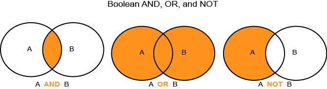

# Boolean Expressions in Trait and Segment Builder{#boolean-expressions-in-trait-and-segment-builder}

Questo articolo spiega come gli strumenti trait e segmenti di Audience Manager usano le espressioni booleane AND, OR e NOT.

<!-- 

c_tb_boolean.xml

 -->

**Espressioni booleane**

Logica booleana è un ramo di algebra che utilizza alcune espressioni di base (o operatori) per determinare se un'istruzione è true o false. The most common operators are [!UICONTROL AND], [!UICONTROL OR], and [!UICONTROL NOT]. Combinazioni di queste espressioni consentono di applicare regole di qualificazione o segmenti mirati in modo univoco adatto ai requisiti di dati. L'illustrazione seguente mostra il funzionamento delle espressioni booleane di base.

  

>[!NOTE]
>
>[!UICONTROL NOT] L'operatore utilizza una condizione implicita e, a volte, viene scritta come [!UICONTROL AND NOT].

**Come utilizzare espressioni booleane in Caratteristiche e Generatore di segmenti**

Potete creare regole di qualificazione per segmenti e segmenti con espressioni booleane. The table below describes general best practices for creating qualification criteria with [!UICONTROL AND], [!UICONTROL OR], and [!UICONTROL NOT].

<table id="table_C762872C98F54C4A86A2F1C840A86657"> 
 <thead> 
  <tr> 
   <th colname="col1" class="entry"> Espressione </th> 
   <th colname="col2" class="entry"> Utilizzatelo per creare </th> 
   <th colname="col3" class="entry"> Per qualificarsi </th> 
  </tr>
 </thead>
 <tbody> 
  <tr> 
   <td colname="col1"> 
<b> AND</b> 
 </td> 
   <td colname="col2"> 
Requisiti di qualifica limitati e mirati. 
 </td> 
   <td colname="col3"> 
Users <i>must</i> belong to all specified traits or segments. 
 </td> 
  </tr> 
  <tr> 
   <td colname="col1"> 
<b> OR</b> 
 </td> 
   <td colname="col2"> 
Requisiti di qualifica generali e meno mirati. 
 </td> 
   <td colname="col3"> 
Users <i>can</i> belong to any specified traits or segments. 
 </td> 
  </tr> 
  <tr> 
   <td colname="col1"> 
<b> NOT</b> 
 </td> 
   <td colname="col2"> 
Requisiti di qualifica limitati e mirati. 
 
Utile in presenza di più condizioni che rendono i requisiti di qualifica dell'audience difficili o inefficienti. Talvolta, è più semplice convalidare con requisiti che escludono piuttosto che includere. 
 </td> 
   <td colname="col3"> 
Users <i>must not</i> belong to an excluded trait or segment. 
 </td> 
  </tr> 
 </tbody> 
</table>

**[!UICONTROL AND]Esempio di caso d'uso**

[!UICONTROL AND] L'operatore è utile se sono stati enumerati con facilità i requisiti di appartenenza a tratti. Ad esempio, supponiamo che sia necessario creare un pubblico di «costosi acquirenti di videocamere. »» Con un modello di pixel, dovrete creare e inserire pixel per le videocamere e un valore di prezzo numerico sulla pagina. By contrast, with traits you can apply Boolean operators to handle both conditions (cameras [!UICONTROL AND] price). Il risultato è una raccolta dati efficiente con meno chiamate HTTP, che a sua volta contribuisce a mantenere l'esperienza utente sul sito.

**[!UICONTROL OR]Esempio di caso d'uso**

[!UICONTROL OR] L'operatore è utile quando desiderate creare segnali con requisiti di qualifica ampi. If you have several trait or segment qualification requirements, the [!UICONTROL OR] operator will evaluate to true when your site visitors exhibit *any* of those characteristics. [!UICONTROL OR] potrebbe essere particolarmente utile quando si desidera creare rapidamente un vasto pubblico di visitatori idonei del sito.

**[!UICONTROL AND NOT]Esempio di caso d'uso**

[!UICONTROL AND NOT] L'operatore è utile quando è più facile definire un pubblico in base *all'esclusione* anziché *all'inclusione*. Ad esempio, supponiamo che tu abbia una vendita e desideri segmentare i visitatori in clienti che guardano solo a elementi a prezzo intero. Rather than create a list of signals for all qualifying full or sale-price items, it may be easier to qualify visitors if they have *not* seen a sale price item. Ciò è efficiente dal punto di vista amministrativo perché in genere si hanno meno prezzi di vendita rispetto a quelli offerti a prezzo completo. With a Boolean [!UICONTROL NOT], visitors *must not* exhibit the sale signal to qualify for full-price audience membership. By contrast, [!UICONTROL AND NOT] is the opposite of the [!UICONTROL AND] use case, which showed how audience membership is determined by inclusion (i.e., the visitor qualified based on 2 explicitly stated signals).

>[!MORE_ LIKE_ THIS]
>
>* [Utilizzo degli operatori di confronto in traitbuilder](../features/traits/trait-comparison-operators.md)
>* [Ordine delle operazioni nelle espressioni traitbuilder](../features/traits/trait-operator-precedence.md)

