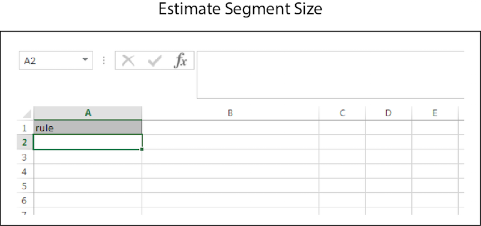

# Stime in blocco{#bulk-estimates}

Una stima in blocco restituisce i dati delle dimensioni del segmento in base alle regole del segmento. Segui queste istruzioni per effettuare una richiesta di stima in blocco.

>[!IMPORTANT]
>
>Gli strumenti di gestione in blocco non sono un’offerta di Adobe ufficialmente supportata. La risoluzione dei problemi e il supporto tramite l’Assistenza clienti verranno gestiti caso per caso.

<!-- 

t_bulk_estimates.xml

 -->

>[!NOTE]
>
>[Le autorizzazioni del gruppo RBAC](../../features/administration/administration-overview.md) assegnate nell&#39;interfaccia utente [!DNL Audience Manager] vengono rispettate in [!UICONTROL Bulk Management Tools].

Per eseguire aggiornamenti in blocco, aprire il foglio di lavoro [!UICONTROL Bulk Management Tools] e:

1. Fare clic sulla scheda **[!UICONTROL Headers]** e copiare l&#39;intestazione [!UICONTROL Estimate Segment Size].
2. Fare clic sulla scheda **[!UICONTROL Estimate]**.
3. Incollare l&#39;intestazione della stima nella prima riga del foglio di lavoro della stima.
4. Incolla o digita i dati che desideri modificare in una colonna corrispondente in base all’etichetta dell’intestazione.
5. Nella barra degli strumenti del foglio di lavoro fare clic sul pulsante Crea corrispondente all&#39;elemento che si sta aggiornando.
Questa azione apre la finestra di dialogo [!UICONTROL Account Information].
6. Fornisci le [informazioni di accesso](../../reference/bulk-management-tools/bulk-management-intro.md#auth-reqs) richieste e fai clic su **[!UICONTROL Submit]**.

Questa azione crea una colonna [!UICONTROL Response] nel foglio di lavoro che contiene i dati delle dimensioni di segmento stimate. Prima di immettere i dati, il foglio di lavoro della stima in blocco deve avere un aspetto simile al seguente:

Se l&#39;aggiornamento in blocco restituisce un errore o non riesce, vedere [Risoluzione dei problemi relativi agli strumenti di gestione in blocco](../../reference/bulk-management-tools/bulk-troubleshooting.md).
