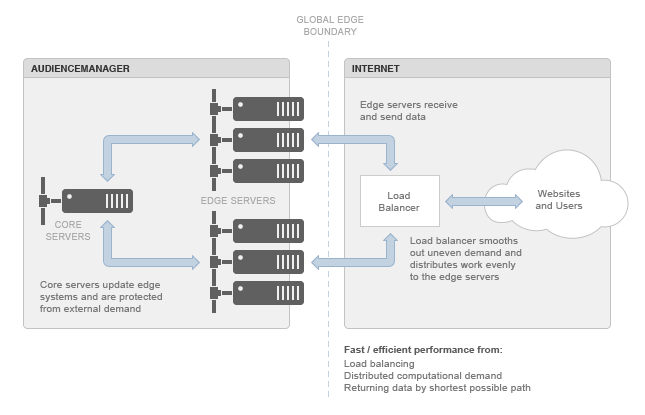

# Informazioni sul centro dati edge{#understanding-the-edge-data-center}

L&#39;Audience Manager utilizza topologie distribuite e edge-computing per soddisfare le esigenze poste ai nostri sistemi da fonti esterne.

## Nozioni di base sul centro dati Edge {#edge-data-center-basics}

<!-- 

c_compedge.xml

 -->

Edge computing fornisce prestazioni migliori in risposta a una domanda diffusa su Internet, perché il &quot;edge&quot; stesso è un confine globale. Ciò significa che [!DNL Audience Manager] colloca dinamicamente l’elaborazione più vicina alle origini della domanda e restituisce i dati in base al percorso più breve possibile. Edge computing consente di mantenere le prestazioni del sito e, a sua volta, di preservare l&#39;esperienza utente sul sito web. Il data center edge è un gateway chiave per lo spostamento dei dati in entrata e in uscita da [!DNL Audience Manager].

Il data center [!DNL Audience Manager] Edge include:

* **Server di base:** questi sono i  [!DNL Audience Manager] sistemi principali. Essi aggiornano e forniscono dati ai server perimetrali.

* **Server perimetrali:** in genere si tratta di server applicazioni e/o web. Si trovano al confine tra [!DNL Audience Manager] e Internet. I server perimetrali, come i sistemi [!DNL DCS] o Akamai, in genere gestiscono dati e richieste in entrata e in uscita da [!DNL Audience Manager].

* **Bilanciatori del carico:** gestire le richieste di elaborazione/elaborazione irregolari inerenti alle applicazioni Internet. Questi bilancieri impediscono che i cluster di server vengano sovraccaricati mentre altri rimangono inattivi.

Il diagramma seguente illustra l’ambiente Audience Manager edge data center.

## Distribuzione geografica e bilanciamento del carico {#geo-dist-balance}

Consulta la sezione [!DNL DCS] in [Componenti di raccolta dati](../../reference/system-components/components-data-collection.md).
