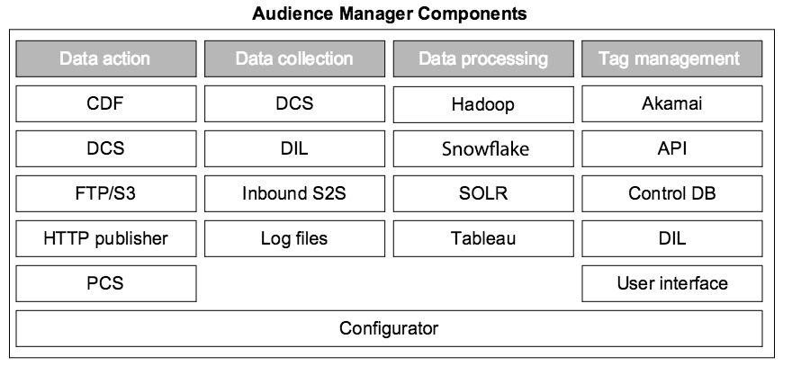

# Key Components in the Audience Manager System{#key-components-in-the-audience-manager-system}

Audience Manager raggruppa i propri sistemi e processi in quattro categorie principali: gestione tag, raccolta dati, organizzazione dati e fruibilità dati.

<!-- 

c_compstack.xml

 -->

The following illustration shows the main components and the underlying technology (hardware and software) that power [!DNL Audience Manager]. Sebbene alcuni processi svolgano funzioni specifiche e altri dispongono di ruoli multipli, tutti i sistemi lavorano insieme per aiutarti a gestire i tag, raccogliere dati, analizzare le prestazioni, sincronizzare le informazioni con altri sistemi e intervenire su tali informazioni.

