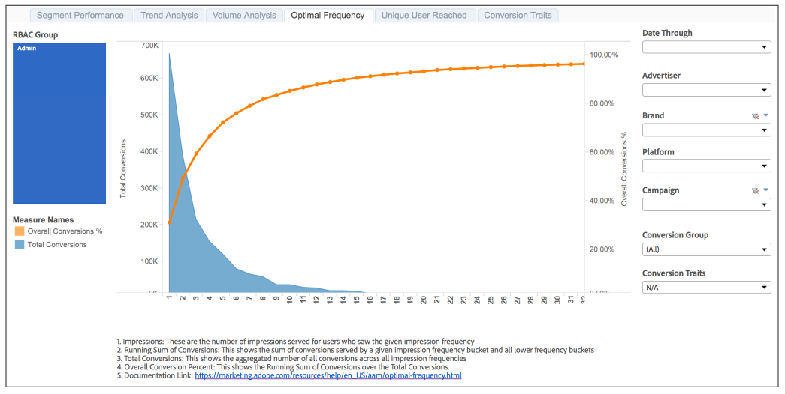

# Rapporto di frequenza ottimale{#optimal-frequency-report}

Il report Optimal Frequency (Frequenza ottimale) consente di scoprire l'equilibrio ottimale tra il numero di impression e di conversioni servite. Consente di regolare il numero di impression che si desidera visualizzare prima di iniziare a vedere i rendimenti diminuiti.

Il volume di conversione diminuisce in genere con intervalli di frequenza ad alta impressione. Meno utenti visualizzano il numero più elevato di impression. Questo significa che i secchi a frequenza più alta hanno meno conversioni.

Tuttavia, il % di conversione totale aumenta con ogni intervallo di frequenza dell'impressione. Con ogni intervallo vengono generate più conversioni, quindi la somma delle conversioni (il numeratore) si avvicina al numero totale delle possibili conversioni (il denominatore) e quindi il % aumenta.

Come mostrato nel rapporto campione, l'intersezione dei 2 grafici a 2 linee fornisce una guida alla frequenza d'impressione "ottimale", ovvero il numero ottimale di impression che devono essere serviti, prima che il cliente inizi a vedere i rendimenti diminuenti.

## Report di esempio

