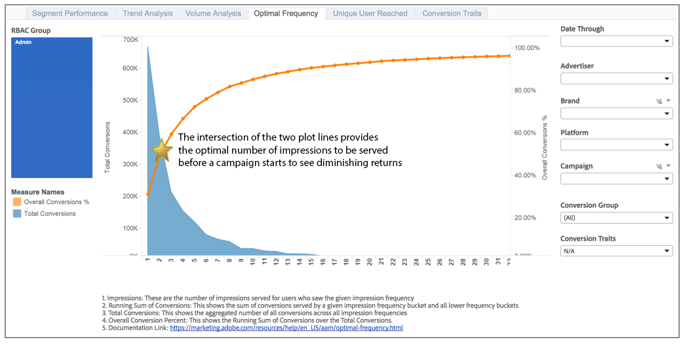

# Rapporto di frequenza ottimale{#optimal-frequency-report}

Il rapporto Optimal Frequency (Frequenza ottimale) consente di scoprire l’equilibrio ottimale tra il numero di impression e di conversioni servite. Consente di regolare il numero di impression da visualizzare prima di iniziare a vedere i rendimenti decrescenti.

Il rapporto ha un intervallo di lookback di 30 giorni, dalla data scelta nel selettore [!UICONTROL Date Through].

Il volume di conversione generalmente diminuisce con secchi di frequenza di impression più elevati. Meno utenti vedono il numero maggiore di impression. Questo significa che i blocchi di frequenza più alti hanno meno conversioni.

Tuttavia, la percentuale di conversione complessiva aumenta con ogni intervallo di frequenza delle impression. Con ogni intervallo vengono generate più conversioni, quindi la somma delle conversioni (il numeratore) avvicina il numero totale delle conversioni possibili (il denominatore) e quindi la percentuale aumenta.

Come mostrato nel rapporto di esempio, l’intersezione dei 2 grafici a linee fornisce una guida alla frequenza di impression &quot;ottimale&quot;, ovvero il numero ottimale di impression che devono essere servite, prima che il cliente inizi a vedere i ritorni in diminuzione.

## Report di esempio

